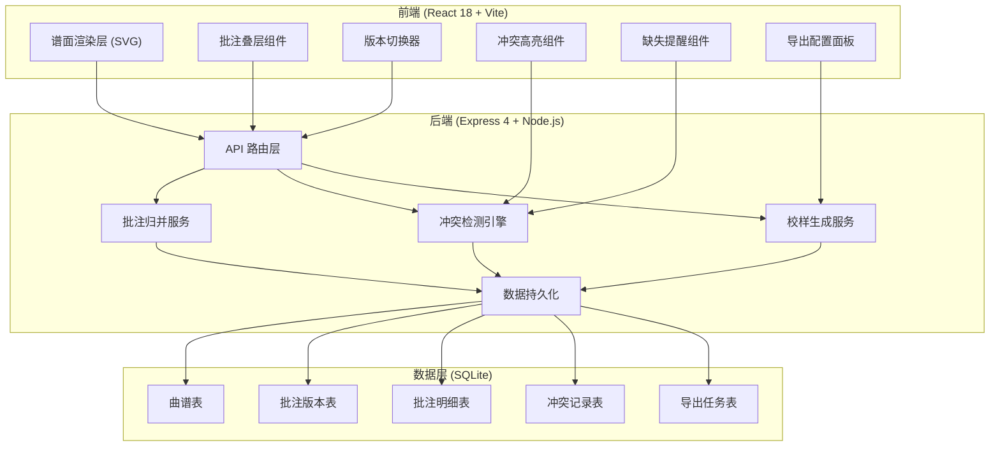
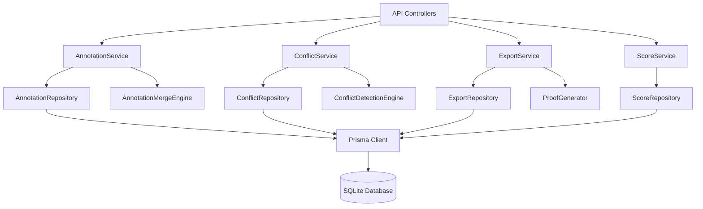
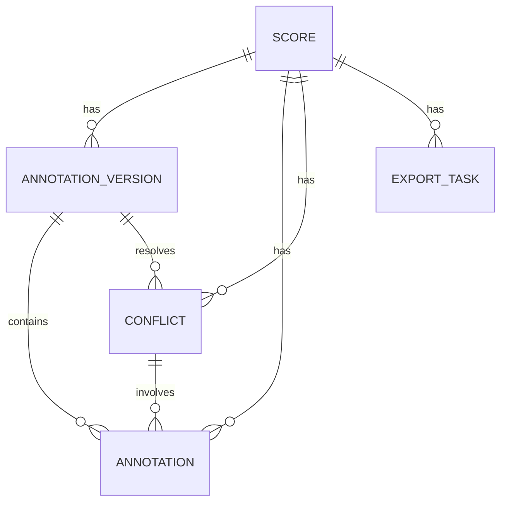

## 1. 架构设计



## 2. 技术描述

### 2.1 技术栈选择
- **前端**：React 18 + TypeScript + Vite
- **样式**：TailwindCSS 3 + CSS Modules
- **状态管理**：Zustand（轻量级，适合中小规模应用）
- **谱面渲染**：原生 SVG + PanZoom（支持缩放平移）
- **后端**：Express 4 + Node.js + TypeScript
- **数据库**：SQLite 3（文件型数据库，便于部署和迁移）
- **ORM**：Prisma（类型安全的数据库访问）
- **文档导出**：pdfmake（PDF生成）+ docx（Word生成）

### 2.2 初始化方式
- 前端：`npm create vite@latest client -- --template react-ts`
- 后端：`npm init -y` + 手动配置 Express + TypeScript
- 数据库：Prisma init + SQLite 配置

## 3. 路由定义

| 路由 | 页面/用途 |
|------|----------|
| / | 曲谱列表页 |
| /score/:id | 批注回看台（核心页） |
| /score/:id/export | 校样导出页 |
| /version/:id | 版本详情页 |

### 3.1 API 路由
| 方法 | 路径 | 用途 |
|------|------|------|
| GET | /api/scores | 获取曲谱列表 |
| GET | /api/scores/:id | 获取曲谱详情 |
| GET | /api/scores/:id/versions | 获取所有批注版本 |
| GET | /api/scores/:id/annotations | 获取合并后的批注数据 |
| GET | /api/scores/:id/conflicts | 检测并获取冲突批注 |
| POST | /api/scores/:id/finalize | 选择定稿版本 |
| POST | /api/export/proof | 生成校样文档 |
| GET | /api/export/:id/download | 下载校样文档 |

## 4. API 类型定义

```typescript
// 曲谱基本信息
interface Score {
  id: string;
  title: string;
  composer: string;
  instrument: string;
  difficulty: 'elementary' | 'intermediate' | 'advanced';
  svgContent: string;
  createdAt: Date;
  updatedAt: Date;
}

// 批注版本
interface AnnotationVersion {
  id: string;
  scoreId: string;
  teacherId: string;
  teacherName: string;
  versionNumber: number;
  color: string;
  createdAt: Date;
  isFinal: boolean;
}

// 批注明细
interface Annotation {
  id: string;
  versionId: string;
  scoreId: string;
  type: 'fingering' | 'phrasing' | 'oral';
  measureNumber: number;
  beatPosition: number;
  content: string;
  x: number;
  y: number;
  width: number;
  height: number;
}

// 冲突记录
interface Conflict {
  id: string;
  scoreId: string;
  measureNumber: number;
  type: 'fingering' | 'phrasing' | 'oral';
  annotations: Annotation[];
  resolved: boolean;
  resolvedVersionId?: string;
  createdAt: Date;
}

// 缺失批注
interface MissingAnnotation {
  id: string;
  scoreId: string;
  measureNumber: number;
  type: 'fingering' | 'phrasing' | 'oral';
  presentInVersions: string[];
  missingInVersions: string[];
  annotation: Annotation;
}

// 校样导出配置
interface ExportConfig {
  scoreId: string;
  format: 'pdf' | 'docx';
  includeConflicts: boolean;
  includeOralNotes: boolean;
  includeFingerings: boolean;
  finalVersionId?: string;
  pageSize: 'A4' | 'Letter';
}
```

## 5. 服务端架构图



## 6. 数据模型

### 6.1 ER 图



### 6.2 Prisma Schema

```prisma
model Score {
  id           String              @id @default(uuid())
  title        String
  composer     String
  instrument   String
  difficulty   String
  svgContent   String
  versions     AnnotationVersion[]
  annotations  Annotation[]
  conflicts    Conflict[]
  exportTasks  ExportTask[]
  createdAt    DateTime            @default(now())
  updatedAt   DateTime            @updatedAt
}

model AnnotationVersion {
  id            String       @id @default(uuid())
  scoreId       String
  teacherId     String
  teacherName   String
  versionNumber Int
  color         String
  isFinal       Boolean      @default(false)
  annotations   Annotation[]
  score         Score        @relation(fields: [scoreId], references: [id])
  createdAt     DateTime     @default(now())
}

model Annotation {
  id            String   @id @default(uuid())
  versionId     String
  scoreId       String
  type          String   // fingering, phrasing, oral
  measureNumber Int
  beatPosition  Float
  content       String
  x             Float
  y             Float
  width         Float
  height        Float
  version       AnnotationVersion @relation(fields: [versionId], references: [id])
  score         Score    @relation(fields: [scoreId], references: [id])
  conflicts     Conflict[]
  createdAt     DateTime @default(now())
}

model Conflict {
  id            String       @id @default(uuid())
  scoreId       String
  measureNumber Int
  type          String
  resolved      Boolean      @default(false)
  resolvedVersionId String?
  score         Score        @relation(fields: [scoreId], references: [id])
  annotations   Annotation[]
  createdAt     DateTime     @default(now())
}

model ExportTask {
  id         String   @id @default(uuid())
  scoreId    String
  format     String   // pdf, docx
  status     String   // pending, processing, completed
  filePath   String?
  config     Json
  score      Score    @relation(fields: [scoreId], references: [id])
  createdAt  DateTime @default(now())
}
```

### 6.3 初始化数据脚本

```sql
-- 插入示例曲谱
INSERT INTO Score (id, title, composer, instrument, difficulty, svgContent)
VALUES 
('score-001', '二泉映月', '华彦钧', '二胡', 'advanced', '<svg>...</svg>'),
('score-002', '高山流水', '传统', '古琴', 'intermediate', '<svg>...</svg>');

-- 插入批注版本（不同老师）
INSERT INTO AnnotationVersion (id, scoreId, teacherId, teacherName, versionNumber, color)
VALUES 
('v1', 'score-001', 't1', '张老师', 1, '#C84B31'),
('v2', 'score-001', 't2', '李老师', 1, '#2E5E8B'),
('v3', 'score-001', 't3', '王老师', 1, '#4A7C59');
```
