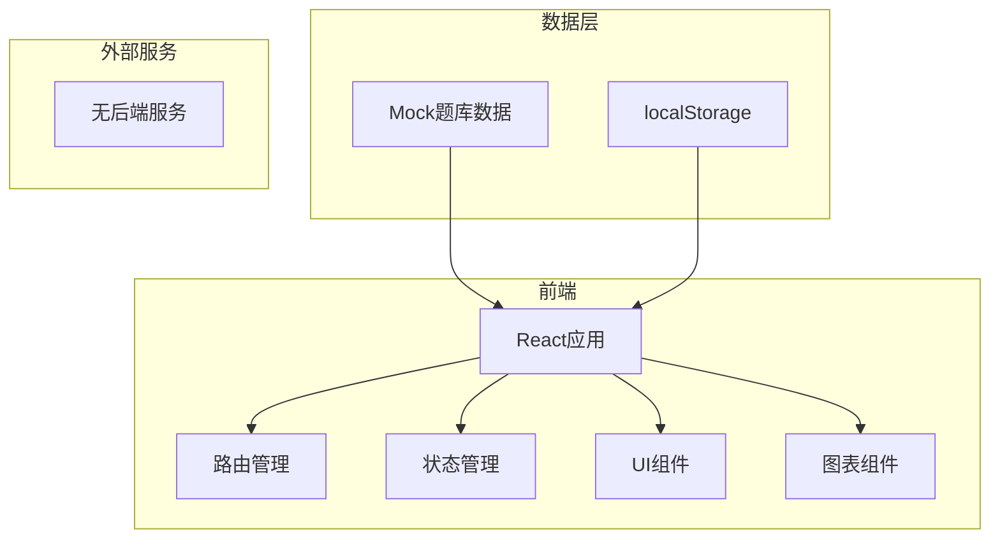
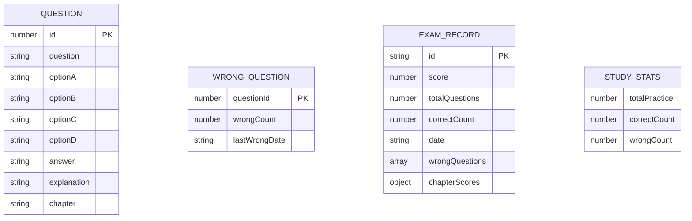

## 1. 架构设计



## 2. 技术说明
- 前端：React@18 + TypeScript + Vite
- 样式：TailwindCSS@3
- 图表：Recharts
- 状态管理：React Context + useReducer
- 路由：React Router v6
- 数据存储：localStorage（保存错题本、考试记录）
- 数据来源：前端Mock数据（1000道题库JSON）

## 3. 路由定义
| 路由 | 用途 |
|-----|------|
| / | 首页，学习概览 |
| /practice | 顺序练习页 |
| /wrong-questions | 错题本页 |
| /exam | 模拟考试页 |
| /exam/result/:id | 成绩单页 |
| /history | 历史记录页 |

## 4. 数据模型

### 4.1 数据模型定义



### 4.2 数据结构定义

```typescript
interface Question {
  id: number;
  question: string;
  optionA: string;
  optionB: string;
  optionC: string;
  optionD: string;
  answer: 'A' | 'B' | 'C' | 'D';
  explanation: string;
  chapter: string;
}

interface WrongQuestion {
  questionId: number;
  wrongCount: number;
  lastWrongDate: string;
}

interface ExamRecord {
  id: string;
  score: number;
  totalQuestions: number;
  correctCount: number;
  date: string;
  wrongQuestions: number[];
  chapterScores: Record<string, { correct: number; total: number }>;
}

interface StudyStats {
  totalPractice: number;
  correctCount: number;
  wrongCount: number;
}
```

## 5. 组件结构

```
src/
├── components/
│   ├── layout/
│   │   ├── Header.tsx
│   │   ├── Navigation.tsx
│   │   └── StatsCard.tsx
│   ├── practice/
│   │   ├── QuestionCard.tsx
│   │   ├── OptionButton.tsx
│   │   ├── ProgressBar.tsx
│   │   └── ResultDisplay.tsx
│   ├── exam/
│   │   ├── ExamTimer.tsx
│   │   ├── ExamQuestion.tsx
│   │   ├── ExamNavigator.tsx
│   │   └── ExamResult.tsx
│   ├── wrong/
│   │   ├── WrongList.tsx
│   │   └── WrongItem.tsx
│   ├── history/
│   │   ├── ScoreChart.tsx
│   │   └── HistoryList.tsx
│   └── common/
│       ├── Button.tsx
│       └── Modal.tsx
├── context/
│   └── AppContext.tsx
├── hooks/
│   └── useLocalStorage.ts
├── data/
│   └── questions.ts (Mock题库数据)
├── types/
│   └── index.ts
├── pages/
│   ├── HomePage.tsx
│   ├── PracticePage.tsx
│   ├── WrongPage.tsx
│   ├── ExamPage.tsx
│   ├── ResultPage.tsx
│   └── HistoryPage.tsx
└── utils/
    ├── storage.ts
    └── examUtils.ts
```
