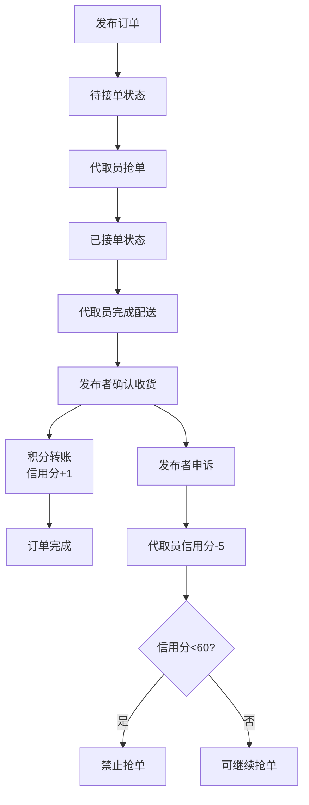

## 1. 产品概述
校园快递代取系统旨在解决校园内快递领取不便的问题，通过积分悬赏机制连接需要代取快递的用户和有时间代取的学生。
- 主要用途：用户发布快递代取需求，代取员抢单完成配送，通过积分进行交易结算
- 目标用户：在校学生，分为发布者和代取员两种角色
- 核心价值：提高校园快递领取效率，减少快递柜拥堵，为学生提供便捷的互助服务

## 2. 核心功能

### 2.1 用户角色
| 角色 | 说明 | 核心权限 |
|------|------|----------|
| 发布者 | 需要代取快递的用户 | 发布订单、确认收货、申诉投诉、查看积分和信用分 |
| 代取员 | 提供代取服务的用户 | 浏览订单、抢单、完成配送、查看积分和信用分 |

### 2.2 功能模块
1. **订单管理页面**：发布订单、订单列表展示、订单状态流转
2. **个人中心页面**：积分余额展示、信用分展示、积分变动记录、信用分变动记录
3. **订单详情弹窗**：查看订单详情、抢单操作、完成操作、确认收货操作、申诉操作

### 2.3 页面详情
| 页面名称 | 模块名称 | 功能描述 |
|----------|----------|----------|
| 订单管理页面 | 发布订单表单 | 填写快递单号、取件码、包裹大小、悬赏积分（1-10分） |
| 订单管理页面 | 订单列表 | 展示所有订单，按状态筛选（待接单、已接单、已完成） |
| 订单管理页面 | 抢单功能 | 代取员点击抢单，订单状态变为"已接" |
| 订单管理页面 | 完成配送 | 代取员送达后点击"完成" |
| 订单管理页面 | 确认收货 | 发布者确认收货，积分自动转账 |
| 订单管理页面 | 申诉功能 | 发布者可对订单进行申诉投诉 |
| 个人中心页面 | 积分展示 | 显示当前积分余额 |
| 个人中心页面 | 信用分展示 | 显示当前信用分，低于60分禁止抢单 |
| 个人中心页面 | 积分变动记录 | 展示所有积分流水记录 |
| 个人中心页面 | 信用分变动记录 | 展示所有信用分流水记录 |

## 3. 核心流程

### 3.1 订单发布与完成流程
发布者填写订单信息 → 提交订单 → 订单进入"待接单"状态 → 代取员浏览并抢单 → 订单变为"已接"状态 → 代取员取件配送 → 代取员点击"完成" → 发布者确认收货 → 积分从发布者账户转到代取员账户 → 订单变为"已完成" → 代取员信用分+1

### 3.2 申诉流程
发布者发起申诉 → 系统记录申诉 → 代取员信用分-5 → 信用分低于60分的代取员无法抢单

## 4. 用户界面设计

### 4.1 设计风格
- **主色调**：采用青春活力的橙黄色系（#FF6B35）作为主色，搭配清爽的天蓝色（#4ECDC4）作为辅助色
- **背景色**：浅灰色渐变背景，营造简洁现代的校园氛围
- **按钮风格**：圆角设计，带有微立体阴影和悬停动效
- **字体**：标题使用"PingFang SC"粗体，正文使用"Microsoft YaHei"常规体
- **布局风格**：卡片式布局，清晰的信息层级，左侧订单列表+右侧个人信息面板
- **图标风格**：线性图标，色彩鲜明，配合微动画效果

### 4.2 页面设计概述
| 页面名称 | 模块名称 | UI元素 |
|----------|----------|--------|
| 订单管理页面 | 顶部导航栏 | Logo、页面标题、个人信息入口、橙色渐变背景 |
| 订单管理页面 | 发布订单表单 | 输入框组、下拉选择、积分滑块、提交按钮、卡片悬浮效果 |
| 订单管理页面 | 订单列表 | Tab切换（待接单/已接单/已完成）、订单卡片、状态标签、操作按钮组 |
| 订单管理页面 | 订单卡片 | 快递信息展示、积分标签、状态角标、悬停上浮动画 |
| 个人中心页面 | 个人信息面板 | 头像、用户名、积分余额卡片、信用分卡片、进度条展示 |
| 个人中心页面 | 记录列表 | 积分变动记录、信用分变动记录、时间线样式 |

### 4.3 响应式设计
- 桌面端优先设计，适配1280px及以上分辨率
- 平板端：左右布局改为上下布局，订单卡片宽度自适应
- 移动端：单列布局，表单简化，按钮触控优化
- 所有交互元素确保最小44px触控区域

### 4.4 动效设计
- 页面加载：元素渐入动画，列表项依次显现
- 按钮交互：悬停时轻微放大+颜色加深，点击时缩放反馈
- 状态变化：订单状态变更时添加高亮闪烁效果
- 积分变动：积分变化时数字滚动动画
- 卡片交互：悬停时轻微上浮+阴影加深
