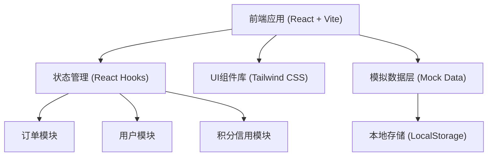
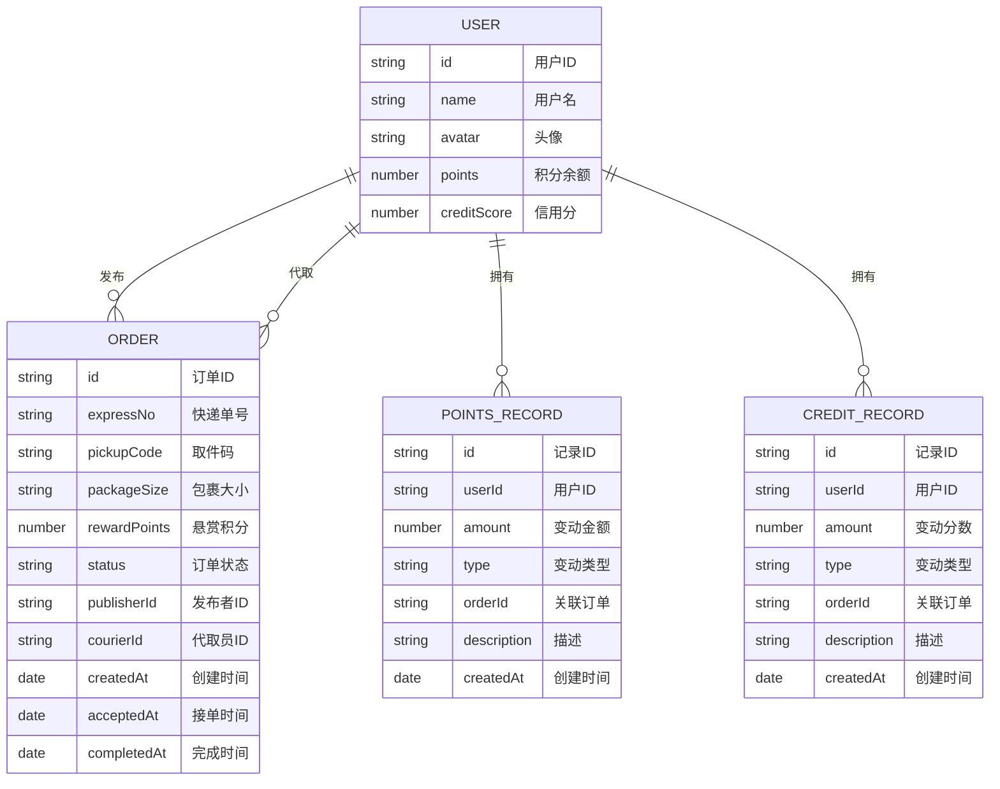

## 1. 架构设计



## 2. 技术描述
- **前端**：React@18 + TypeScript + Vite@5
- **样式**：Tailwind CSS@3
- **图标**：Lucide React
- **状态管理**：React Hooks (useState, useEffect, useContext)
- **数据持久化**：LocalStorage
- **初始化工具**：Vite 脚手架

## 3. 路由定义
| 路由 | 页面 | 说明 |
|------|------|------|
| / | 订单管理页面 | 首页，包含订单发布和订单列表 |
| /profile | 个人中心页面 | 展示积分、信用分及变动记录 |

## 4. 数据模型

### 4.1 实体关系图


### 4.2 TypeScript 类型定义

```typescript
// 用户类型
interface User {
  id: string;
  name: string;
  avatar: string;
  points: number;
  creditScore: number;
}

// 订单状态
type OrderStatus = 'pending' | 'accepted' | 'delivered' | 'completed' | 'appealed';

// 包裹大小
type PackageSize = 'small' | 'medium' | 'large';

// 订单类型
interface Order {
  id: string;
  expressNo: string;
  pickupCode: string;
  packageSize: PackageSize;
  rewardPoints: number;
  status: OrderStatus;
  publisherId: string;
  courierId?: string;
  createdAt: Date;
  acceptedAt?: Date;
  deliveredAt?: Date;
  completedAt?: Date;
}

// 积分记录类型
interface PointsRecord {
  id: string;
  userId: string;
  amount: number;
  type: 'earn' | 'spend';
  orderId: string;
  description: string;
  createdAt: Date;
}

// 信用分记录类型
interface CreditRecord {
  id: string;
  userId: string;
  amount: number;
  type: 'increase' | 'decrease';
  orderId: string;
  description: string;
  createdAt: Date;
}
```

## 5. 核心模块设计

### 5.1 订单管理模块
- **发布订单**：验证用户积分是否足够，扣减积分，创建订单
- **抢单**：验证代取员信用分≥60，更新订单状态和代取员信息
- **完成配送**：更新订单状态为"已送达"
- **确认收货**：积分转账给代取员，代取员信用分+1
- **申诉**：代取员信用分-5，记录申诉信息

### 5.2 用户信息模块
- **用户信息获取**：获取当前登录用户信息
- **积分查询**：实时展示积分余额
- **信用分查询**：实时展示信用分，低于60分时显示警告

### 5.3 记录管理模块
- **积分变动记录**：按时间倒序展示所有积分流水
- **信用分变动记录**：按时间倒序展示所有信用分流水

## 6. 模拟数据

### 6.1 初始用户数据
```typescript
const mockUsers: User[] = [
  {
    id: 'user1',
    name: '张同学',
    avatar: 'https://api.dicebear.com/7.x/avataaars/svg?seed=zhang',
    points: 100,
    creditScore: 85,
  },
  {
    id: 'user2',
    name: '李同学',
    avatar: 'https://api.dicebear.com/7.x/avataaars/svg?seed=li',
    points: 150,
    creditScore: 92,
  },
];
```

### 6.2 初始订单数据
```typescript
const mockOrders: Order[] = [
  {
    id: 'order1',
    expressNo: 'SF1234567890',
    pickupCode: '5-2-18',
    packageSize: 'medium',
    rewardPoints: 5,
    status: 'pending',
    publisherId: 'user1',
    createdAt: new Date(Date.now() - 3600000),
  },
  {
    id: 'order2',
    expressNo: 'YT0987654321',
    pickupCode: '3-1-05',
    packageSize: 'small',
    rewardPoints: 3,
    status: 'accepted',
    publisherId: 'user1',
    courierId: 'user2',
    createdAt: new Date(Date.now() - 7200000),
    acceptedAt: new Date(Date.now() - 5400000),
  },
];
```
