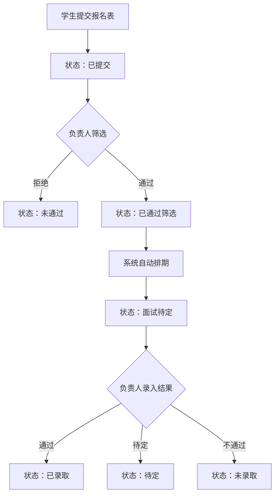

# 社团招新报名系统 PRD

## 1. 产品概述
面向高校社团招新场景的一站式管理系统，解决传统报名流程信息分散、筛选与面试排期低效的问题。
- 目标用户：在校学生（报名者）、社团负责人（审核者）
- 产品价值：统一报名表录入、自动化筛选排期、面试结果闭环管理，提升招新效率与学生体验

## 2. 核心功能

### 2.1 用户角色

| 角色 | 登录方式 | 核心权限 |
|------|----------|----------|
| 学生 | 学号登录 | 填写报名表、查看报名状态、查看面试时间地点 |
| 社团负责人 | 账号密码登录 | 查看本社团报名列表、筛选、通过/拒绝、录入面试结果、维护面试时段 |

### 2.2 功能模块
1. **首页/登录页**：角色选择、登录入口
2. **学生报名页**：报名表填写（姓名、学号、学院、第一志愿、第二志愿、自我介绍）
3. **学生状态页**：展示报名状态：已提交 / 已通过筛选 / 面试待定 / 已录取
4. **社团负责人面板**：报名列表、筛选（按学院/关键词）、通过/拒绝操作
5. **面试排期管理**：社团预设面试时段，按报名顺序自动分配；负责人录入面试结果
6. **面试信息展示**：学生端显示面试时间、地点

### 2.3 页面明细

| 页面名称 | 模块名称 | 功能描述 |
|----------|----------|----------|
| 登录页 | 角色选择 | 学生/负责人切换，学号或账号密码登录 |
| 学生报名页 | 报名表 | 姓名、学号、学院、双志愿、自我介绍，提交后进入状态流转 |
| 学生状态页 | 状态时间线 | 显示各阶段状态与面试时间地点 |
| 负责人面板-报名列表 | 列表与筛选 | 展示本社团报名人员，按学院/关键词过滤 |
| 负责人面板-审核 | 通过/拒绝 | 审核学生报名，通过后自动进入排期 |
| 负责人面板-面试时段 | 时段维护 | 社团预设面试时间段与地点 |
| 负责人面板-面试结果 | 结果录入 | 录入 通过/待定/不通过 |

## 3. 核心流程

学生提交报名表 → 负责人按学院/关键词筛选 → 通过者进入面试排期池 → 系统按报名顺序从社团预设时段中分配 → 学生查看面试信息 → 负责人录入面试结果 → 学生查看最终状态

## 4. 用户界面设计

### 4.1 设计风格
- 主色：深靛蓝 `#2D3561`，辅色：琥珀金 `#E7B86B`，中性：米白 `#F5F1E8`
- 按钮：圆角 8px，悬停带阴影上浮
- 字体：标题使用 "DM Serif Display"（展示字体），正文使用 "Noto Sans SC"
- 布局：卡片式 + 侧栏导航（负责人），单页流式（学生）
- 图标：lucide-react 线性图标

### 4.2 页面设计概览

| 页面 | 模块 | UI 元素 |
|------|------|---------|
| 登录页 | Hero | 渐变背景、双卡片角色切换、居中卡片布局 |
| 学生报名页 | 表单 | 大号输入框、浮动标签、底部固定提交条 |
| 学生状态页 | 时间线 | 垂直时间线节点、状态色点、面试卡片 |
| 负责人面板 | 列表 | 表格卡片、顶栏筛选、批量操作、行内审核按钮 |
| 面试时段 | 配置 | 可添加/删除的时段卡片，日期时间选择器 |

### 4.3 响应式
- 桌面优先（≥ 1024px）
- 平板/移动自适应，表格横向滚动
