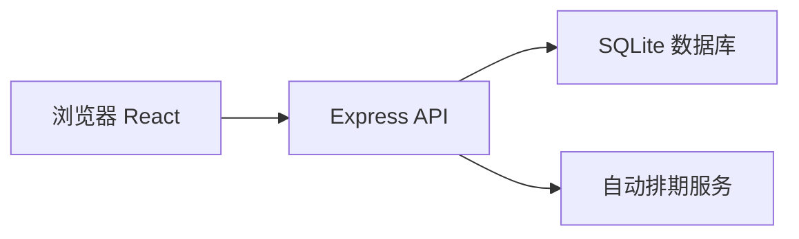
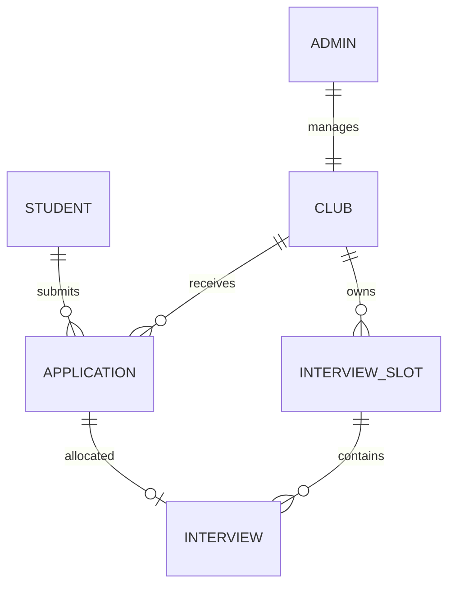

# 社团招新报名系统 技术架构

## 1. 架构设计

## 2. 技术说明
- 前端：React 18 + TypeScript + Vite + TailwindCSS + react-router-dom + zustand
- 后端：Express 4 + TypeScript
- 数据库：SQLite（better-sqlite3）
- 初始化：vite-init react-express-ts 模板

## 3. 路由定义

| 前端路由 | 用途 |
|----------|------|
| `/login` | 登录页 |
| `/student/apply` | 学生报名页 |
| `/student/status` | 学生状态页 |
| `/admin/dashboard` | 负责人报名列表 |
| `/admin/schedule` | 面试时段管理 |
| `/admin/interviews` | 面试结果录入 |

## 4. API 定义

### 4.1 学生端
- `POST /api/student/login` `{studentId, name}` → `{token, student}`
- `POST /api/applications` 提交报名表
- `GET /api/applications/my` 获取本人报名与状态
- `GET /api/clubs` 获取可选社团列表

### 4.2 负责人端
- `POST /api/admin/login` `{username, password}` → `{token, admin, clubId}`
- `GET /api/admin/applications?clubId=&college=&keyword=`
- `POST /api/admin/applications/:id/review` `{status: 'approved'|'rejected'}`
- `GET /api/admin/slots?clubId=`
- `POST /api/admin/slots`
- `DELETE /api/admin/slots/:id`
- `GET /api/admin/interviews?clubId=`
- `POST /api/admin/interviews/:id/result` `{result: 'pass'|'pending'|'fail'}`

## 5. 数据模型

### 5.1 表结构

- `students(id, student_id, name, college)`
- `admins(id, username, password, club_id)`
- `clubs(id, name, description, location)`
- `applications(id, student_id, club_1_id, club_2_id, intro, status, created_at)`
  - status: `submitted | approved | rejected | interview | admitted | pending | failed`
- `interview_slots(id, club_id, date, start_time, end_time, capacity, location)`
- `interviews(id, application_id, slot_id, result, created_at)`
  - result: `pass | pending | fail`

## 6. 核心业务规则
- 通过筛选后系统自动为该申请分配该社团下一个可用的面试时段（按报名顺序）
- 一个时段满员则自动顺延至下一时段
- 面试结果录入后学生状态同步更新
