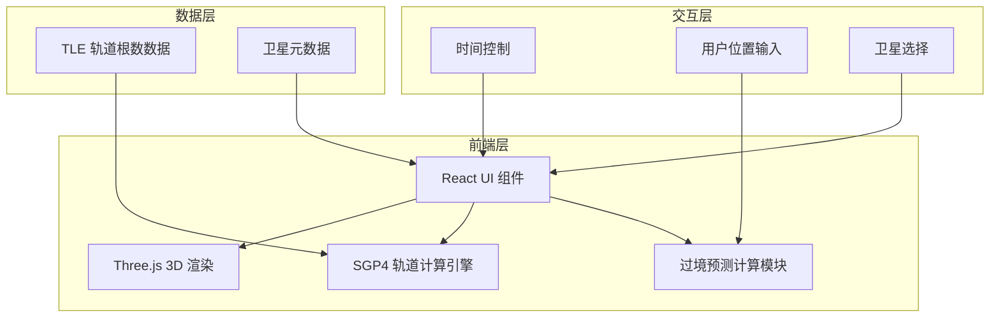

## 1. 架构设计



## 2. 技术说明

- **前端框架**：React@18 + TypeScript
- **3D渲染**：Three.js + @react-three/fiber + @react-three/drei
- **样式方案**：Tailwind CSS@3
- **构建工具**：Vite
- **轨道计算**：自实现简化版SGP4算法（预置TLE数据）
- **后端**：无（纯前端，所有计算在浏览器端完成）
- **地图**：简易Canvas 2D世界地图（用于点选位置）

## 3. 路由定义

| 路由 | 用途 |
|------|------|
| / | 主页面（3D轨道可视化+所有功能面板） |

## 4. 项目目录结构

```
src/
├── main.tsx                    # 应用入口
├── App.tsx                     # 根组件
├── components/
│   ├── Scene/                  # 3D场景组件
│   │   ├── Earth.tsx           # 地球模型
│   │   ├── Satellite.tsx       # 卫星标记
│   │   ├── OrbitLine.tsx       # 轨道线
│   │   ├── StarField.tsx       # 星空背景
│   │   └── SceneContainer.tsx  # 场景容器
│   ├── Panels/                 # 信息面板组件
│   │   ├── SatelliteSelector.tsx   # 卫星选择面板
│   │   ├── PositionInfo.tsx        # 位置信息面板
│   │   ├── PassPrediction.tsx      # 过境预测面板
│   │   └── UserLocation.tsx        # 用户位置设置
│   ├── Controls/               # 控制组件
│   │   ├── TimeControl.tsx     # 时间加速控制
│   │   └── MapPicker.tsx       # 地图点选器
│   └── UI/                     # 通用UI组件
│       ├── GlassPanel.tsx      # 玻璃态面板
│       └── GlowButton.tsx      # 发光按钮
├── core/
│   ├── sgp4.ts                 # SGP4轨道计算核心
│   ├── passes.ts               # 过境预测计算
│   ├── constants.ts            # 物理常量
│   └── coordinate.ts           # 坐标转换（TEME→经纬度）
├── data/
│   ├── satellites.ts           # 卫星TLE数据与元信息
│   └── tle.ts                  # TLE解析器
├── hooks/
│   ├── useSatellite.ts         # 卫星状态Hook
│   ├── useTimeControl.ts       # 时间控制Hook
│   └── useUserLocation.ts      # 用户位置Hook
├── types/
│   └── index.ts                # TypeScript类型定义
└── utils/
    └── math.ts                 # 数学工具函数
```

## 5. 核心模块设计

### 5.1 SGP4轨道计算核心

- 输入：TLE两行轨道根数 + 时间戳
- 输出：TEME坐标系下的位置向量(x,y,z)和速度向量(vx,vy,vz)
- 实现SGP4简化版，包含主要摄动项（地球扁率J2、大气阻力等）
- 预置10颗卫星的TLE数据（使用2025年近期数据）

### 5.2 坐标转换模块

- TEME → ECI → ECEF → LLA（经纬度高度）
- 基于格林尼治恒星时(GST)计算地球自转
- 考虑地球扁率(WGS84椭球模型)

### 5.3 过境预测计算

- 输入：卫星轨道、用户观测位置（经纬度）、时间范围
- 输出：每日过境事件列表（时间、最大仰角、方位角、亮度估算）
- 算法：逐分钟计算卫星相对于观测者的仰角，检测仰角>0°的连续区间
- 亮度估算：基于卫星尺寸、高度角、与太阳的相位角

### 5.4 预置卫星数据

| 卫星名称 | NORAD ID | 类型 | 亮度等级 |
|---------|----------|------|---------|
| ISS（国际空间站） | 25544 | 载人空间站 | -4.0 |
| 哈勃空间望远镜 | 20580 | 太空望远镜 | 2.0 |
| 北斗-3 M1 | 43001 | 导航卫星 | 4.0 |
| 天宫空间站 | 48274 | 空间站 | -1.0 |
| GPS IIF-12 | 41019 | 导航卫星 | 3.5 |
| GLONASS-M | 46095 | 导航卫星 | 3.0 |
| 星链-1007 | 44713 | 通信卫星 | 3.0 |
| NOAA-19 | 33591 | 气象卫星 | 3.5 |
| Landsat 9 | 49260 | 对地观测 | 4.0 |
| 詹姆斯·韦伯 | 50463 | 太空望远镜 | 不可见 |

## 6. 数据模型

无数据库需求。所有数据均为前端静态预置（TLE轨道根数）和实时计算结果。
