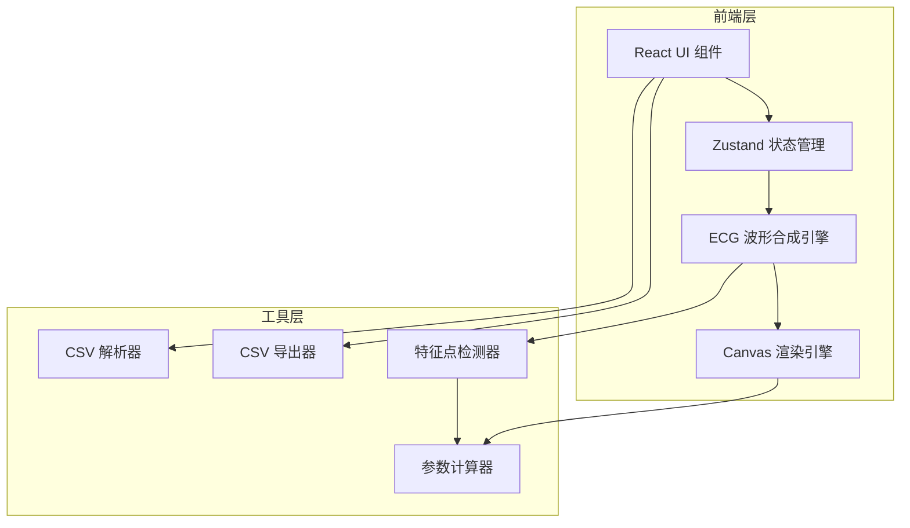

## 1. 架构设计



## 2. 技术说明

- **前端**: React@18 + TypeScript + Tailwind CSS@3 + Vite
- **初始化工具**: vite-init (react-ts 模板)
- **后端**: 无（纯前端应用）
- **数据库**: 无（所有数据在内存中处理）
- **状态管理**: Zustand
- **图标**: lucide-react

## 3. 路由定义

| 路由 | 用途 |
|------|------|
| / | ECG模拟主页，包含所有功能模块 |

## 4. API定义

无后端API，所有逻辑在前端完成。

## 5. 服务器架构图

不适用（纯前端项目）

## 6. 数据模型

### 6.1 核心数据结构定义

```typescript
type RhythmType = 'normal' | 'tachycardia' | 'bradycardia' | 'atrial_fibrillation'

interface ECGConfig {
  rhythmType: RhythmType
  heartRate: number
  isPlaying: boolean
  speed: number
}

interface FeaturePoint {
  type: 'P' | 'QRS' | 'T'
  timeOffset: number
  amplitude: number
  duration: number
}

interface WaveformParameters {
  prInterval: number
  qrsDuration: number
  qtInterval: number
  rrInterval: number
}

interface ECGDataPoint {
  time: number
  voltage: number
}

interface RhythmStats {
  bpm: number
  isRegular: boolean
  rrIntervals: number[]
}
```

### 6.2 波形合成算法架构

波形合成采用模块化设计，每种心律类型由独立的参数配置驱动：

- **P波**: 高斯脉冲模拟，宽度和幅度由心律类型决定
- **QRS波群**: 由Q波（负向高斯）+ R波（正向高斯）+ S波（负向高斯）组合
- **T波**: 宽高斯脉冲，幅度和宽度可调
- **基线**: 微弱正弦漂移模拟呼吸伪差
- **房颤**: 去除P波，添加不规则 fibrillatory 小波（高频低幅正弦叠加），RR间期随机化

各波形参数根据心律类型预设：

| 参数 | 正常窦性 | 窦性心动过速 | 窦性心动过缓 | 房颤 |
|------|----------|------------|------------|------|
| 心率(bpm) | 72 | 120 | 45 | 不规则(60-140) |
| PR间期(ms) | 160 | 140 | 180 | 无 |
| QRS时限(ms) | 80 | 80 | 80 | 80 |
| QT间期(ms) | 380 | 320 | 440 | 不定 |
| P波 | 有 | 有 | 有 | 无(代以f波) |
| 节律 | 规整 | 规整 | 规整 | 不规整 |

### 6.3 模块文件结构

```
src/
├── components/
│   ├── ECGCanvas.tsx          # Canvas波形渲染组件
│   ├── RhythmSelector.tsx     # 心律类型选择器
│   ├── PlaybackControls.tsx   # 播放控制（播放/暂停/速度）
│   ├── StatsPanel.tsx         # 心率节律统计面板
│   ├── Tooltip.tsx            # 波形参数悬停提示
│   └── ImportExport.tsx       # CSV导入导出按钮组
├── hooks/
│   ├── useECGAnimation.ts     # Canvas动画循环hook
│   └── useFeatureDetection.ts # 特征点检测hook
├── utils/
│   ├── ecgSynthesis.ts        # ECG波形合成算法核心
│   ├── featureDetector.ts     # 特征点检测算法
│   ├── parameterCalculator.ts # 波形参数计算
│   ├── csvParser.ts           # CSV解析
│   └── csvExporter.ts         # CSV导出
├── store/
│   └── ecgStore.ts            # Zustand状态管理
├── types/
│   └── ecg.ts                 # TypeScript类型定义
├── pages/
│   └── Home.tsx               # 主页面
├── App.tsx
└── main.tsx
```
