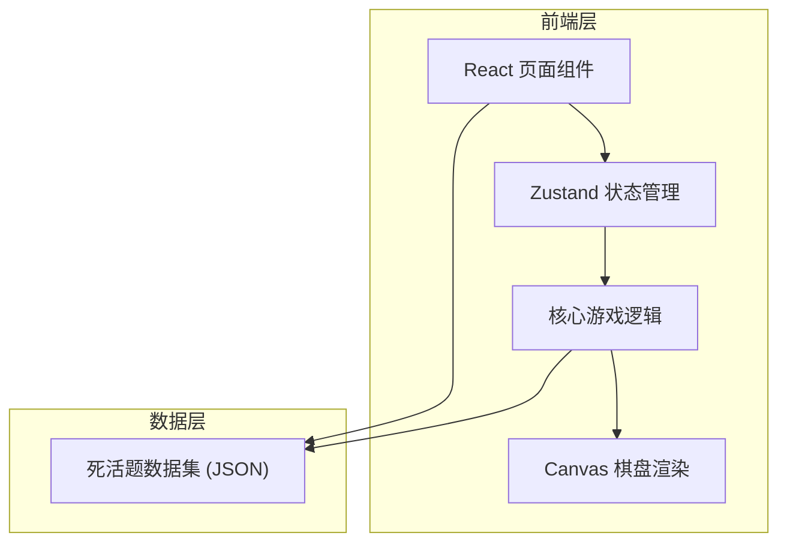
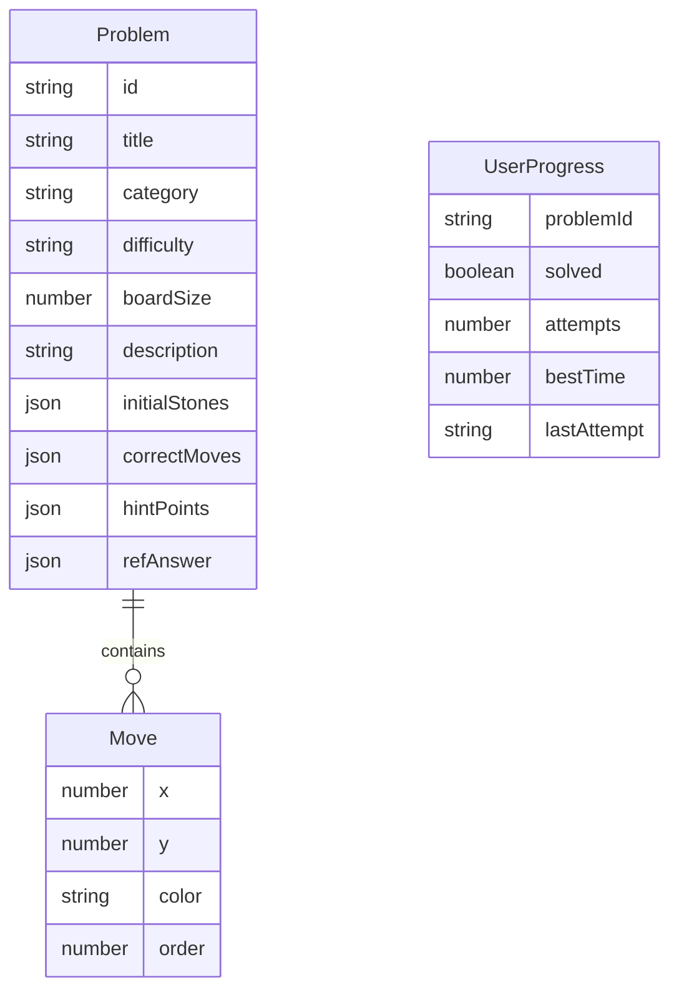

## 1. 架构设计



## 2. 技术说明
- 前端：React@18 + TypeScript + Tailwind CSS@3 + Vite
- 初始化工具：vite-init
- 后端：无（纯前端应用）
- 数据库：无（本地JSON数据集 + localStorage持久化进度）

## 3. 路由定义
| 路由 | 用途 |
|------|------|
| / | 题目列表页面，展示所有题目及分类筛选 |
| /practice/:id | 练习页面，根据题目ID加载对应死活题 |

## 4. API定义
- 无后端API，所有数据内置于前端

## 5. 服务器架构图
- 不适用，纯前端项目

## 6. 数据模型

### 6.1 数据模型定义



### 6.2 数据定义

**Problem（题目）数据结构：**
```typescript
interface Stone {
  x: number;
  y: number;
  color: 'black' | 'white';
}

interface Move {
  x: number;
  y: number;
  color: 'black' | 'white';
  order: number;
}

interface Problem {
  id: string;
  title: string;
  category: 'corner' | 'edge' | 'center';
  difficulty: 'beginner' | 'intermediate' | 'advanced';
  boardSize: 9 | 13 | 19;
  description: string;
  initialStones: Stone[];
  correctMoves: Move[];
  hintPoints: { x: number; y: number }[];
  refAnswer: Move[];
  playerColor: 'black' | 'white';
}
```

**UserProgress（用户进度）数据结构：**
```typescript
interface UserProgress {
  problemId: string;
  solved: boolean;
  attempts: number;
  bestTime: number;
  lastAttemptAt: string;
}
```

数据存储于localStorage，key为`go-tsumego-progress`。

## 7. 核心模块划分

| 模块 | 职责 |
|------|------|
| `src/data/problems.ts` | 50道死活题数据集 |
| `src/store/gameStore.ts` | Zustand全局状态（当前题目、棋盘状态、计时器、进度） |
| `src/components/GoBoard.tsx` | Canvas棋盘渲染组件（含落子动画） |
| `src/components/ProblemInfo.tsx` | 题目信息展示组件 |
| `src/components/GameControls.tsx` | 操作按钮组件 |
| `src/components/StatsPanel.tsx` | 统计信息组件 |
| `src/components/ProblemList.tsx` | 题目列表组件 |
| `src/components/CategoryFilter.tsx` | 分类筛选组件 |
| `src/pages/HomePage.tsx` | 首页（题目列表） |
| `src/pages/PracticePage.tsx` | 练习页 |
| `src/utils/boardRenderer.ts` | Canvas绘制工具函数 |
| `src/utils/gameLogic.ts` | 围棋规则判定工具（提子、禁着等） |
| `src/types/index.ts` | TypeScript类型定义 |
