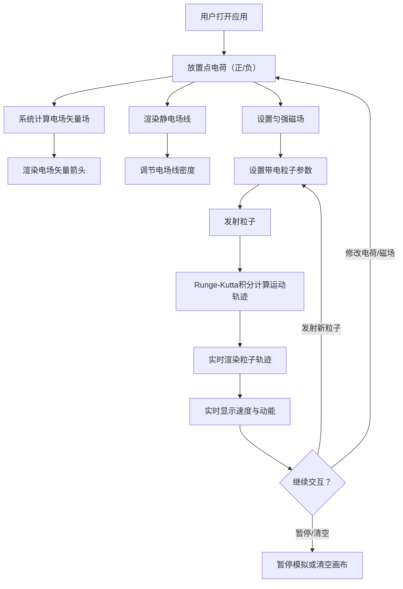

## 1. 产品概述

电磁场模拟器是一款交互式物理仿真应用，允许用户在二维画布上自由放置正负点电荷、配置匀强磁场，并发射带电粒子观察其在电磁场中的运动轨迹。系统实时计算电场矢量场、静电场线，并通过 Runge-Kutta 积分精确模拟粒子运动，同时实时显示粒子速度与动能。

- 目标用户：物理学习者、教师、科普爱好者
- 核心价值：将抽象的电磁场概念可视化，通过交互操作加深对电场、磁场和带电粒子运动的理解

## 2. 核心功能

### 2.1 功能模块

1. **模拟画布页**：主交互区域，包含画布渲染层、控制面板、实时数据显示

### 2.2 页面详情

| 页面名称 | 模块名称 | 功能描述 |
|----------|----------|----------|
| 模拟画布页 | 画布渲染层 | 渲染电场矢量箭头、静电场线、粒子轨迹、电荷图标、磁场方向指示 |
| 模拟画布页 | 电荷放置工具 | 点击画布放置正/负电荷，支持拖拽移动、删除、调节电荷量 |
| 模拟画布页 | 磁场控制面板 | 设置匀强磁场强度和方向（垂直屏幕向内/向外），实时更新场显示 |
| 模拟画布页 | 粒子发射器 | 设置粒子初始位置、速度方向、电荷量、质量，点击发射粒子 |
| 模拟画布页 | 参数面板 | 调节电场线密度、矢量场网格密度、模拟速度等参数 |
| 模拟画布页 | 实时数据面板 | 显示选中粒子的速度（vx, vy, |v|）、动能、位置坐标 |
| 模拟画布页 | 工具栏 | 选择当前工具（放置电荷、发射粒子、选择/移动）、清空、暂停/继续 |

## 3. 核心流程

用户打开应用后，在画布上放置正负点电荷，系统自动计算并在网格点上显示电场矢量箭头，同时渲染从正电荷指向负电荷的静电场线。用户可添加匀强磁场（方向可调），然后设置带电粒子参数并发射。粒子在电磁场中运动，轨迹实时渲染，同时数据面板实时更新粒子速度与动能。

## 4. 用户界面设计

### 4.1 设计风格

- **主色调**：深邃太空黑（#0a0e1a）作为画布背景，模拟宇宙真空环境
- **辅助色**：电场蓝（#00d4ff）用于正电荷和电场线，磁场紫（#a855f7）用于磁场指示，粒子橙（#ff6b35）用于运动轨迹
- **按钮风格**：圆角胶囊型按钮，带微妙发光效果
- **字体**：JetBrains Mono 用于数据显示，Outfit 用于界面文字
- **布局**：左侧为主画布（占70%宽度），右侧为控制面板（30%宽度），顶部窄工具栏
- **图标**：lucide-react 图标库

### 4.2 页面设计概览

| 页面名称 | 模块名称 | UI元素 |
|----------|----------|--------|
| 模拟画布页 | 画布渲染层 | 深色背景Canvas，矢量箭头半透明蓝，场线渐变色，轨迹发光橙线 |
| 模拟画布页 | 工具栏 | 顶部水平栏，图标按钮组，当前工具高亮 |
| 模拟画布页 | 控制面板 | 右侧竖向面板，分区折叠面板，滑块+数字输入 |
| 模拟画布页 | 数据面板 | 右侧面板底部，等宽字体数字，带单位标签 |

### 4.3 响应式设计

- 桌面优先设计，画布区自适应窗口大小
- 控制面板在小屏幕下可折叠为抽屉式
- 支持鼠标滚轮缩放画布、拖拽平移

### 4.4 物理仿真细节

- **电场计算**：E = kQ/r²，叠加原理合成多点电荷场
- **磁场**：匀强磁场 B = B_z ẑ（垂直屏幕方向）
- **粒子运动**：洛伦兹力 F = q(E + v × B)，四阶 Runge-Kutta 积分
- **场线渲染**：从正电荷出发沿电场方向追踪，到负电荷或画布边界终止
- **矢量场**：在均匀网格点上计算 E 并以箭头显示方向和相对大小
