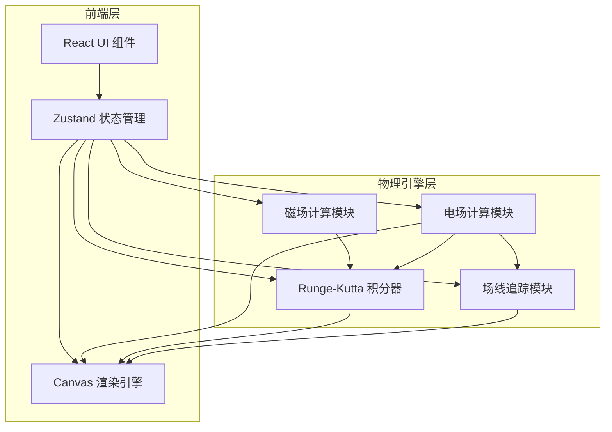
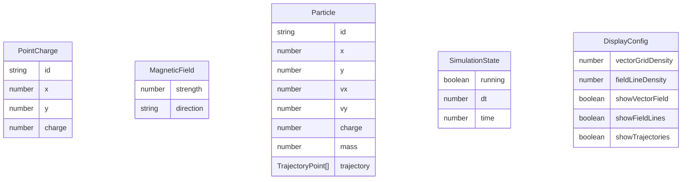

## 1. 架构设计



## 2. 技术说明

- **前端**：React@18 + TypeScript + TailwindCSS@3 + Vite
- **初始化工具**：vite-init（react-ts 模板）
- **后端**：无（纯前端物理模拟）
- **状态管理**：Zustand
- **渲染**：HTML5 Canvas 2D（高性能矢量场和轨迹渲染）
- **图标**：lucide-react

## 3. 路由定义

| 路由 | 用途 |
|------|------|
| / | 模拟器主页（单页应用） |

## 4. 模块架构

### 4.1 物理引擎模块 (`src/utils/physics/`)

- **`electricField.ts`**：点电荷电场计算、叠加场计算、矢量场网格采样
- **`magneticField.ts`**：匀强磁场定义和力计算
- **`rk4Integrator.ts`**：四阶 Runge-Kutta 积分器，处理带电粒子在电磁场中的运动
- **`fieldLineTracer.ts`**：静电场线追踪算法，从正电荷出发追踪至负电荷或边界

### 4.2 渲染模块 (`src/utils/rendering/`)

- **`canvasRenderer.ts`**：Canvas 渲染主控，协调各渲染层
- **`vectorFieldRenderer.ts`**：电场矢量箭头渲染
- **`fieldLineRenderer.ts`**：静电场线渲染
- **`particleRenderer.ts`**：粒子位置和轨迹渲染
- **`chargeRenderer.ts`**：点电荷图标渲染
- **`gridRenderer.ts`**：背景网格渲染

### 4.3 状态管理 (`src/store/`)

- **`useSimulationStore.ts`**：核心 Zustand store，管理电荷列表、磁场参数、粒子列表、模拟状态、渲染参数

### 4.4 组件结构 (`src/components/`)

- **`SimulatorCanvas.tsx`**：主画布组件，处理鼠标交互和 Canvas 渲染循环
- **`Toolbar.tsx`**：顶部工具栏，工具选择和全局操作
- **`ChargePanel.tsx`**：电荷控制面板
- **`MagneticFieldPanel.tsx`**：磁场设置面板
- **`ParticleLauncher.tsx`**：粒子发射器面板
- **`DisplaySettings.tsx`**：渲染参数设置面板
- **`ParticleDataPanel.tsx`**：粒子实时数据显示面板

### 4.5 数据模型



### 4.6 关键算法

**四阶 Runge-Kutta 积分器**：

```
状态向量: [x, y, vx, vy]
加速度: a = (q/m) * (E + v × B)

k1 = f(t, y)
k2 = f(t + dt/2, y + dt*k1/2)
k3 = f(t + dt/2, y + dt*k2/2)
k4 = f(t + dt, y + dt*k3)
y_next = y + (dt/6)*(k1 + 2*k2 + 2*k3 + k4)
```

**场线追踪**：
- 从正电荷表面均匀分布的起始点出发
- 沿电场方向以小步长前进（自适应步长）
- 终止条件：到达负电荷附近、场强趋近零、到达画布边界
- 每条场线记录路径点序列用于渲染
