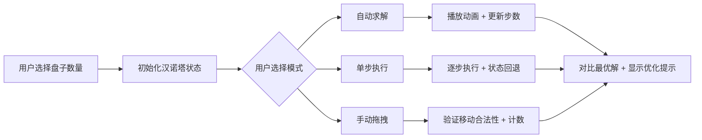

## 1. 产品概述

汉诺塔可视化学习工具，通过交互式可视化帮助用户理解递归算法原理，支持自动求解、单步执行和手动操作三种模式。

- 核心目标：直观展示汉诺塔问题的递归解法，对比最优解与手动操作效率
- 目标用户：编程学习者、算法爱好者、计算机科学教育者
- 产品价值：将抽象的递归算法转化为可视化、可交互的学习体验

## 2. 核心功能

### 2.1 功能模块

1. **主可视化区**：三根柱子 + 可拖拽盘子
2. **控制面板**：速度调节、播放控制、单步执行
3. **信息面板**：步数统计、优化提示、递归树展示
4. **设置区**：盘子数量调节（3-8个）

### 2.2 页面详情

| 页面名称 | 模块名称 | 功能描述 |
|-----------|-------------|---------------------|
| 主页面 | 可视化区 | 三根柱子，不同颜色盘子，支持拖拽移动 |
| 主页面 | 控制面板 | 播放/暂停、速度调节(快/中/慢)、上一步/下一步 |
| 主页面 | 信息面板 | 当前步数/总步数、最优步数对比、优化比例 |
| 主页面 | 递归树 | 展示当前递归深度、调用栈信息 |
| 主页面 | 设置区 | 盘子数量选择(3-8)、重置按钮 |

## 3. 核心流程

## 4. 用户界面设计

### 4.1 设计风格
- **主色调**：深蓝 (#1e3a5f) - 代表智慧与算法
- **辅助色**：渐变色系盘子（从暖到冷区分大小）
- **按钮风格**：圆角矩形，悬浮时轻微放大，色彩过渡动画
- **字体**：现代无衬线字体，标题加粗，正文清晰易读
- **布局风格**：卡片式布局，清晰的视觉层次
- **图标风格**：简洁线性图标，来自 lucide-react

### 4.2 页面设计概述

| 页面名称 | 模块名称 | UI元素 |
|-----------|-------------|-------------|
| 主页面 | 可视化区 | 深色背景，渐变柱子，彩色盘子，平滑动画 |
| 主页面 | 控制面板 | 圆角按钮组，速度选择器，状态指示器 |
| 主页面 | 信息面板 | 统计卡片，进度条，递归树树形结构 |
| 主页面 | 设置区 | 数字选择器，重置按钮 |

### 4.3 响应性
- 桌面端优先设计，自适应宽度
- 移动端：垂直堆叠布局，简化控制按钮
- 触摸优化：增大可点击区域

## 5. 数据与状态

### 5.1 核心数据模型
- 盘子状态：三维数组表示三根柱子上的盘子
- 移动历史：记录每一步操作，支持回退
- 递归调用栈：记录算法执行状态
- 用户操作计数：区分自动与手动步数
