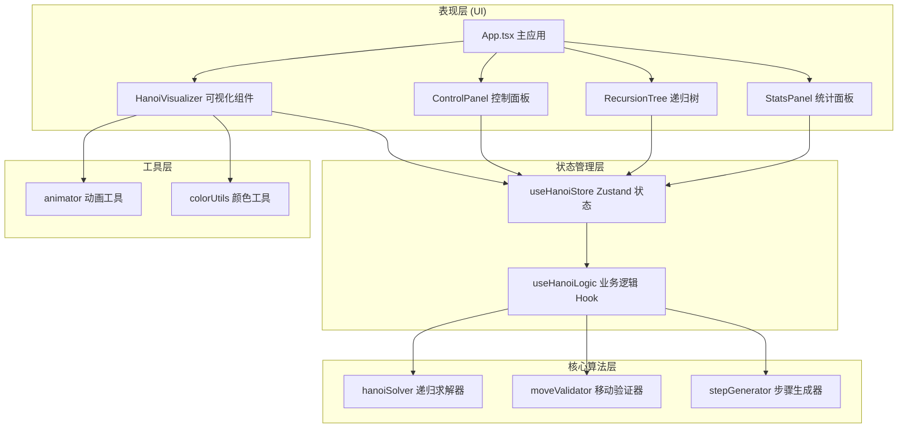

## 1. 架构设计



## 2. 技术描述

- **前端框架**：React@18 + TypeScript
- **构建工具**：Vite
- **样式方案**：TailwindCSS@3
- **状态管理**：Zustand
- **图标库**：lucide-react

## 3. 目录结构

```
src/
├── components/
│   ├── HanoiVisualizer/
│   │   ├── index.tsx
│   │   ├── Rod.tsx
│   │   └── Disk.tsx
│   ├── ControlPanel/
│   │   └── index.tsx
│   ├── RecursionTree/
│   │   └── index.tsx
│   └── StatsPanel/
│       └── index.tsx
├── hooks/
│   ├── useHanoiLogic.ts
│   └── useAnimation.ts
├── store/
│   └── useHanoiStore.ts
├── utils/
│   ├── hanoiSolver.ts
│   ├── colorUtils.ts
│   └── validator.ts
├── types/
│   └── hanoi.ts
├── App.tsx
└── main.tsx
```

## 4. 核心数据类型定义

```typescript
// 盘子类型
interface Disk {
  id: number;
  size: number;
  color: string;
}

// 柱子标识
type RodId = 'A' | 'B' | 'C';

// 移动步骤
interface MoveStep {
  from: RodId;
  to: RodId;
  disk: number;
  description: string;
}

// 递归调用节点
interface RecursionNode {
  id: string;
  n: number;
  from: RodId;
  to: RodId;
  aux: RodId;
  depth: number;
  isActive: boolean;
  isCompleted: boolean;
}

// 游戏状态
interface HanoiState {
  diskCount: number;
  rods: Record<RodId, Disk[]>;
  currentStep: number;
  totalSteps: number;
  manualSteps: number;
  isPlaying: boolean;
  speed: 'slow' | 'medium' | 'fast';
  moveHistory: MoveStep[];
  optimalSteps: number;
  recursionStack: RecursionNode[];
  solutionSteps: MoveStep[];
}
```

## 5. 核心算法

### 5.1 汉诺塔递归求解器

```typescript
function hanoi(n: number, from: RodId, to: RodId, aux: RodId): MoveStep[] {
  const steps: MoveStep[] = [];
  
  function solve(n: number, from: RodId, to: RodId, aux: RodId) {
    if (n === 0) return;
    solve(n - 1, from, aux, to);
    steps.push({ from, to, disk: n, description: `移动盘子 ${n} 从 ${from} 到 ${to}` });
    solve(n - 1, aux, to, from);
  }
  
  solve(n, from, to, aux);
  return steps;
}
```

### 5.2 最优步数计算

```typescript
function calculateOptimalSteps(n: number): number {
  return Math.pow(2, n) - 1;
}
```

## 6. 职责分层原则

| 层级 | 职责 | 不应该做的事 |
|------|------|-------------|
| 组件层 | 渲染UI、处理用户交互 | 不包含业务逻辑、不直接操作算法 |
| Hook层 | 组合业务逻辑、管理副作用 | 不直接渲染UI、不定义状态结构 |
| Store层 | 状态存储、状态更新接口 | 不包含复杂业务逻辑 |
| 算法层 | 纯函数计算、数据转换 | 不依赖React、不处理UI |
| 工具层 | 通用工具函数 | 不包含业务逻辑 |
