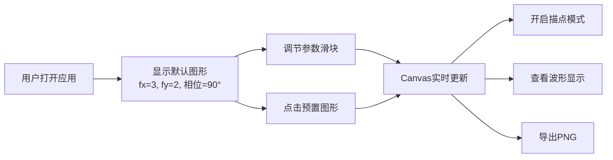

## 1. 产品概述
李萨如图形合成器是一款基于Web的科学可视化工具，通过调节X/Y轴频率和相位差参数，实时生成优美的李萨如图形。适用于物理教学、信号处理学习、以及艺术创作场景。

- 核心目标：提供直观、高性能的李萨如图形交互体验
- 目标用户：学生、教师、工程师、数字艺术爱好者
- 产品价值：将抽象的数学物理概念转化为可视化、可交互的动态图形

## 2. 核心功能

### 2.1 用户角色
| 角色 | 注册方式 | 核心权限 |
|------|----------|----------|
| 访客用户 | 无需注册 | 使用全部功能，本地调节参数，导出图形 |

### 2.2 功能模块
1. **主界面**：Canvas绘图区 + 参数控制面板 + 波形显示区
2. **参数控制模块**：X/Y轴频率滑块、相位差滑块、频率比显示
3. **预置图形模块**：圆形、八字形、无限形等经典图形一键加载
4. **动态描点模块**：显示运动点随时间在轨迹上移动
5. **波形显示模块**：独立显示x(t)和y(t)的正弦波形
6. **导出模块**：将当前图形导出为PNG图片

### 2.3 页面详情
| 页面名称 | 模块名称 | 功能描述 |
|---------|---------|----------|
| 主页面 | Canvas绘图区 | 实时绘制李萨如图形，支持动态描点模式 |
| 主页面 | 参数控制面板 | 三个滑块控制X频率(1-20Hz)、Y频率(1-20Hz)、相位差(0-360°)，显示最简频率比 |
| 主页面 | 预置图形选择器 | 6-8种经典李萨如图形预设，点击一键应用参数 |
| 主页面 | 波形显示区 | 分上下两部分显示X轴和Y轴的正弦波随时间变化 |
| 主页面 | 工具栏 | 描点模式开关、波形显示开关、导出PNG按钮 |

## 3. 核心流程
用户打开应用 → 查看默认李萨如图形 → 调节参数观察图形变化 → 或点击预置图形快速体验 → 开启描点模式观察运动轨迹 → 查看波形理解物理原理 → 导出满意的图形为PNG。

## 4. 用户界面设计

### 4.1 设计风格
- **主色调**：深色科技风格，深空蓝(#0a0e17)为背景，霓虹青(#00f5d4)为图形颜色，辅以洋红(#ff006e)和金黄(#ffbe0b)作为强调色
- **按钮风格**：圆角8px，渐变边框，hover时有发光效果
- **字体**：主要使用JetBrains Mono（等宽字体增强科技感），标题使用Orbitron
- **布局风格**：三栏式布局（左控制面板 + 中央Canvas + 右波形区），卡片式分组，玻璃拟态面板
- **图标风格**：使用Lucide图标库，线性风格，颜色与主题一致

### 4.2 页面设计概述
| 页面名称 | 模块名称 | UI元素 |
|---------|---------|--------|
| 主页面 | 顶部标题栏 | 应用Logo、标题、主题切换、导出按钮 |
| 主页面 | 左侧控制面板 | 参数滑块组、频率比显示、预置图形网格 |
| 主页面 | 中央绘图区 | 大尺寸Canvas、网格背景、坐标轴线、图形发光效果 |
| 主页面 | 右侧波形区 | 两个小型Canvas分别显示X/Y波形，时间轴滚动效果 |
| 主页面 | 底部工具栏 | 描点开关、波形开关、重置按钮 |

### 4.3 响应性
- 桌面端（≥1280px）：三栏布局完整显示
- 平板端（768-1279px）：波形区折叠至底部，控制面板与绘图区左右排列
- 移动端（<768px）：垂直堆叠布局，控制面板在上，绘图区居中，波形区可折叠

### 4.4 视觉动效
- 页面加载：元素渐入动画，滑块从左到右滑入
- 参数调节：图形平滑过渡而非跳变
- 描点模式：运动点带有拖尾效果
- 按钮交互：hover时缩放1.05倍，点击时有波纹效果
- 波形显示：时间轴从右向左平滑滚动
