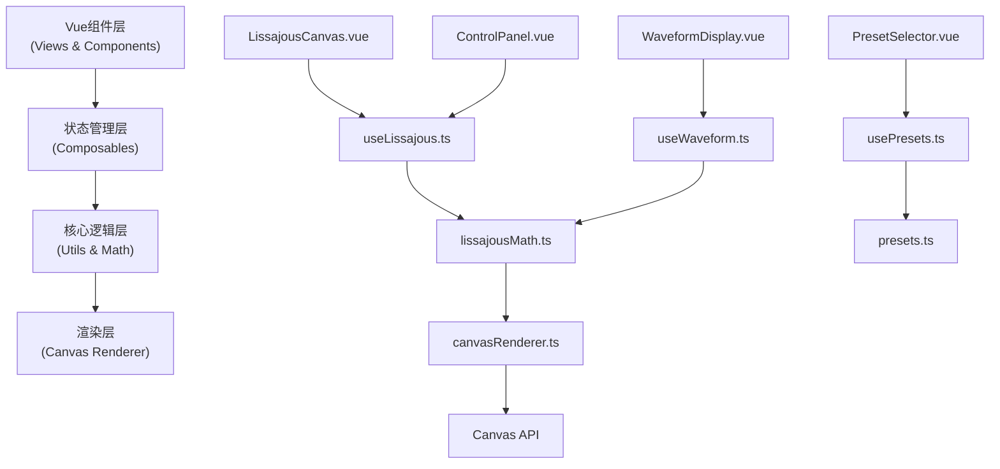

## 1. 架构设计
纯前端单页应用，采用分层架构设计，确保代码可维护性和扩展性。



## 2. 技术描述
- **前端框架**：Vue 3.4 + TypeScript 5.0 + Vite 5.0
- **样式方案**：TailwindCSS 3.4 + CSS Variables（主题系统）
- **状态管理**：Vue Composition API + 自定义Composables（无需Pinia）
- **图标库**：lucide-vue-next
- **构建工具**：Vite
- **部署目标**：纯静态资源，可部署于任何静态服务器

### 目录结构
```
src/
├── components/
│   ├── LissajousCanvas.vue    # 主Canvas绘图组件
│   ├── ControlPanel.vue       # 参数控制面板
│   ├── WaveformDisplay.vue    # 波形显示组件
│   ├── PresetSelector.vue     # 预置图形选择器
│   ├── ParameterSlider.vue    # 可复用滑块组件
│   └── Toolbar.vue            # 工具栏组件
├── composables/
│   ├── useLissajous.ts        # 李萨如图形核心状态与逻辑
│   ├── useWaveform.ts         # 波形数据生成逻辑
│   ├── usePresets.ts          # 预置图形管理
│   └── useCanvasRenderer.ts   # Canvas渲染封装
├── utils/
│   ├── lissajousMath.ts       # 数学计算工具
│   ├── canvasUtils.ts         # Canvas辅助函数
│   └── gcd.ts                 # 最大公约数计算（频率比）
├── types/
│   └── index.ts               # TypeScript类型定义
├── App.vue                    # 根组件
├── main.ts                    # 入口文件
└── style.css                  # 全局样式与主题变量
```

## 3. 技术关键设计

### 3.1 核心数据结构
```typescript
interface LissajousParams {
  fx: number;           // X轴频率 1-20
  fy: number;           // Y轴频率 1-20
  phase: number;        // 相位差 0-360
  amplitude: number;    // 振幅 0-1
}

interface Point {
  x: number;
  y: number;
  t: number;            // 时间戳
}

interface Preset {
  id: string;
  name: string;
  icon: string;
  params: LissajousParams;
  description: string;
}

interface FrequencyRatio {
  x: number;
  y: number;
  string: string;       // 如 "3:2"
}
```

### 3.2 数学计算核心
李萨如图形公式：
- x(t) = A * sin(fx * t + φ)
- y(t) = B * sin(fy * t)

其中φ为相位差（弧度）。

### 3.3 性能优化
- 使用`requestAnimationFrame`进行60fps动画循环
- Canvas采用离屏渲染优化复杂场景
- 轨迹点采用环形缓冲区避免内存泄漏
- 参数变化时使用插值平滑过渡

### 3.4 扩展性设计
- 核心逻辑与UI分离，便于替换渲染引擎（如WebGL）
- 预置图形可配置化，新增预设只需修改数据
- 主题系统支持深色/浅色切换
- 模块化架构便于添加新功能（如3D李萨如、傅里叶分析等）

## 4. 模块职责说明

| 模块 | 职责 | 依赖 |
|-----|-----|-----|
| `lissajousMath.ts` | 纯数学计算：坐标点生成、频率比化简、相位转换 | 无 |
| `useLissajous.ts` | 参数状态管理、动画循环控制、轨迹数据缓存 | lissajousMath |
| `useCanvasRenderer.ts` | Canvas绘制封装：网格、轴线、曲线、描点 | 无 |
| `LissajousCanvas.vue` | 画布元素管理、尺寸自适应、用户交互 | useLissajous, useCanvasRenderer |
| `ControlPanel.vue` | 参数滑块渲染、用户输入处理 | useLissajous |
| `PresetSelector.vue` | 预设列表展示、一键应用 | useLissajous, usePresets |
| `WaveformDisplay.vue` | X/Y轴波形独立显示 | useWaveform, useCanvasRenderer |

## 5. 实现关键路径
1. 项目初始化与依赖安装
2. 类型定义与数学工具实现
3. 核心composable开发（状态与动画逻辑）
4. Canvas渲染层开发
5. Vue组件开发（按依赖顺序）
6. UI样式与动效实现
7. 功能测试与性能优化
8. 构建验证
