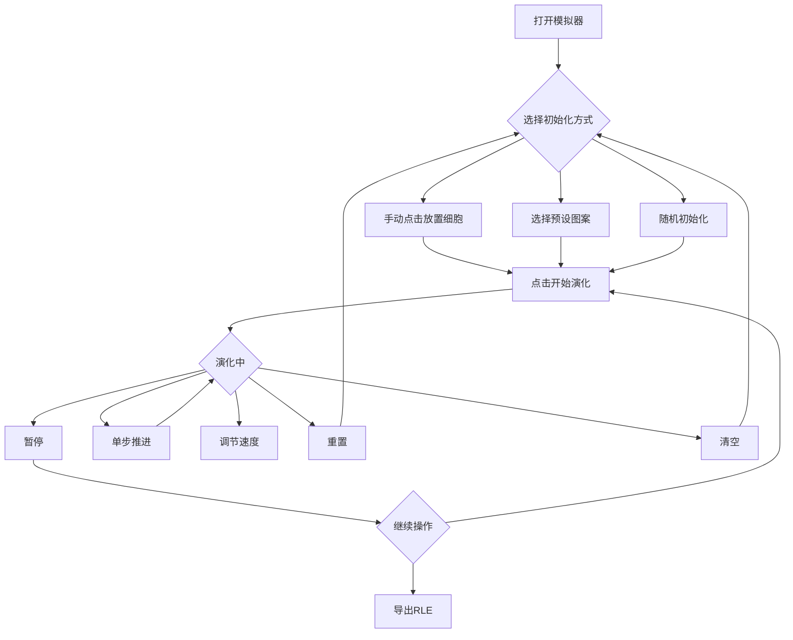

## 1. 产品概述

康威生命游戏（Conway's Game of Life）模拟器——一个交互式细胞自动机可视化工具，允许用户在可调网格上创建、观察和探索生命游戏的演化过程。面向编程爱好者、数学爱好者和教育场景。

- 核心价值：提供直观、高性能的生命游戏沙盒，支持自定义图案、预设模板和RLE格式导出，兼具教育性和趣味性
- 目标用户：对细胞自动机、数学模拟、编程感兴趣的群体

## 2. 核心功能

### 2.1 功能模块

1. **模拟器主页**：网格画布、控制面板、状态信息、预设图案面板

### 2.2 页面详情

| 页面名称 | 模块名称 | 功能描述 |
|---------|---------|---------|
| 模拟器主页 | 网格画布 | 可调尺寸(20×20至100×100)的Canvas网格，支持点击/拖拽放置活细胞，网格线开关 |
| 模拟器主页 | 控制面板 | 开始/暂停演化、单步推进、重置到初始状态、清空网格 |
| 模拟器主页 | 参数调节 | 网格尺寸滑块、演化速度滑块(50-500ms帧间隔)、随机初始化(设定存活概率) |
| 模拟器主页 | 状态显示 | 实时显示当前代数(演化步数)和活细胞数量 |
| 模拟器主页 | 预设图案 | 滑翔机、轻量级飞船、脉冲星等经典图案一键加载 |
| 模拟器主页 | RLE导出 | 导出当前网格状态为RLE格式文本 |

## 3. 核心流程

用户打开模拟器后，可通过以下方式开始：
1. 手动点击网格放置活细胞 → 点击"开始"观察演化
2. 选择预设图案 → 点击"开始"观察演化
3. 随机初始化（设定存活概率）→ 点击"开始"观察演化
4. 演化过程中可暂停、单步推进、调节速度、重置或清空

## 4. 用户界面设计

### 4.1 设计风格

- **主色调**：深色主题——近黑色背景(#0a0a0f)，搭配荧光绿(#00ff88)作为活细胞颜色和强调色，深灰(#1a1a2e)作为面板背景
- **辅助色**：暗蓝灰(#16213e)作为网格线颜色，柔和青色(#4ecca3)作为次要强调
- **按钮风格**：圆角(8px)，主要操作用荧光绿填充，次要操作用边框风格，hover有微妙发光效果
- **字体**：显示字体使用 JetBrains Mono（代码/技术感），UI字体使用 Noto Sans SC
- **布局**：左侧大面积Canvas网格画布，右侧控制面板（竖向排列各功能区域）
- **动效**：活细胞出现/消失有微妙的渐变过渡，按钮hover发光，面板有轻微的玻璃态效果

### 4.2 页面设计概览

| 页面名称 | 模块名称 | UI元素 |
|---------|---------|--------|
| 模拟器主页 | 网格画布 | Canvas全高渲染，深色背景，荧光绿活细胞，暗蓝灰网格线(可开关) |
| 模拟器主页 | 控制面板 | 玻璃态半透明面板，分组排列：演化控制按钮组、参数滑块组、预设图案按钮组 |
| 模拟器主页 | 状态栏 | 画布上方或面板顶部，代数和活细胞数以数字+标签形式展示，等宽字体 |

### 4.3 响应式设计

- 桌面优先设计，左侧画布占据主要空间，右侧固定宽度控制面板
- 画布自适应可用高度，保持正方形比例
- 控制面板在小屏幕下可折叠为底部抽屉
