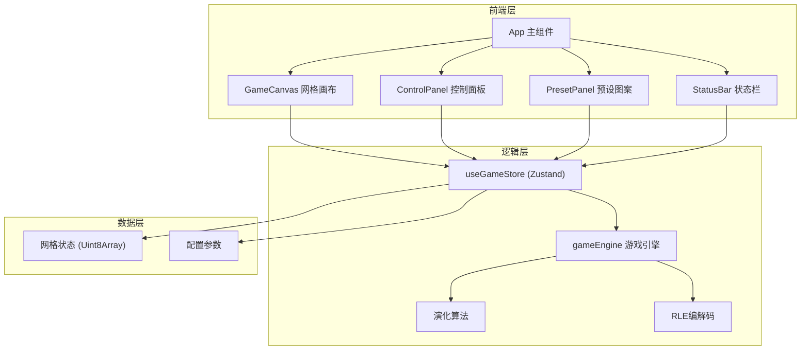

## 1. 架构设计



## 2. 技术说明

- **前端框架**：React@18 + TypeScript + Vite
- **样式方案**：Tailwind CSS@3
- **状态管理**：Zustand（单一store管理游戏状态）
- **渲染方案**：Canvas 2D（高性能，支持大网格）
- **图标**：lucide-react
- **后端**：无（纯前端应用）
- **数据库**：无

## 3. 路由定义

| 路由 | 用途 |
|-----|------|
| / | 模拟器主页面 |

## 4. 模块职责

### 4.1 游戏引擎 (`src/utils/gameEngine.ts`)
- 纯函数式设计，接收网格状态，返回新一代状态
- `nextGeneration(grid, rows, cols)`: 计算下一代
- `countNeighbors(grid, rows, cols, row, col)`: 计算邻居数
- `randomize(rows, cols, probability)`: 随机初始化
- `clearGrid(rows, cols)`: 清空网格

### 4.2 RLE工具 (`src/utils/rleExporter.ts`)
- `exportToRLE(grid, rows, cols)`: 将当前网格状态转为RLE格式字符串
- 遵循标准RLE格式规范

### 4.3 预设图案 (`src/utils/presets.ts`)
- 定义经典图案的坐标集合
- 滑翔机(Glider)、轻量级飞船(LWSS)、脉冲星(Pulsar)等
- 每个图案提供名称和相对坐标数组

### 4.4 状态管理 (`src/hooks/useGameStore.ts`)
- Zustand store，单一数据源
- 状态字段：grid(Uint8Array)、rows、cols、generation、aliveCells、isRunning、speed、showGridLines、initialGrid
- Actions：toggleCell、step、start、pause、reset、clear、setGridSize、setSpeed、toggleGridLines、loadPreset、randomize

### 4.5 组件职责

| 组件 | 文件 | 职责 |
|------|------|------|
| App | `src/App.tsx` | 布局组合，全局编排 |
| GameCanvas | `src/components/GameCanvas.tsx` | Canvas渲染网格，处理鼠标交互 |
| ControlPanel | `src/components/ControlPanel.tsx` | 演化控制按钮、参数滑块 |
| PresetPanel | `src/components/PresetPanel.tsx` | 预设图案选择 |
| StatusBar | `src/components/StatusBar.tsx` | 显示代数和活细胞数 |
| SpeedSlider | `src/components/SpeedSlider.tsx` | 速度控制滑块 |
| GridSizeSlider | `src/components/GridSizeSlider.tsx` | 网格尺寸控制滑块 |
| RleExportButton | `src/components/RleExportButton.tsx` | RLE导出按钮及逻辑 |

## 5. 数据模型

### 5.1 网格数据结构

```typescript
type Grid = Uint8Array; // 长度 = rows * cols，0=死 1=活

interface GameState {
  grid: Grid;
  rows: number;
  cols: number;
  generation: number;
  aliveCells: number;
  isRunning: boolean;
  speed: number;       // 帧间隔 ms (50-500)
  showGridLines: boolean;
  initialGrid: Grid;   // 用于重置
  survivalProbability: number; // 随机初始化存活概率
}
```

### 5.2 预设图案数据结构

```typescript
interface Preset {
  name: string;
  nameCN: string;
  cells: [number, number][]; // [row, col] 相对坐标
}
```
