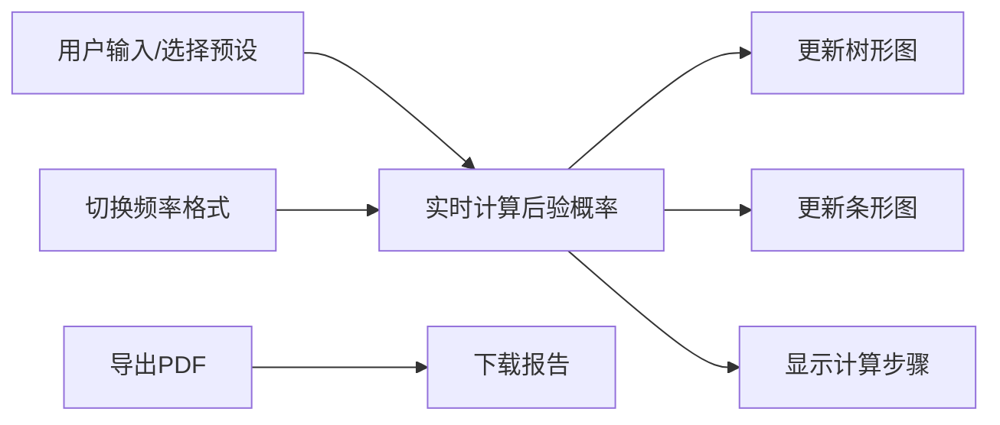

## 1. 产品概述
贝叶斯定理工具是一个交互式概率计算应用，帮助用户理解和应用贝叶斯定理进行疾病检测概率分析。用户输入疾病先验概率、检测灵敏度和假阳性率，系统自动计算后验概率，并通过可视化图表展示计算过程和结果。

- **主要用途**：医学检测结果解读、概率思维训练、教育演示
- **目标用户**：医疗从业者、学生、数据分析师、对概率统计感兴趣的公众
- **核心价值**：将抽象的贝叶斯定理转化为直观的可视化工具，降低理解门槛

## 2. 核心功能

### 2.1 用户角色
| 角色 | 注册方式 | 核心权限 |
|------|----------|----------|
| 普通用户 | 无需注册 | 使用所有计算和可视化功能，导出PDF报告 |

### 2.2 功能模块
1. **参数输入模块**：先验概率、灵敏度、假阳性率输入，常见疾病预设
2. **计算结果模块**：实时贝叶斯计算，后验概率显示，计算步骤展示
3. **可视化模块**：概率树形图、先验/后验对比条形图
4. **格式切换模块**：概率格式/频率格式切换
5. **报告导出模块**：PDF报告生成与下载

### 2.3 页面详情
| 页面名称 | 模块名称 | 功能描述 |
|----------|----------|----------|
| 主页面 | 参数输入区 | 滑动条输入三个概率参数，下拉选择预设疾病 |
| 主页面 | 结果展示区 | 显示计算结果，实时更新 |
| 主页面 | 可视化区 | 树形图和条形图展示，支持响应式布局 |
| 主页面 | 计算步骤区 | 分步展示贝叶斯公式计算过程 |
| 主页面 | 工具栏 | 格式切换按钮、PDF导出按钮 |

## 3. 核心流程

用户输入参数（或选择预设）→ 系统实时计算贝叶斯后验概率 → 更新可视化图表（树形图、条形图）→ 展示计算步骤 → 用户可切换频率格式 → 用户导出PDF报告

## 4. 用户界面设计

### 4.1 设计风格
- **主色调**：深蓝色（#1e3a5f）代表专业和信任，配合青色（#00d4aa）作为强调色
- **辅助色**：浅灰背景，白色卡片，营造简洁专业的氛围
- **按钮风格**：圆角按钮，悬停时有微妙的阴影和颜色变化
- **字体**：使用Inter字体，标题加粗，正文清晰易读
- **布局风格**：卡片式布局，分区域展示不同功能模块
- **图标风格**：简洁线性图标，与整体专业风格一致

### 4.2 页面设计概述
| 页面名称 | 模块名称 | UI元素 |
|----------|----------|--------|
| 主页面 | 参数输入区 | 带数值显示的滑动条，预设下拉菜单，标签说明 |
| 主页面 | 结果展示区 | 大号数字显示，百分比格式化，颜色区分 |
| 主页面 | 可视化区 | SVG树形图，Canvas条形图，图例说明 |
| 主页面 | 计算步骤区 | 折叠面板，公式展示，分步说明 |
| 主页面 | 工具栏 | 切换开关，导出按钮，帮助提示 |

### 4.3 响应式
- 桌面端（>1024px）：三列布局，参数区、可视化区、步骤区并列
- 平板端（768-1024px）：两列布局，上下堆叠
- 移动端（<768px）：单列布局，垂直排列所有模块

### 4.4 动画效果
- 数值变化时的平滑过渡动画
- 图表数据更新的渐进动画
- 悬停时的微交互效果
- 页面加载时的元素渐入动画
