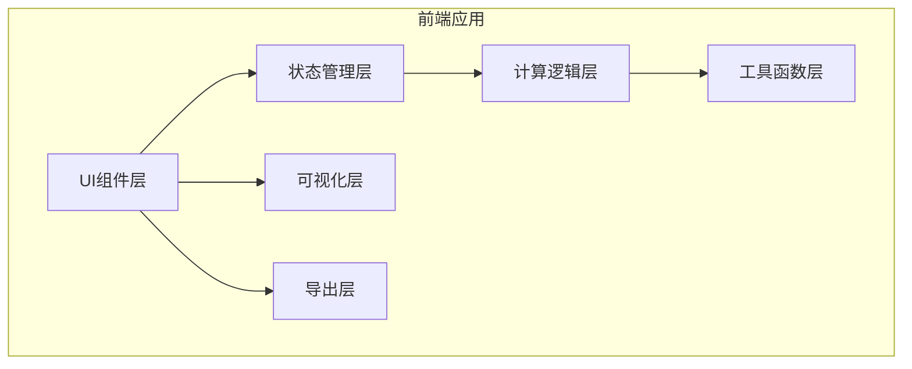

## 1. 架构设计



## 2. 技术描述

- **前端框架**：React@18 + TypeScript
- **构建工具**：Vite@5
- **样式方案**：TailwindCSS@3
- **图表库**：Chart.js + react-chartjs-2（条形图），自定义SVG（树形图）
- **PDF导出**：jspdf + html2canvas
- **状态管理**：React Hooks（useState/useReducer）
- **图标库**：lucide-react

## 3. 目录结构

```
src/
├── components/
│   ├── ParameterInput.tsx    # 参数输入组件
│   ├── ResultDisplay.tsx     # 结果显示组件
│   ├── TreeDiagram.tsx       # 概率树形图组件
│   ├── BarChart.tsx          # 条形图对比组件
│   ├── CalculationSteps.tsx  # 计算步骤展示组件
│   ├── FormatToggle.tsx      # 格式切换组件
│   └── ExportButton.tsx      # 导出按钮组件
├── hooks/
│   └── useBayesianCalculation.ts  # 贝叶斯计算Hook
├── utils/
│   ├── bayesian.ts           # 贝叶斯计算逻辑
│   ├── formatters.ts         # 数值格式化工具
│   └── pdfExport.ts          # PDF导出工具
├── data/
│   └── presets.ts            # 常见疾病预设数据
├── types/
│   └── index.ts              # TypeScript类型定义
├── App.tsx
└── main.tsx
```

## 4. 核心数据类型

```typescript
// 计算参数
interface BayesianParams {
  priorProbability: number;      // 先验概率 (0-1)
  sensitivity: number;           // 灵敏度 (0-1)
  falsePositiveRate: number;     // 假阳性率 (0-1)
}

// 计算结果
interface BayesianResult {
  posteriorProbability: number;  // 后验概率
  truePositives: number;         // 真阳性人数
  falsePositives: number;        // 假阳性人数
  trueNegatives: number;         // 真阴性人数
  falseNegatives: number;        // 假阴性人数
  totalPopulation: number;       // 总人数（频率格式用）
  calculationSteps: CalculationStep[];
}

// 计算步骤
interface CalculationStep {
  formula: string;
  description: string;
  value: number;
}

// 疾病预设
interface DiseasePreset {
  id: string;
  name: string;
  description: string;
  priorProbability: number;
  sensitivity: number;
  falsePositiveRate: number;
}
```

## 5. 可扩展性设计

1. **模块化架构**：各功能组件独立，便于添加新的可视化类型
2. **预设数据驱动**：疾病预设存储在独立数据文件中，便于扩展
3. **计算逻辑分离**：核心计算逻辑与UI分离，便于添加新的计算模式
4. **插件化导出**：导出模块设计为可扩展，便于添加新的导出格式
5. **类型安全**：全面的TypeScript类型定义，提高代码可维护性
