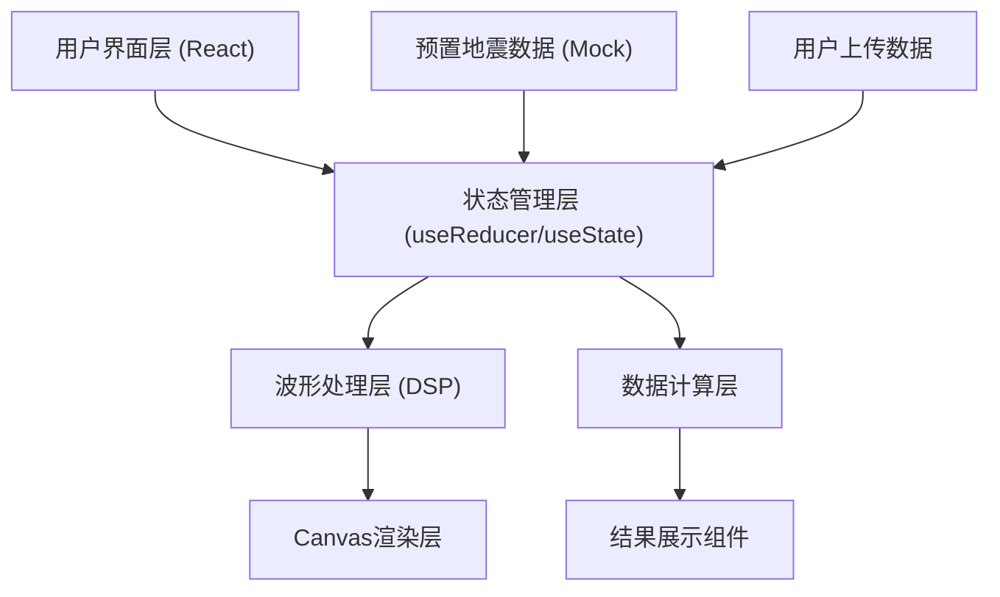

## 1. 架构设计



## 2. 技术描述

- **前端框架**: React@18 + TypeScript
- **构建工具**: Vite@5
- **样式方案**: TailwindCSS@3
- **波形绘制**: HTML5 Canvas API
- **数字信号处理**: 自定义IIR/FIR滤波器实现
- **图标**: Lucide React
- **后端**: 无（纯前端应用）
- **数据库**: 无（预置Mock数据）

## 3. 目录结构

```
src/
├── components/
│   ├── WaveformCanvas.tsx      # 波形画布组件
│   ├── ControlPanel.tsx        # 左侧控制面板
│   ├── ResultPanel.tsx         # 右侧结果面板
│   ├── DataSelector.tsx        # 数据选择器
│   ├── FilterControls.tsx      # 滤波控制
│   └── ZoomControls.tsx        # 缩放控制
├── hooks/
│   ├── useWaveformData.ts      # 波形数据处理Hook
│   ├── useFilter.ts            # 滤波器Hook
│   └── useAnnotation.ts        # 标注功能Hook
├── utils/
│   ├── dsp.ts                  # 数字信号处理函数
│   ├── calculation.ts          # 震中距/震级计算
│   └── waveformGenerator.ts    # 模拟波形生成器
├── data/
│   └── presetEarthquakes.ts    # 预置地震数据
├── types/
│   └── index.ts                # TypeScript类型定义
├── App.tsx
└── main.tsx
```

## 4. 路由定义

| 路由 | 用途 |
|------|------|
| / | 主分析页面（单页应用） |

## 5. 数据模型

### 5.1 数据结构定义

```typescript
// 地震波形数据
interface EarthquakeData {
  id: string;
  name: string;
  location: string;
  magnitude: number;
  depth: number;
  date: string;
  sampleRate: number;  // 采样率 (Hz)
  startTime: number;   // 开始时间戳
  duration: number;    // 持续时间 (秒)
  components: {
    north: number[];   // 南北分量
    east: number[];    // 东西分量
    vertical: number[]; // 垂直分量
  };
  expectedPTime?: number;  // 理论P波到时
  expectedSTime?: number;  // 理论S波到时
}

// 标注点
interface Annotation {
  type: 'P' | 'S';
  time: number;       // 标注时间点 (秒)
  component?: 'north' | 'east' | 'vertical';
}

// 滤波参数
interface FilterParams {
  type: 'none' | 'lowpass' | 'highpass' | 'bandpass';
  lowFreq?: number;   // 低通截止频率/带通下限
  highFreq?: number;  // 高通截止频率/带通上限
  order: number;      // 滤波器阶数
}

// 视图状态
interface ViewState {
  zoomLevel: number;  // 缩放级别 (1 = 正常)
  timeOffset: number; // 时间偏移 (秒)
  visibleRange: {
    start: number;
    end: number;
  };
}

// 分析结果
interface AnalysisResult {
  pTime: number | null;      // P波到时 (秒)
  sTime: number | null;      // S波到时 (秒)
  psDifference: number | null; // P-S时差 (秒)
  epicenterDistance: number | null; // 震中距 (km)
  estimatedMagnitude: number | null; // 推算震级
  maxAmplitude: number;      // 最大振幅
}
```

### 5.2 核心算法

**震中距估算公式**:
```
震中距(km) = P-S时差(秒) × 8(km/s)
```

**震级推算（简化版）**:
```
震级 = log10(最大振幅 × 1000) + 震中距校正因子
```

**Butterworth滤波器**:
- 低通/高通/带通IIR滤波器
- 双线性变换法设计
- 支持2-4阶滤波

## 6. 预置地震数据（5个模拟事件）

| ID | 名称 | 位置 | 震级 | 深度 |
|----|------|------|------|------|
| EQ001 | 汶川大地震模拟 | 四川汶川 | 8.0 | 14km |
| EQ002 | 东日本大地震模拟 | 日本东海岸 | 9.0 | 32km |
| EQ003 | 唐山大地震模拟 | 河北唐山 | 7.8 | 12km |
| EQ004 | 智利大地震模拟 | 智利近海 | 8.8 | 35km |
| EQ005 | 台湾花莲地震模拟 | 台湾花莲 | 6.7 | 10km |
