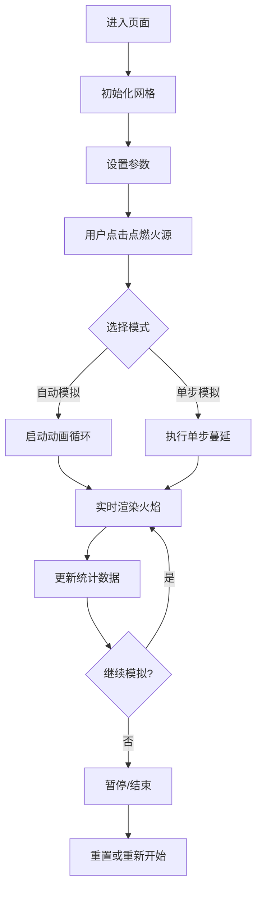

## 1. 产品概述

森林火灾蔓延模拟器是一个交互式的科学可视化工具，通过元胞自动机模型模拟森林火灾的蔓延过程，帮助用户理解风向、湿度等环境因素对火灾传播的影响。

- 主要用途：教育演示、科学研究、应急管理培训
- 目标用户：学生、教师、研究人员、应急管理专业人员
- 核心价值：直观展示火灾蔓延规律，提供可交互的模拟实验环境

## 2. 核心功能

### 2.1 功能模块

1. **主模拟界面**：100x100网格火场显示、实时动画渲染
2. **控制面板**：模拟控制、参数调节、预设场景
3. **数据统计**：燃烧树木数量、过火面积实时统计
4. **环境设置**：风向选择、湿度调节、树木密度设置

### 2.2 页面详情

| 页面名称 | 模块名称 | 功能描述 |
|---------|---------|---------|
| 主页面 | 火场网格 | 100x100 Canvas渲染，三种状态（树/火/空地）可视化 |
| 主页面 | 模拟控制 | 开始/暂停、单步模拟、重置功能 |
| 主页面 | 参数设置 | 树木密度滑块、湿度滑块、8方向风向选择器 |
| 主页面 | 预设场景 | 干燥多风、湿润无风等快速场景切换 |
| 主页面 | 统计面板 | 实时显示燃烧树木数、过火面积、模拟时间 |
| 主页面 | 风向指示器 | 可视化风向箭头指示 |

## 3. 核心流程

### 用户操作流程
1. 用户进入页面，系统自动初始化随机树木分布
2. 用户调整树木密度、湿度、风向等参数（可选）
3. 用户点击网格上的树木位置点燃火源
4. 用户点击"开始"启动自动模拟，或使用"单步"进行逐步观察
5. 系统实时渲染火焰蔓延动画并更新统计数据
6. 用户可随时暂停、重置或切换预设场景

## 4. 用户界面设计

### 4.1 设计风格
- **设计主题**：自然/科学可视化风格，以深绿色森林为基调
- **主色调**：深森林绿 (#1B4332)、火焰橙红 (#FF4500)、土地棕 (#8B4513)
- **辅助色**：天空蓝 (#87CEEB)、灰烬灰 (#696969)
- **按钮风格**：圆角矩形，微立体效果，hover时有轻微缩放动画
- **字体**：标题使用现代无衬线字体，数据统计使用等宽字体
- **布局风格**：左侧控制区 + 右侧模拟区的双栏布局
- **图标风格**：简洁的SVG图标，火焰、树木、风等自然元素

### 4.2 页面设计概述

| 页面名称 | 模块名称 | UI元素 |
|---------|---------|--------|
| 主页面 | 火场网格 | Canvas画布，100x100方格，树木（绿色）、火焰（红色跳动动画）、空地（棕色） |
| 主页面 | 控制区 | 深色半透明背景面板，分组组织控制项 |
| 主页面 | 风向选择器 | 8方向罗盘式选择器，选中方向高亮显示 |
| 主页面 | 滑块控件 | 自定义样式滑块，带数值显示，平滑过渡动画 |
| 主页面 | 统计面板 | 卡片式布局，数据数值放大显示，带有变化趋势指示 |

### 4.3 响应式设计
- **桌面端**：左侧30%控制区 + 右侧70%模拟区的双栏布局
- **平板端**：上下布局，控制区在上，模拟区在下
- **移动端**：垂直堆叠布局，优先展示模拟区，控制区可折叠
- **触摸优化**：加大按钮点击区域，支持触摸滑动调节滑块

### 4.4 动画效果
- **火焰动画**：红色单元格有轻微的大小和颜色脉动效果
- **蔓延过渡**：树木燃烧时颜色渐变过渡（绿→橙→红→灰）
- **风向指示**：箭头有飘动动画，指示风力方向
- **按钮交互**：hover时上浮效果，点击时按压反馈
- **统计更新**：数值变化时有平滑的数字滚动动画
