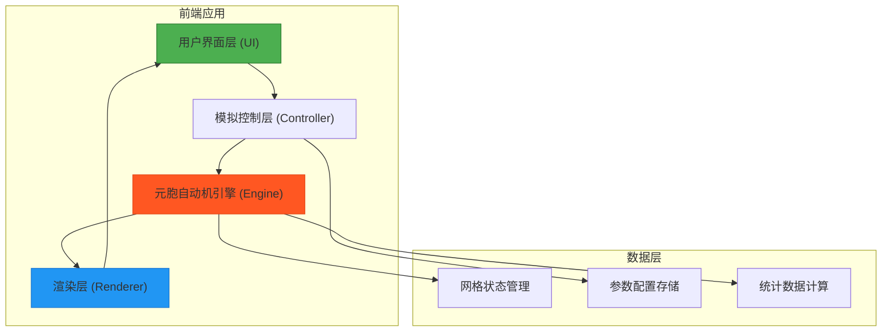

## 1. 架构设计



## 2. 技术选型

### 2.1 技术栈
- **前端框架**：React 18 + TypeScript
- **构建工具**：Vite 5
- **样式方案**：Tailwind CSS 3
- **渲染引擎**：Canvas 2D API
- **状态管理**：React Hooks (useState, useRef, useEffect)

### 2.2 核心依赖
- `react`: 18.2.0
- `react-dom`: 18.2.0
- `typescript`: 5.0+
- `vite`: 5.0+
- `tailwindcss`: 3.4+
- `postcss`: 8.4+
- `autoprefixer`: 10.4+

## 3. 目录结构

```
src/
├── components/
│   ├── ControlPanel/       # 控制面板组件
│   │   ├── SimulationControls.tsx
│   │   ├── WindDirection.tsx
│   │   ├── SliderControl.tsx
│   │   └── PresetScenes.tsx
│   ├── Simulator/          # 模拟器核心
│   │   ├── GridCanvas.tsx  # Canvas渲染组件
│   │   └── Statistics.tsx  # 统计面板组件
│   └── Layout/             # 布局组件
│       └── AppLayout.tsx
├── engine/
│   ├── types.ts            # 类型定义
│   ├── constants.ts        # 常量配置
│   ├── CellGrid.ts         # 网格数据类
│   └── FireSimulator.ts    # 火灾模拟引擎
├── hooks/
│   └── useSimulation.ts    # 模拟控制Hook
├── utils/
│   └── math.ts             # 数学工具函数
├── App.tsx
├── main.tsx
└── index.css
```

## 4. 核心数据模型

### 4.1 单元格状态

```typescript
enum CellState {
  EMPTY = 0,  // 空地
  TREE = 1,   // 树木
  FIRE = 2,   // 燃烧中
  ASH = 3     // 灰烬
}
```

### 4.2 风向定义

```typescript
type WindDirection = 
  | 'N'   // 北
  | 'NE'  // 东北
  | 'E'   // 东
  | 'SE'  // 东南
  | 'S'   // 南
  | 'SW'  // 西南
  | 'W'   // 西
  | 'NW'; // 西北

interface WindVector {
  dx: number;  // X方向分量 (-1, 0, 1)
  dy: number;  // Y方向分量 (-1, 0, 1)
  name: WindDirection;
}
```

### 4.3 模拟参数

```typescript
interface SimulationParams {
  treeDensity: number;      // 树木密度 0-100%
  humidity: number;         // 湿度 0-100%
  windDirection: WindDirection;
  windStrength: number;     // 风力强度 0-1
  spreadRate: number;       // 基础蔓延概率
  burnDuration: number;     // 燃烧持续步数
}
```

### 4.4 统计数据

```typescript
interface SimulationStats {
  totalTrees: number;       // 初始树木总数
  burningTrees: number;     // 当前燃烧树木数
  burnedTrees: number;      // 已烧毁树木数
  burnedArea: number;       // 过火面积（格数）
  survivalRate: number;     // 存活率
  timeStep: number;         // 模拟步数
}
```

## 5. 蔓延算法设计

### 5.1 蔓延规则

1. **邻域检测**：每个燃烧单元格检查周围8个相邻单元格
2. **风向影响**：与风向相同方向的蔓延概率增加
3. **湿度影响**：湿度越高，蔓延概率越低
4. **概率计算**：
   ```
   基础概率 = baseSpreadRate * (1 - humidity/100)
   风向系数 = 顺风方向: 1.5, 垂直方向: 1.0, 逆风方向: 0.5
   最终概率 = 基础概率 * 风向系数
   ```

### 5.2 模拟步骤

```typescript
// 每一步模拟流程
function simulateStep(): void {
  // 1. 收集所有当前燃烧的单元格
  const burningCells = grid.getBurningCells();
  
  // 2. 对每个燃烧单元格，尝试蔓延到邻居
  for (const cell of burningCells) {
    const neighbors = grid.getNeighbors(cell.x, cell.y);
    for (const neighbor of neighbors) {
      if (neighbor.state === CellState.TREE) {
        const spreadProbability = calculateSpreadProbability(
          cell, neighbor, params
        );
        if (Math.random() < spreadProbability) {
          nextGrid.setState(neighbor.x, neighbor.y, CellState.FIRE);
        }
      }
    }
  }
  
  // 3. 更新燃烧单元格的燃烧时间
  grid.updateBurnDuration();
  
  // 4. 交换网格状态
  grid.swap(nextGrid);
}
```

## 6. 渲染优化

### 6.1 Canvas渲染策略
- **离屏渲染**：使用双缓冲技术减少闪烁
- **脏矩形优化**：只重绘状态变化的单元格
- **批量绘制**：相同状态的单元格批量绘制

### 6.2 动画帧率控制
- 目标帧率：30 FPS
- 使用 `requestAnimationFrame` 控制渲染循环
- 模拟步频与渲染帧率分离

## 7. 性能优化

### 7.1 数据结构
- 使用 `Uint8Array` 存储网格状态，内存占用小
- 维护燃烧单元格列表，避免全网格遍历

### 7.2 计算优化
- 预计算风向向量和邻域偏移
- 使用位运算加速状态判断
