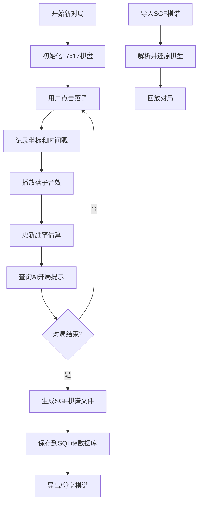

## 1. 产品概述

藏棋（密芒）棋谱记录工具，为藏棋爱好者提供专业的棋谱记录、管理和分析平台。支持17x17标准棋盘的可视化落子，SGF格式棋谱的导入导出，以及基于AI的开局提示和胜率分析。

- 核心用途：记录、管理、分析藏棋对局
- 目标用户：藏棋爱好者、棋手、教练
- 产品价值：传承藏棋文化，提升对弈水平，系统化管理棋谱

## 2. 核心功能

### 2.1 用户角色

| 角色 | 注册方式 | 核心权限 |
|------|----------|----------|
| 普通用户 | 无需注册 | 棋盘对弈、棋谱导入导出、AI提示 |

### 2.2 功能模块

1. **棋盘对弈**：17x17Canvas棋盘，落子交互，落子音效，悔棋功能
2. **棋谱管理**：SGF格式导入/导出，对局历史记录，棋谱文件生成
3. **AI辅助**：开局库提示（约200个变化），胜率估算
4. **数据存储**：SQLite后端存储，对局历史查询

### 2.3 页面详情

| 页面名称 | 模块名称 | 功能描述 |
|-----------|----------|----------|
| 主界面 | 棋盘区域 | Canvas绘制17x17棋盘，点击落子，显示棋子和坐标 |
| 主界面 | 控制面板 | 悔棋、新对局、切换先后手、AI提示按钮 |
| 主界面 | 信息面板 | 当前手数、时间记录、胜率显示、走子提示 |
| 主界面 | 棋谱操作 | SGF导入/导出、保存对局、历史记录 |
| 主界面 | 胜率图表 | 实时胜率曲线展示 |

## 3. 核心流程

## 4. 用户界面设计

### 4.1 设计风格

- **主色调**：深木色(#5D4037) + 象牙白(#FFF8E1) + 金色(#FFD54F)
- **辅助色**：墨黑(#212121)用于黑子，雪白(#FAFAFA)用于白子
- **按钮风格**：圆角木质按钮，轻微浮雕效果
- **字体**：展示字体用"Ma Shan Zheng"（书法风格），正文字体用"Noto Serif SC"
- **布局风格**：传统中式棋盘布局，左右对称，信息面板在侧边
- **整体氛围**：古典雅致，兼具传统棋盘质感与现代交互体验

### 4.2 页面设计概述

| 页面名称 | 模块名称 | UI元素 |
|-----------|----------|--------|
| 主界面 | 棋盘区域 | Canvas木纹背景，金色星位点，阴影立体棋子 |
| 主界面 | 控制面板 | 木质风格按钮组，悬停动画，点击反馈 |
| 主界面 | 信息面板 | 半透明宣纸质感背景，竖排文字，印章装饰 |
| 主界面 | 胜率图表 | 极简线性图表，黑白双色对比 |

### 4.3 响应式

- 桌面端优先：棋盘居中，左右信息面板
- 平板适配：信息面板改为上下布局
- 移动端：单栏布局，棋盘自适应宽度
- 触摸优化：增大落子可点击区域

### 4.4 视觉细节

- 棋盘背景添加细微木质纹理
- 棋子添加光影和轻微阴影增强立体感
- 星位点用金色小圆点标记
- 最后落子位置用红色小圈标记
- 落子动画：棋子从上方落下并轻微反弹
