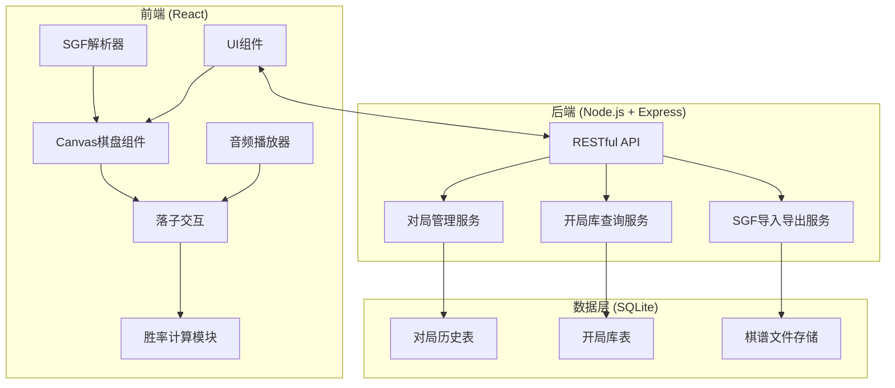
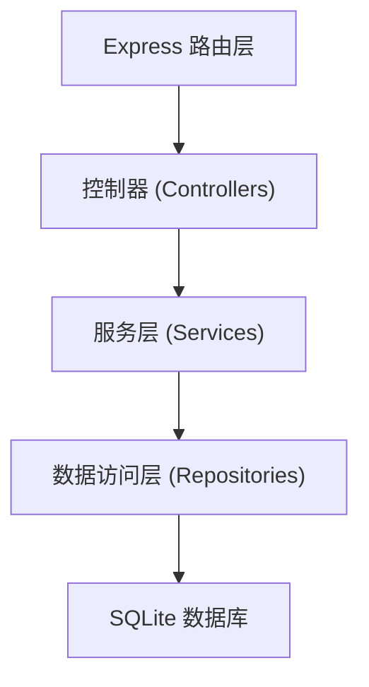
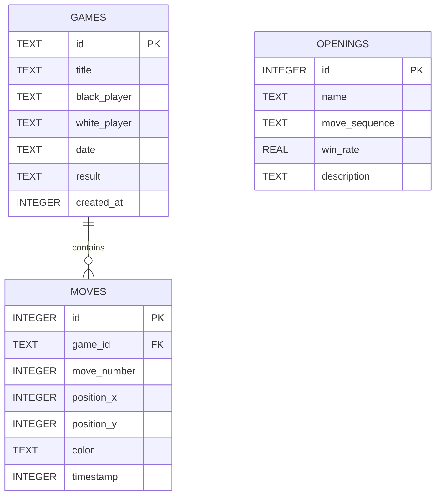

## 1. 架构设计



## 2. 技术描述

- **前端技术栈**：React@18 + TypeScript + Vite + TailwindCSS@3
- **初始化工具**：Vite React TypeScript 模板
- **后端技术栈**：Node.js + Express@4 + TypeScript
- **数据库**：SQLite3 + better-sqlite3
- **状态管理**：React Hooks (useState, useReducer)
- **音频处理**：Web Audio API
- **图表绘制**：Chart.js / 自定义 Canvas 绘制

## 3. 路由定义

| 路由 | 方法 | 用途 |
|------|------|------|
| /api/games | GET | 获取对局列表 |
| /api/games | POST | 创建新对局 |
| /api/games/:id | GET | 获取单个对局详情 |
| /api/games/:id | PUT | 更新对局 |
| /api/games/:id/sgf | GET | 导出SGF文件 |
| /api/games/import | POST | 导入SGF文件 |
| /api/openings | GET | 获取开局提示 |
| /api/openings/search | POST | 根据当前局面搜索开局 |

## 4. API 定义

### 4.1 类型定义

```typescript
// 棋子类型
type StoneColor = 'black' | 'white' | null;

// 棋盘位置
interface Position {
  x: number;
  y: number;
}

// 落子记录
interface Move {
  position: Position;
  color: StoneColor;
  timestamp: number;
  moveNumber: number;
}

// 对局信息
interface Game {
  id: string;
  title: string;
  blackPlayer: string;
  whitePlayer: string;
  date: string;
  result: string;
  moves: Move[];
  createdAt: number;
}

// 开局库条目
interface Opening {
  id: string;
  name: string;
  moves: Position[];
  winRate: number;
  description: string;
}

// 胜率数据
interface WinRateData {
  moveNumber: number;
  blackWinRate: number;
  whiteWinRate: number;
}
```

### 4.2 请求响应示例

创建对局
```typescript
POST /api/games
Request: {
  title: string;
  blackPlayer: string;
  whitePlayer: string;
}

Response: Game
```

获取开局提示
```typescript
POST /api/openings/search
Request: {
  currentMoves: Position[];
  color: 'black' | 'white';
}

Response: {
  suggestions: Opening[];
}
```

## 5. 服务端架构图



## 6. 数据模型

### 6.1 数据模型定义



### 6.2 DDL 语句

```sql
-- 对局表
CREATE TABLE IF NOT EXISTS games (
  id TEXT PRIMARY KEY,
  title TEXT,
  black_player TEXT,
  white_player TEXT,
  date TEXT,
  result TEXT,
  created_at INTEGER
);

-- 落子记录表
CREATE TABLE IF NOT EXISTS moves (
  id INTEGER PRIMARY KEY AUTOINCREMENT,
  game_id TEXT,
  move_number INTEGER,
  position_x INTEGER,
  position_y INTEGER,
  color TEXT,
  timestamp INTEGER,
  FOREIGN KEY (game_id) REFERENCES games(id)
);

-- 开局库表
CREATE TABLE IF NOT EXISTS openings (
  id INTEGER PRIMARY KEY AUTOINCREMENT,
  name TEXT,
  move_sequence TEXT,
  win_rate REAL,
  description TEXT
);

-- 索引
CREATE INDEX IF NOT EXISTS idx_moves_game_id ON moves(game_id);
CREATE INDEX IF NOT EXISTS idx_openings_sequence ON openings(move_sequence);
```

### 6.3 初始化开局库数据
- 预置约200个常见藏棋开局变化
- 每个开局包含名称、走子序列、胜率统计、描述
- 走子序列使用JSON格式存储坐标数组
