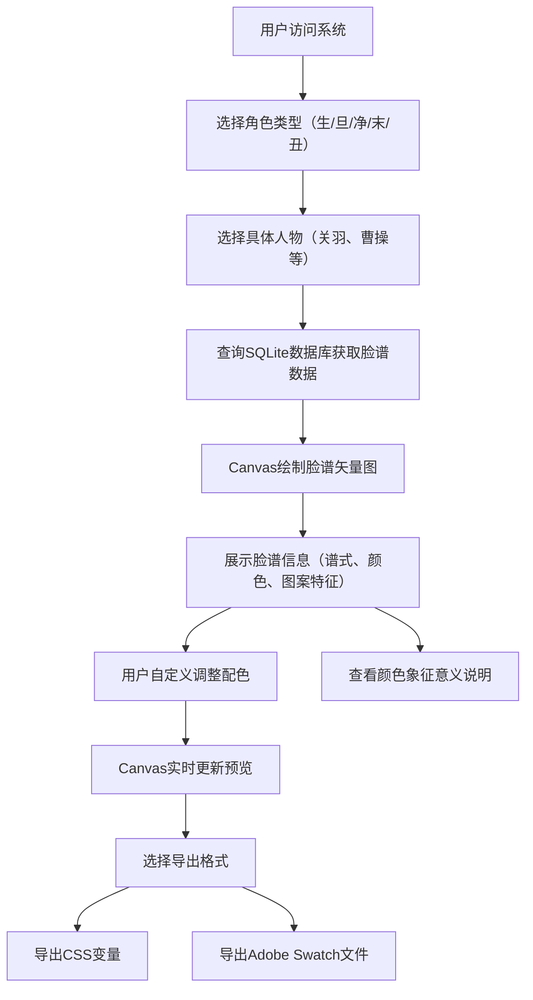

## 1. 产品概述

川剧脸谱查询与配色生成系统是一款面向川剧爱好者、设计师和文化研究者的在线工具，提供川剧脸谱的查询、可视化展示、自定义配色及导出功能。系统通过交互式Canvas绘制脸谱矢量图，让用户能够深入了解川剧脸谱艺术并进行创意配色设计。

- 核心目的：传承和推广川剧脸谱文化，提供便捷的脸谱查询与创意设计工具
- 目标用户：川剧爱好者、平面设计师、文化研究者、学生
- 市场价值：填补川剧脸谱数字化互动工具的空白，促进传统文化的数字化传播

## 2. 核心功能

### 2.1 用户角色
| 角色 | 注册方式 | 核心权限 |
|------|----------|----------|
| 普通用户 | 无需注册 | 查询脸谱信息、自定义配色、导出配色方案、查看颜色象征意义 |

### 2.2 功能模块
1. **脸谱查询页面**：角色类型选择、具体人物选择、脸谱信息展示、Canvas矢量图绘制
2. **配色编辑器**：颜色选择器、实时预览、配色方案调整
3. **导出功能**：CSS变量导出、Adobe Swatch文件导出
4. **颜色象征说明**：脸谱颜色文化含义展示

### 2.3 页面详情
| 页面名称 | 模块名称 | 功能描述 |
|----------|----------|----------|
| 脸谱查询页面 | 角色选择模块 | 提供生、旦、净、末、丑五大角色类型的选择 |
| 脸谱查询页面 | 人物列表模块 | 根据所选角色类型展示对应人物列表，支持点击选择 |
| 脸谱查询页面 | 信息展示模块 | 显示脸谱谱式、主色、辅色、图案特征文字描述 |
| 脸谱查询页面 | Canvas绘制模块 | 根据脸谱数据实时绘制矢量示意图 |
| 配色编辑器 | 颜色调整模块 | 提供主色、辅色等颜色的自定义调整 |
| 配色编辑器 | 实时预览模块 | Canvas实时重绘展示配色效果 |
| 导出功能 | CSS导出模块 | 生成CSS变量格式的配色代码 |
| 导出功能 | ASE导出模块 | 生成Adobe Swatch格式文件供下载 |
| 颜色象征说明 | 含义展示模块 | 展示红色忠勇、白色奸诈等颜色文化含义 |

## 3. 核心流程

用户打开系统后，首先选择角色类型（生、旦、净、末、丑），然后从该类别中选择具体人物（如关羽、曹操）。系统从SQLite数据库读取该人物的脸谱信息，包括谱式类型、主色、辅色、图案特征等，通过Canvas绘制矢量示意图。用户可通过颜色选择器调整配色，Canvas实时更新预览效果。完成配色后，用户可选择导出为CSS变量或Adobe Swatch文件。

## 4. 用户界面设计

### 4.1 设计风格
- **主色调**：采用中国传统配色，以朱砂红(#C41E3A)为主色，搭配古金色(#D4AF37)作为点缀，背景使用米白色(#F5F0E6)营造古典氛围
- **辅助色**：墨黑(#1A1A1A)用于文字和边框，石青(#2E4A62)作为次要按钮色
- **按钮风格**：中式圆角矩形按钮，带有细微的渐变和阴影，悬停时有轻微放大效果
- **字体**：标题使用"Ma Shan Zheng"或"ZCOOL XiaoWei"等具有书法感的中文字体，正文使用"Noto Sans SC"保证可读性
- **布局风格**：采用传统中式对称布局，主内容区居中展示，左侧为选择面板，右侧为Canvas预览区，底部为配色编辑器
- **装饰元素**：加入云纹、回纹等传统中式边框和分隔线，提升文化氛围

### 4.2 页面设计概览
| 页面名称 | 模块名称 | UI元素 |
|----------|----------|--------|
| 脸谱查询页面 | 角色选择模块 | 五个大尺寸角色按钮，图标+文字，选中状态有金色边框高亮 |
| 脸谱查询页面 | 人物列表模块 | 卡片式人物列表，包含人物头像缩略图和姓名，滚动展示 |
| 脸谱查询页面 | 信息展示模块 | 中式卷轴风格信息面板，分栏展示谱式、颜色、图案特征 |
| 脸谱查询页面 | Canvas绘制模块 | 大尺寸圆形画布，带有木质纹理边框装饰 |
| 配色编辑器 | 颜色调整模块 | 每行一个颜色项，包含颜色名称、色值显示、颜色选择器、颜色滑块 |
| 配色编辑器 | 实时预览模块 | Canvas区域带有脉冲动画提示更新 |
| 导出功能 | 导出按钮组 | 两个并排按钮，分别为CSS和ASE图标，点击有复制/下载动画 |
| 颜色象征说明 | 含义展示模块 | 颜色色块+文字说明的网格布局，每个色块有悬停放大效果 |

### 4.3 响应式
- 桌面端优先设计，采用左右分栏布局（左侧选择面板30%，右侧预览区70%）
- 平板端调整为上下布局，上半部分为预览区，下半部分为选择和编辑区
- 移动端采用单列流式布局，Canvas画布自适应屏幕宽度，按钮尺寸优化为适合触摸操作
- 所有交互元素最小触摸尺寸不小于44x44px

### 4.4 动画与交互
- 页面加载时，各模块采用渐入+上移的交错动画效果
- 角色选择按钮悬停时有轻微上浮和阴影加深效果
- Canvas绘制过程采用描边动画，从轮廓到填色逐步呈现
- 颜色调整时，Canvas采用平滑过渡动画更新颜色
- 导出成功时显示对勾动画和提示文字
