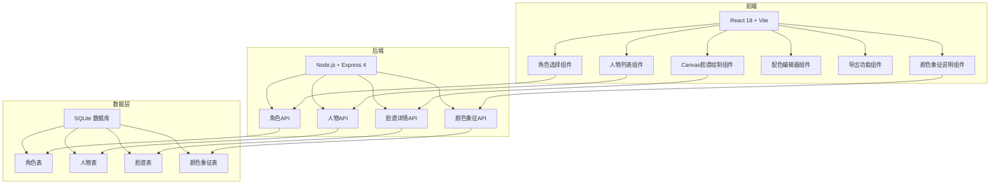
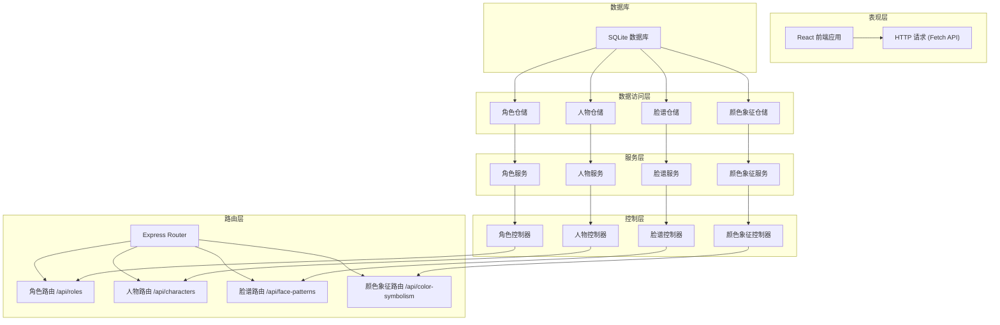
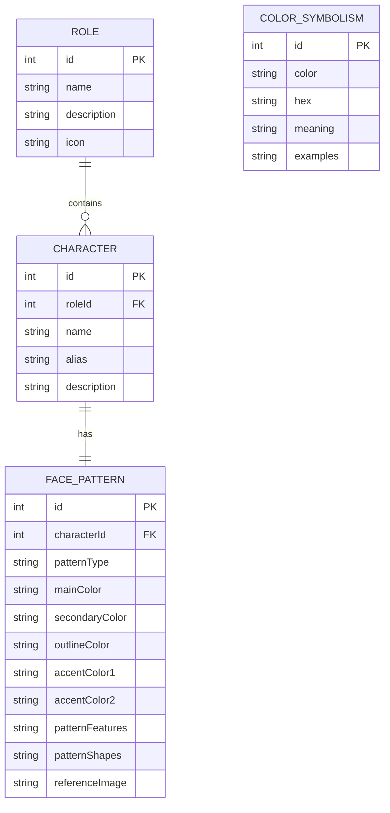

## 1. 架构设计



## 2. 技术描述

- **前端框架**: React@18 + Vite@5
- **样式方案**: TailwindCSS@3 + CSS变量
- **UI组件库**: 自定义组件，不引入第三方组件库以保持独特的中式设计风格
- **图标方案**: React Icons，选用中式风格图标
- **后端框架**: Express@4
- **数据库**: SQLite3，使用better-sqlite3驱动
- **Canvas绘图**: 原生HTML5 Canvas API，自定义脸谱绘制引擎
- **颜色处理**: chroma-js用于颜色空间转换和验证
- **ASE导出**: 自定义Adobe Swatch文件生成器（二进制格式）
- **构建工具**: Vite@5
- **包管理器**: npm

## 3. 路由定义

| 路由 | 目的 |
|------|------|
| / | 首页，展示角色选择、人物列表、Canvas预览、配色编辑器 |

## 4. API 定义

### 4.1 TypeScript 类型定义

```typescript
// 角色类型
interface Role {
  id: number;
  name: string;       // 生、旦、净、末、丑
  description: string;
  icon: string;
}

// 人物
interface Character {
  id: number;
  roleId: number;
  name: string;       // 关羽、曹操等
  alias: string;      // 别名
  description: string;
}

// 脸谱详情
interface FacePattern {
  id: number;
  characterId: number;
  patternType: 'symmetric' | 'asymmetric';  // 对称/不对称
  mainColor: string;       // 主色（HEX）
  secondaryColor: string;  // 辅色（HEX）
  outlineColor: string;    // 轮廓色（HEX）
  accentColor1: string;    // 点缀色1
  accentColor2: string;    // 点缀色2
  patternFeatures: string; // 图案特征文字描述
  patternShapes: Shape[];  // 绘制形状数据
  referenceImage: string;  // 参考图URL（可选）
}

// 绘制形状
interface Shape {
  type: 'path' | 'circle' | 'ellipse' | 'rect' | 'polygon';
  points: number[];        // 坐标点
  color: string;           // 颜色类型：main/secondary/outline/accent1/accent2
  fill: boolean;
  strokeWidth: number;
}

// 颜色象征
interface ColorSymbolism {
  id: number;
  color: string;       // 颜色名称
  hex: string;         // HEX值
  meaning: string;     // 象征意义
  examples: string;    // 代表人物
}

// API响应
interface ApiResponse<T> {
  success: boolean;
  data: T;
  message?: string;
}
```

### 4.2 RESTful API 接口

#### 获取角色列表
- **GET** `/api/roles`
- 响应: `ApiResponse<Role[]>`

#### 获取指定角色的人物列表
- **GET** `/api/characters?roleId={roleId}`
- 响应: `ApiResponse<Character[]>`

#### 获取人物脸谱详情
- **GET** `/api/face-patterns?characterId={characterId}`
- 响应: `ApiResponse<FacePattern>`

#### 获取颜色象征列表
- **GET** `/api/color-symbolism`
- 响应: `ApiResponse<ColorSymbolism[]>`

## 5. 服务器架构图



## 6. 数据模型

### 6.1 数据模型定义



### 6.2 数据定义语言

```sql
-- 角色表
CREATE TABLE IF NOT EXISTS roles (
    id INTEGER PRIMARY KEY AUTOINCREMENT,
    name TEXT NOT NULL UNIQUE,
    description TEXT NOT NULL,
    icon TEXT NOT NULL
);

-- 人物表
CREATE TABLE IF NOT EXISTS characters (
    id INTEGER PRIMARY KEY AUTOINCREMENT,
    role_id INTEGER NOT NULL,
    name TEXT NOT NULL,
    alias TEXT,
    description TEXT NOT NULL,
    FOREIGN KEY (role_id) REFERENCES roles(id)
);

-- 脸谱表
CREATE TABLE IF NOT EXISTS face_patterns (
    id INTEGER PRIMARY KEY AUTOINCREMENT,
    character_id INTEGER NOT NULL,
    pattern_type TEXT NOT NULL CHECK (pattern_type IN ('symmetric', 'asymmetric')),
    main_color TEXT NOT NULL,
    secondary_color TEXT NOT NULL,
    outline_color TEXT NOT NULL DEFAULT '#000000',
    accent_color_1 TEXT,
    accent_color_2 TEXT,
    pattern_features TEXT NOT NULL,
    pattern_shapes TEXT NOT NULL,
    reference_image TEXT,
    FOREIGN KEY (character_id) REFERENCES characters(id),
    UNIQUE (character_id)
);

-- 颜色象征表
CREATE TABLE IF NOT EXISTS color_symbolism (
    id INTEGER PRIMARY KEY AUTOINCREMENT,
    color TEXT NOT NULL,
    hex TEXT NOT NULL,
    meaning TEXT NOT NULL,
    examples TEXT NOT NULL
);

-- 创建索引
CREATE INDEX IF NOT EXISTS idx_characters_role_id ON characters(role_id);
CREATE INDEX IF NOT EXISTS idx_face_patterns_character_id ON face_patterns(character_id);

-- 初始化角色数据
INSERT OR IGNORE INTO roles (name, description, icon) VALUES
('生', '男性角色，分老生、小生、武生等', '👨'),
('旦', '女性角色，分青衣、花旦、武旦等', '👩'),
('净', '花脸角色，性格鲜明的男性', '🎭'),
('末', '中年男性角色，多为正面人物', '🧔'),
('丑', '滑稽角色，分文丑、武丑', '🤡');

-- 初始化颜色象征数据
INSERT OR IGNORE INTO color_symbolism (color, hex, meaning, examples) VALUES
('红色', '#C41E3A', '象征忠勇、正义、耿直、热情', '关羽、姜维'),
('白色', '#FFFFFF', '象征奸诈、多疑、阴险、狡猾', '曹操、司马懿'),
('黑色', '#1A1A1A', '象征刚正、勇猛、鲁莽、正直', '张飞、包拯'),
('蓝色', '#2E4A62', '象征刚强、骁勇、有心计', '窦尔敦、夏侯惇'),
('绿色', '#228B22', '象征鲁莽、暴躁、绿林好汉', '程咬金、单雄信'),
('黄色', '#FFD700', '象征凶猛、残暴、工于心计', '典韦、宇文成都'),
('紫色', '#8B008B', '象征肃穆、稳重、富有正义感', '徐延昭、专诸'),
('金色', '#FFD700', '象征神仙、佛祖、高人', '如来佛、二郎神'),
('银色', '#C0C0C0', '象征妖怪、精灵', '白骨精、蜘蛛精');
```
