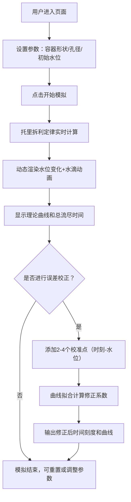

## 1. 产品概述

中国古代水钟（漏刻）模拟器是一款结合传统科技文化与现代物理计算的交互式教育工具。用户可通过调整容器形状、孔径大小、初始水位等参数，直观体验古代计时工具的工作原理，理解托里拆利定律在实际中的应用，并了解古人如何通过日晷校准来提高计时精度。

- **主要用途**：科学教育、历史文化展示、物理实验模拟
- **目标用户**：学生、教师、历史爱好者、科技馆访客
- **核心价值**：将抽象的流体力学原理具象化，展现中国古代科技智慧

## 2. 核心功能

### 2.1 用户角色
无需注册，访客即可使用全部功能

| 角色 | 注册方式 | 核心权限 |
|------|----------|----------|
| 访客用户 | 无需注册 | 使用全部模拟功能、设置参数、添加校准点、查看曲线 |

### 2.2 功能模块
1. **参数控制面板**：容器形状选择、孔径调节、初始水位设置
2. **物理模拟引擎**：托里拆利定律计算、实时水位更新、流量计算
3. **可视化展示区**：容器3D效果、水滴动画、水位-时间曲线图、瞬时流量图
4. **误差校正系统**：校准点管理、曲线拟合算法、修正系数计算、修正后时间刻度
5. **动画演示系统**：水滴下落动画、水位变化动画、播放/暂停/重置控制

### 2.3 页面详情
| 页面名称 | 模块名称 | 功能描述 |
|---------|---------|----------|
| 主页面 | 标题区 | 古风标题、历史文化介绍、使用说明 |
| 主页面 | 参数控制面板 | 容器形状（圆柱/圆锥/立方体）单选、孔径滑块（1-10mm）、水位高度输入、开始/暂停/重置按钮 |
| 主页面 | 容器可视化区 | 动态渲染容器形状、实时水位显示、水滴下落动画、刻度标注 |
| 主页面 | 数据显示区 | 当前水位、瞬时流速、剩余时间、总流尽时间 |
| 主页面 | 误差校正区 | 校准点添加表单（2-4个）、拟合计算按钮、修正系数显示、修正后时间刻度表 |
| 主页面 | 图表区 | 水位-时间曲线图（理论值vs校正值）、瞬时流量曲线图 |

## 3. 核心流程

用户进入页面 → 选择容器形状和参数 → 点击开始模拟 → 实时显示水位变化和水滴动画 → 查看理论曲线和总时间 → （可选）添加校准点 → 执行误差校正 → 查看修正后曲线和时间刻度

## 4. 用户界面设计

### 4.1 设计风格
- **设计主题**：中国古典风格与现代科学可视化结合
- **主色调**：深青色（#1a3a4a）、赭石色（#c17817）、米白色（#f5f0e6）
- **辅助色**：水蓝色（#4a90a4）用于水位、金色（#d4af37）用于刻度标注
- **字体**：标题使用"Ma Shan Zheng"（马善政楷体），正文使用"Noto Serif SC"（思源宋体）
- **按钮风格**：圆角矩形、古典边框装饰、悬停时微亮效果
- **布局风格**：左右分栏布局，左侧控制面板+容器可视化，右侧图表和数据展示
- **装饰元素**：古典云纹边框、竹简质感背景、印章风格图标

### 4.2 页面设计概述
| 页面名称 | 模块名称 | UI元素 |
|---------|---------|--------|
| 主页面 | 标题区 | 古风书法字体标题、竹简纹理背景、印章装饰 |
| 主页面 | 参数控制面板 | 卡片式布局、古典边框、滑块带刻度标签、图标使用水滴/容器形状 |
| 主页面 | 容器可视化区 | 居中展示、SVG绘制的容器、渐变水位填充、水滴粒子动画 |
| 主页面 | 数据显示区 | 仿古仪表盘风格、数字动态变化、单位标注清晰 |
| 主页面 | 误差校正区 | 表格形式添加校准点、拟合进度动画、修正系数高亮显示 |
| 主页面 | 图表区 | 双图表上下布局、古典配色、曲线平滑过渡动画 |

### 4.3 响应式
- **PC端优先**：采用左右分栏布局，左侧40%，右侧60%
- **平板适配**：改为上下布局，参数控制在上，可视化和图表在下
- **移动端**：单列流式布局，图表可横向滚动，触控优化滑块和按钮
- **动画效果**：参数改变时平滑过渡、水位变化缓动效果、水滴下落贝塞尔曲线动画

### 4.4 动画设计
- 水滴下落：使用CSS动画，贝塞尔曲线模拟重力加速效果
- 水位变化：水位高度使用transition平滑过渡
- 图表更新：曲线点依次出现，模拟实时绘制效果
- 按钮交互：悬停时轻微放大、点击时凹陷效果
- 页面加载：元素依次淡入，营造古典卷轴展开效果
