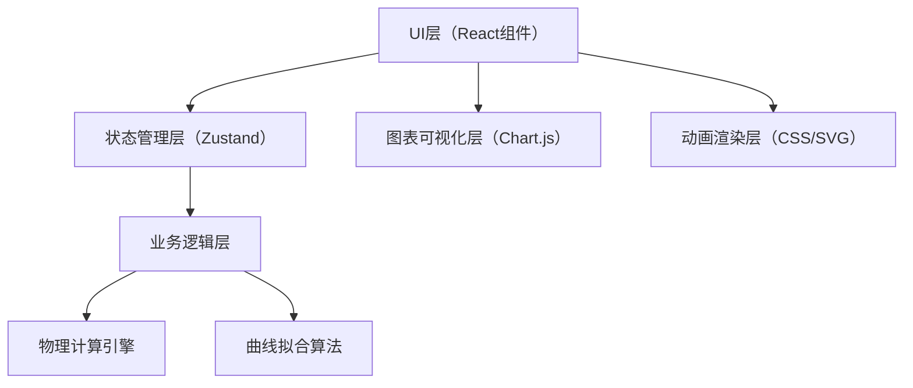

## 1. 架构设计

纯前端单页应用，采用分层架构设计：



- **UI层**：React组件，负责用户交互和界面展示
- **状态管理层**：Zustand存储全局状态（参数、模拟数据、校准点）
- **业务逻辑层**：协调物理计算和数据处理
- **物理计算引擎**：托里拆利定律实现、容器面积计算、水位时间曲线生成
- **曲线拟合算法**：最小二乘法多项式拟合、误差校正系数计算
- **图表可视化层**：Chart.js绘制水位-时间曲线和流量曲线
- **动画渲染层**：CSS动画+SVG实现水滴效果和水位变化

## 2. 技术描述

- **前端框架**：React@18 + TypeScript + Vite
- **状态管理**：Zustand@4
- **图表库**：Chart.js@4 + react-chartjs-2@5
- **样式方案**：Tailwind CSS@3
- **图标库**：Lucide React
- **数学计算**：原生JavaScript数学库（无需额外依赖）

## 3. 目录结构

```
src/
├── components/
│   ├── ControlPanel.tsx      # 参数控制面板
│   ├── ContainerView.tsx     # 容器可视化组件
│   ├── DataDisplay.tsx       # 数据显示区
│   ├── CalibrationPanel.tsx  # 误差校正面板
│   ├── ChartsSection.tsx     # 图表展示区
│   ├── WaterDrop.tsx         # 水滴动画组件
│   └── Header.tsx            # 页头组件
├── store/
│   └── useSimulationStore.ts # Zustand状态管理
├── utils/
│   ├── physics.ts            # 物理计算引擎
│   ├── fitting.ts            # 曲线拟合算法
│   └── constants.ts          # 物理常量和配置
├── types/
│   └── index.ts              # TypeScript类型定义
├── App.tsx
├── main.tsx
└── index.css
```

## 4. 核心数据模型

```typescript
// 容器形状类型
type ContainerShape = 'cylinder' | 'cone' | 'cube';

// 模拟参数
interface SimulationParams {
  containerShape: ContainerShape;
  apertureDiameter: number;  // 孔径，单位：mm，范围1-10
  initialWaterHeight: number; // 初始水位，单位：cm
  containerSize: number;      // 容器尺寸（直径/边长），单位：cm
}

// 校准点
interface CalibrationPoint {
  id: number;
  observedTime: number;       // 实际观测时刻，单位：秒
  observedWaterHeight: number; // 观测水位，单位：cm
}

// 数据点
interface DataPoint {
  time: number;               // 时间，单位：秒
  waterHeight: number;        // 水位，单位：cm
  flowRate: number;           // 瞬时流量，单位：cm³/s
  velocity: number;           // 瞬时流速，单位：m/s
}

// 拟合结果
interface FittingResult {
  coefficients: number[];     // 多项式系数
  correctedTimeScale: DataPoint[]; // 修正后时间刻度
  rSquared: number;           // 拟合优度
}

// 模拟状态
interface SimulationState {
  params: SimulationParams;
  isRunning: boolean;
  isPaused: boolean;
  currentTime: number;
  currentWaterHeight: number;
  theoreticalData: DataPoint[];
  calibrationPoints: CalibrationPoint[];
  fittingResult: FittingResult | null;
  totalDrainTime: number;
}
```

## 5. 核心算法

### 5.1 托里拆利定律
瞬时流速：v = √(2gh)，其中g为重力加速度，h为当前水位高度

瞬时流量：Q = v × A孔，其中A孔为孔的横截面积

水位下降速率：dh/dt = -Q / A容器(h)，其中A容器(h)为水位h处的容器横截面积

### 5.2 容器横截面积计算
- 圆柱体：A(h) = π × (D/2)² （常数）
- 圆锥体（顶点朝下）：A(h) = π × (D×h/(2H))² （随h变化）
- 立方体：A(h) = S² （常数）

### 5.3 数值积分方法
采用四阶龙格-库塔法（RK4）求解微分方程，保证计算精度

### 5.4 曲线拟合算法
最小二乘法多项式拟合，寻找修正系数k，使得：
t_corrected = k × t_theoretical
或更高阶多项式拟合

## 6. 状态管理设计

```typescript
// Zustand Store 操作
const useSimulationStore = create<SimulationState & Actions>((set, get) => ({
  // 初始状态
  params: defaultParams,
  isRunning: false,
  isPaused: false,
  currentTime: 0,
  currentWaterHeight: 20,
  theoreticalData: [],
  calibrationPoints: [],
  fittingResult: null,
  totalDrainTime: 0,

  // Actions
  setParams: (params) => set({ params }),
  startSimulation: () => { ... },
  pauseSimulation: () => { ... },
  resetSimulation: () => { ... },
  addCalibrationPoint: (point) => { ... },
  removeCalibrationPoint: (id) => { ... },
  performFitting: () => { ... },
  updateSimulationStep: (deltaTime) => { ... },
}));
```

## 7. 性能优化

1. **动画帧同步**：使用requestAnimationFrame驱动模拟更新，与浏览器刷新率同步
2. **数据采样**：理论曲线生成时按时间间隔采样，避免数据点过多
3. **计算缓存**：已计算的理论曲线在参数未改变时直接复用
4. **分批渲染**：图表数据较多时分批更新，避免UI阻塞
5. **CSS硬件加速**：transform和opacity属性驱动动画，启用GPU加速
