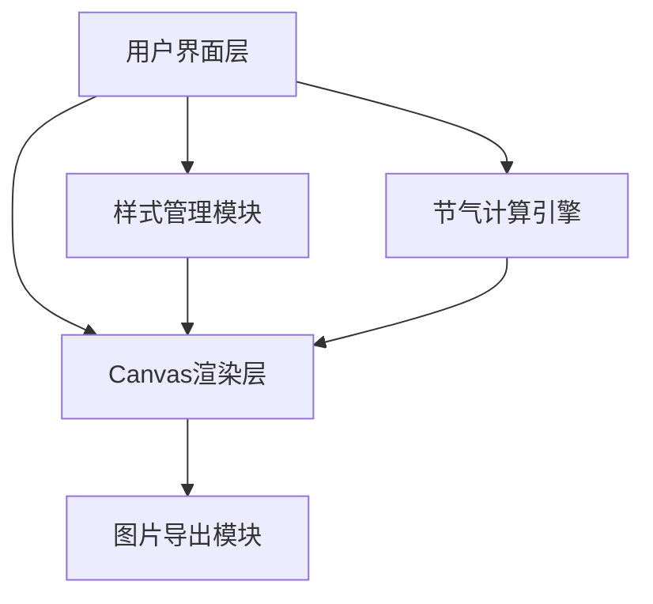

## 1. 架构设计



## 2. 技术描述

- **前端框架**: React@18 + TypeScript + Vite
- **样式方案**: TailwindCSS@3
- **核心技术**: HTML5 Canvas API
- **字体方案**: Google Fonts (Ma Shan Zheng, Noto Serif SC)
- **无后端，纯前端应用**

## 3. 目录结构

```
src/
├── components/
│   ├── ControlPanel.tsx      # 左侧控制面板
│   ├── CanvasPreview.tsx     # Canvas预览组件
│   ├── YearSelector.tsx      # 年份选择器
│   ├── ThemeSelector.tsx     # 主题选择器
│   └── ExportPanel.tsx       # 导出面板
├── utils/
│   ├── solarTerm.ts          # 二十四节气计算算法
│   ├── canvasRenderer.ts     # Canvas渲染工具
│   └── themes.ts             # 主题配色定义
├── types/
│   └── index.ts              # 类型定义
├── App.tsx
├── main.tsx
└── index.css
```

## 4. 核心数据模型

### 4.1 节气数据类型

```typescript
interface SolarTerm {
  name: string;           // 节气名称
  date: Date;             // 公历日期
  phenology: string;      // 物候简语
  month: number;          // 所属月份
}

interface Theme {
  id: string;
  name: string;
  backgroundColor: string;
  primaryColor: string;
  secondaryColor: string;
  textColor: string;
  accentColor: string;
}

interface CanvasConfig {
  year: number;
  layout: 'portrait' | 'landscape';
  theme: Theme;
  fontFamily: string;
  backgroundColor: string;
  exportSize: 'A3' | 'A4';
}
```

## 5. 核心算法

### 5.1 二十四节气计算公式
使用定气法计算太阳黄经，基于24节气的精确时间算法（从2000年到2030年的精确数据）。

### 5.2 Canvas渲染流程
1. 计算画布尺寸（A3: 3508×4961px, A4: 2480×3508px，300DPI）
2. 绘制背景和装饰边框
3. 绘制标题区域
4. 按季节分组排列24节气
5. 每个节气卡片：名称、日期、物候
6. 添加装饰元素（印章、云纹等）

## 6. 输出规格

| 尺寸 | 像素(300DPI) | 用途 |
|------|-------------|------|
| A4纵向 | 2480×3508px | 普通打印 |
| A4横向 | 3508×2480px | 宽幅打印 |
| A3纵向 | 3508×4961px | 大幅挂图 |
| A3横向 | 4961×3508px | 超宽挂图 |

## 7. 性能优化

- Canvas按需重绘，避免不必要的渲染
- 使用离屏Canvas进行高清导出
- 节气数据预计算缓存
- 图片导出使用Blob流式处理
