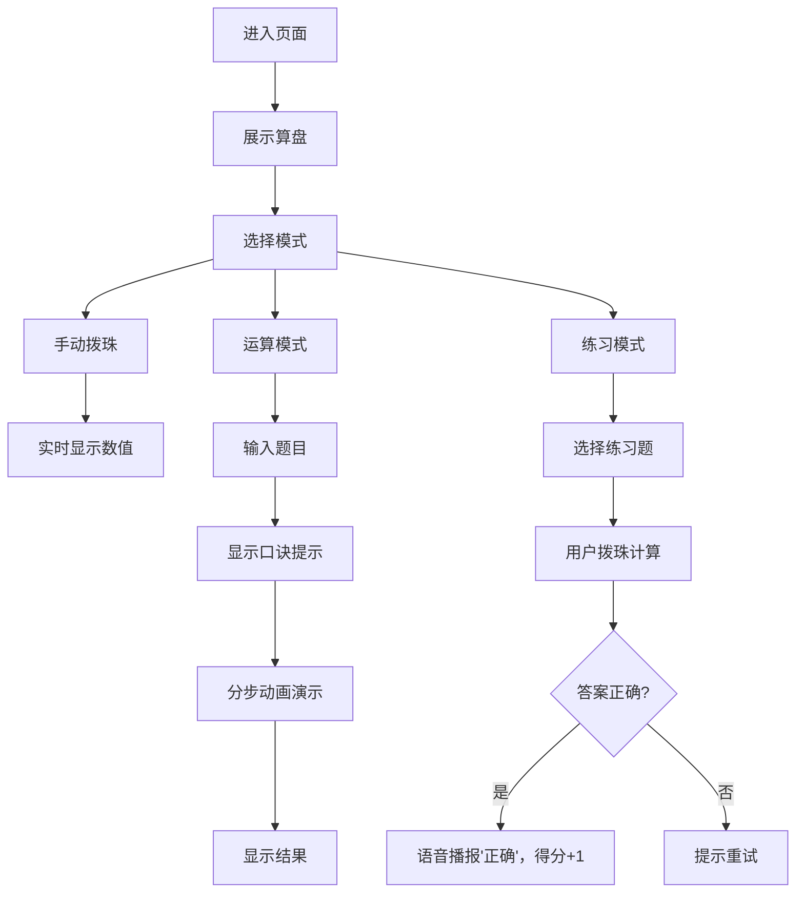

## 1. 产品概述

交互式算盘模拟器，提供传统珠算的数字化体验。用户可通过点击或拖拽拨动算盘珠进行计算，学习珠算口诀，掌握基本运算技巧。

- 面向学生和珠算爱好者，提供沉浸式的珠算学习工具
- 融合传统珠算文化与现代交互技术，寓教于乐

## 2. 核心功能

### 2.1 用户角色
| 角色 | 注册方式 | 核心权限 |
|------|----------|----------|
| 普通用户 | 无需注册 | 使用所有算盘功能、练习和学习 |

### 2.2 功能模块
1. **算盘主界面**：Canvas绘制标准算盘，支持上二下五珠/上一下四珠切换
2. **交互系统**：珠子点击/拖拽拨动，实时显示数值
3. **运算模块**：加减乘除四则运算，珠算口诀提示
4. **步骤演示**：运算过程分步动画演示
5. **练习系统**：5道预置练习题，自动判分
6. **反馈系统**：正确时语音播报，得分记录

### 2.3 页面详情
| 页面名称 | 模块名称 | 功能描述 |
|----------|----------|----------|
| 主页面 | 算盘展示区 | Canvas绘制算盘，支持珠子交互，实时数值显示 |
| 主页面 | 运算控制区 | 数字输入、运算符选择、清除、计算、口诀提示 |
| 主页面 | 步骤演示区 | 显示当前运算步骤，支持分步演示控制 |
| 主页面 | 练习模式区 | 练习题列表、答题区域、得分显示 |
| 主页面 | 设置区 | 算盘类型切换（上二下五/上一下四） |

## 3. 核心流程
用户进入页面 → 查看默认算盘（上二下五珠）→ 点击珠子进行手动拨珠计算 → 或选择运算模式输入题目 → 系统显示珠算口诀 → 点击分步演示查看拨珠过程 → 或进入练习模式答题 → 答对后语音播报并累计得分

## 4. 用户界面设计

### 4.1 设计风格
- **主色调**：传统木色 #8B4513 作为算盘框架，深棕色 #3D2314 为背景，金色 #DAA520 为点缀
- **辅助色**：珠子上珠为深色 #2C1810，下珠为浅色 #F5DEB3，梁为金色 #DAA520
- **按钮风格**：圆角木质按钮，带有轻微立体阴影，hover时有悬浮效果
- **字体**：标题使用楷体类传统字体，正文使用清晰易读的无衬线字体
- **布局风格**：左右分栏，左侧为算盘主体，右侧为控制面板，整体古典雅致
- **装饰元素**：木纹纹理背景，传统中国风边框装饰

### 4.2 页面设计概述
| 页面名称 | 模块名称 | UI元素 |
|----------|----------|--------|
| 主页面 | 算盘区 | Canvas绘制的立体算盘，木纹质感，金色横梁，圆润珠子，带有阴影和高光 |
| 主页面 | 数值显示 | 大号数字显示，带发光效果，实时更新 |
| 主页面 | 控制面板 | 木质风格按钮组，数字键盘，运算符选择 |
| 主页面 | 口诀提示 | 古典卷轴样式背景，金色文字 |
| 主页面 | 练习区 | 卡片式题目列表，当前题目高亮，得分徽章 |
| 主页面 | 设置区 | 切换开关，传统中式滑块样式 |

### 4.3 响应性
- 桌面端优先，左右分栏布局（算盘占65%，控制区占35%）
- 平板端上下布局，算盘在上，控制区在下
- 移动端适配触摸操作，珠子点击区域适当放大
- 最小支持宽度320px

### 4.4 动画效果
- 珠子拨动：平滑的CSS过渡动画，带有弹性缓动效果
- 步骤演示：珠子依次高亮并移动，配合口诀文字淡入
- 正确反馈：数字闪烁金色光芒，弹出"正确"徽标动画
- 页面加载：算盘从模糊到清晰，控制区滑入
