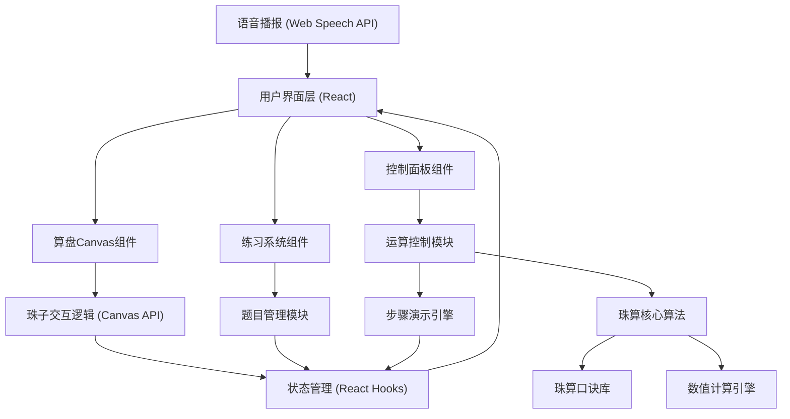

## 1. 架构设计



## 2. 技术描述
- **前端**：React@18 + Vite@5 + TypeScript
- **样式**：TailwindCSS@3 + 自定义CSS动画
- **绘图**：Canvas 2D API
- **语音**：Web Speech API (SpeechSynthesis)
- **状态管理**：React Hooks (useState, useReducer, useRef)
- **动画**：requestAnimationFrame + CSS Transition
- **初始化工具**：npm create vite@latest
- **后端**：无（纯前端应用）
- **数据库**：无（localStorage存储得分）

## 3. 目录结构

```
src/
├── components/
│   ├── AbacusCanvas.tsx      # 算盘Canvas主组件
│   ├── ControlPanel.tsx      # 运算控制面板
│   ├── PracticePanel.tsx     # 练习模式面板
│   ├── FormulaDisplay.tsx    # 口诀显示组件
│   ├── StepDisplay.tsx       # 步骤演示组件
│   ├── ScoreDisplay.tsx      # 得分显示组件
│   └── SettingsToggle.tsx    # 设置切换组件
├── hooks/
│   ├── useAbacusState.ts     # 算盘状态管理Hook
│   ├── useCalculation.ts     # 计算逻辑Hook
│   └── useSpeech.ts          # 语音播报Hook
├── utils/
│   ├── abacusMath.ts         # 珠算核心算法
│   ├── formulas.ts           # 珠算口诀库
│   ├── beadRenderer.ts       # 珠子渲染逻辑
│   └── constants.ts          # 常量定义
├── types/
│   └── index.ts              # TypeScript类型定义
├── data/
│   └── practiceProblems.ts   # 预置练习题数据
├── App.tsx
├── main.tsx
└── index.css
```

## 4. 核心数据结构

### 4.1 算盘状态
```typescript
interface AbacusState {
  type: '2-5' | '1-4';                    // 算盘类型：上二下五/上一下四
  columns: number;                        // 档数
  beads: BeadColumn[];                    // 每档珠子状态
  currentValue: number;                   // 当前显示数值
  displayValue: string;                   // 显示的数值字符串
}

interface BeadColumn {
  upper: number[];                        // 上珠位置数组 [0|1]
  lower: number[];                        // 下珠位置数组 [0|1|2|3|4]
  columnValue: number;                    // 该档表示的数值
}
```

### 4.2 运算状态
```typescript
interface CalculationState {
  mode: 'manual' | 'calculation' | 'practice';
  operand1: number | null;
  operand2: number | null;
  operator: '+' | '-' | '×' | '÷' | null;
  result: number | null;
  currentStep: number;
  steps: CalculationStep[];
  currentFormula: string | null;
}

interface CalculationStep {
  description: string;                    // 步骤描述
  formula: string;                        // 对应口诀
  beadChanges: BeadChange[];              // 珠子变化
}

interface BeadChange {
  columnIndex: number;                    // 档索引
  beadType: 'upper' | 'lower';            // 珠子类型
  beadIndex: number;                      // 珠子索引
  fromPosition: number;                   // 起始位置
  toPosition: number;                     // 目标位置
}
```

### 4.3 练习数据
```typescript
interface PracticeProblem {
  id: number;
  question: string;                       // 题目文字
  operand1: number;
  operand2: number;
  operator: '+' | '-' | '×' | '÷';
  answer: number;
  difficulty: 'easy' | 'medium' | 'hard';
}
```

## 5. 核心算法说明

### 5.1 珠子位置计算
- 上珠：每颗代表5，靠梁时（位置1）生效
- 下珠：每颗代表1，靠梁时（位置>0）生效
- 档位从右到左，依次为个位、十位、百位...

### 5.2 珠算口诀映射
- 加法口诀：如"一下五去四"（+1）、"二下五去三"（+2）
- 减法口诀：如"一上四去五"（-1）、"二上三去五"（-2）
- 乘法：九九乘法表结合错位累加
- 除法：归除法口诀

### 5.3 步骤演示算法
1. 将运算分解为个位到最高位的逐位运算
2. 每一步匹配对应珠算口诀
3. 计算该步骤需要拨动的珠子
4. 按顺序生成动画帧
5. 使用requestAnimationFrame平滑过渡

## 6. 交互事件处理

### 6.1 Canvas事件监听
- mousedown / touchstart：检测点击的珠子
- mousemove / touchmove：拖拽珠子跟随
- mouseup / touchend：判断珠子最终位置，触发状态更新

### 6.2 碰撞检测
- 珠子位置使用矩形/圆形碰撞检测
- 考虑珠子间距，防止重叠
- 边界检测防止珠子超出范围
