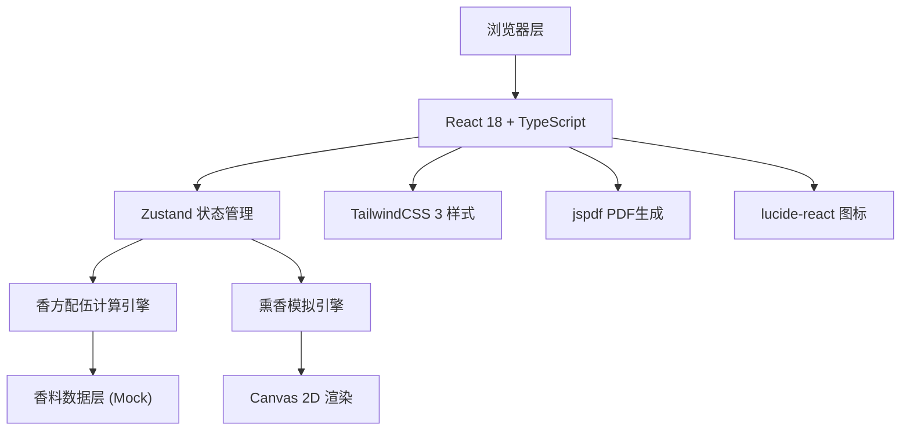

## 1. 架构设计



## 2. 技术描述

- **前端框架**：React@18 + TypeScript@5 + Vite@5
- **状态管理**：Zustand@4
- **样式方案**：TailwindCSS@3
- **UI图标**：lucide-react@0.294
- **PDF生成**：jspdf@2.5.1
- **Canvas渲染**：原生Canvas 2D API
- **初始化工具**：vite-init
- **后端**：无需后端，纯前端应用
- **数据**：内置Mock数据，本地存储用户自定义香方

## 3. 目录结构

```
src/
├── components/
│   ├── IncenseLibrary/      # 香料库组件
│   ├── FormulaAnalyzer/     # 香方分析组件
│   ├── IncenseSimulator/    # 隔火熏香模拟组件
│   ├── ClassicFormulas/     # 经典香方组件
│   ├── AshCanvas.tsx        # Canvas香灰动画
│   └── PDFExport.tsx        # PDF导出组件
├── store/
│   └── useIncenseStore.ts   # Zustand状态管理
├── data/
│   ├── spices.ts            # 10种香料数据
│   └── classicFormulas.ts   # 3个经典香方数据
├── utils/
│   ├── formulaAnalyzer.ts   # 香方分析算法
│   └── incenseSimulator.ts  # 熏香模拟算法
├── types/
│   └── index.ts             # TypeScript类型定义
├── pages/
│   └── Home.tsx             # 主页面
├── App.tsx
└── main.tsx
```

## 4. 数据模型

### 4.1 类型定义

```typescript
// 香料类型
interface Spice {
  id: string;
  name: string;        // 名称：沉香、檀香等
  alias: string;       // 雅称
  aromaType: 'woody' | 'spicy' | 'fresh' | 'sweet' | 'musk';
  intensity: number;   // 香气浓度 1-10
  duration: number;    // 留香时间 1-10
  temperature: 'cool' | 'neutral' | 'warm'; // 性味
  description: string; // 描述
  image: string;       // 图标
}

// 已选香料
interface SelectedSpice {
  spice: Spice;
  grams: number;
}

// 香方分析结果
interface FormulaAnalysis {
  totalWeight: number;
  aromaType: '清雅' | '浓郁' | '温润' | '清冽' | '醇厚' | '淡雅';
  topNote: string;     // 前调
  middleNote: string;  // 中调
  baseNote: string;    // 尾调
  overallScore: number; // 配伍评分
  suggestion: string;  // 配伍建议
}

// 熏香状态
interface IncenseState {
  temperature: number;      // 120-200℃
  releaseRate: number;      // 出香率 0-100%
  burnTime: number;         // 燃烧时间(秒)
  ashColor: { r: number; g: number; b: number }; // 香灰颜色
  isBurning: boolean;       // 是否燃烧中
}

// 经典香方
interface ClassicFormula {
  id: string;
  name: string;
  origin: string;           // 出处
  era: string;              // 年代
  ingredients: SelectedSpice[];
  description: string;
  story: string;            // 典故
}
```

## 5. 核心算法

### 5.1 香方分析算法
- 根据每种香料的`aromaType`和`grams`加权计算主香气类型
- 根据`intensity`计算整体浓度阈值，判断清雅/浓郁
- 根据`temperature`属性判断温润/清冽
- 前调/中调/尾调根据挥发特性（duration）分配

### 5.2 出香率计算
```typescript
// 最佳出香温度区间为150-180℃
// 低于120℃出香率<10%，高于200℃焦糊味，出香率下降
function calculateReleaseRate(temp: number): number {
  if (temp < 120) return temp * 0.08;
  if (temp <= 165) return 40 + (temp - 120) * 1.33;
  if (temp <= 180) return 100 - (temp - 165) * 0.67;
  return Math.max(20, 80 - (temp - 180) * 2);
}
```

### 5.3 香灰颜色渐变
```typescript
// 随时间和温度变化：灰白(200,200,200) → 灰褐(100,90,80)
function getAshColor(burnTime: number, temp: number): RGB {
  const progress = Math.min(1, burnTime / 300); // 5分钟完全变色
  const tempFactor = Math.min(1, (temp - 120) / 80);
  return {
    r: 200 - 100 * progress * tempFactor,
    g: 200 - 110 * progress * tempFactor,
    b: 200 - 120 * progress * tempFactor,
  };
}
```

## 6. 路由定义

| 路由 | 用途 |
|------|------|
| / | 主页，包含所有功能模块 |

## 7. Canvas 香灰动画实现

1. 初始化Canvas，绘制炉底
2. 每50ms更新一帧，根据燃烧进度在随机位置堆积香灰颗粒
3. 使用粒子系统模拟香灰飘落效果
4. 颜色随时间从灰白过渡到灰褐
5. 温度越高，香灰堆积速度越快
