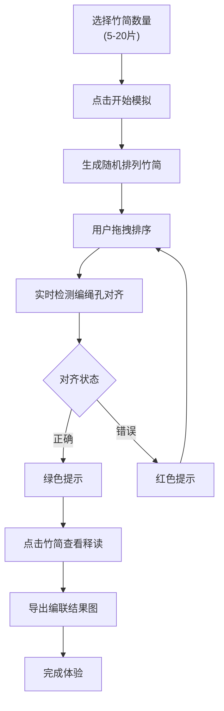

## 1. 产品概述

竹简编联模拟器是一款交互式的文物数字化教育工具，让用户通过拖拽操作体验古代竹简的编联过程。用户可以选择竹简数量，对未排序的竹简碎片进行重新排列，并通过编绳孔对齐检测获得即时反馈。点击竹简可查看古文释读与现代汉字对照，支持导出编联结果图。

- **主要用途**：文化教育、文物数字化体验、历史爱好者互动学习
- **目标用户**：学生、历史文化爱好者、博物馆参观者
- **产品价值**：通过沉浸式互动体验，让用户深入了解中国古代简牍文化

## 2. 核心功能

### 2.1 用户角色

| 角色 | 注册方式 | 核心权限 |
|------|----------|----------|
| 普通用户 | 无需注册 | 使用全部交互功能、导出结果图 |

### 2.2 功能模块

1. **竹简数量选择区**：5-20片竹简选择器，开始模拟按钮
2. **竹简编联工作区**：可拖拽的竹简碎片，编绳孔对齐检测，实时状态反馈
3. **文字释读区**：竹简古文显示，现代汉字对照，释读说明
4. **结果导出区**：顺序编号标注，图片导出功能

### 2.3 页面详情

| 页面名称 | 模块名称 | 功能描述 |
|---------|---------|----------|
| 主页面 | 竹简数量选择 | 下拉选择器选择5-20片竹简，点击开始生成随机排列的竹简 |
| 主页面 | 竹简编联工作区 | 拖拽排序竹简，编绳孔对齐检测（绿色表示对齐，红色表示未对齐），竹简可翻转查看背面 |
| 主页面 | 文字释读面板 | 点击竹简显示《郭店楚简》选段的摹写字形与现代汉字对照，包含释读说明 |
| 主页面 | 结果导出栏 | 显示当前顺序编号，导出PNG图片功能，重置按钮 |

## 3. 核心流程

用户选择竹简数量 → 点击开始生成 → 系统随机打乱竹简顺序 → 用户拖拽重新排列 → 系统实时检测编绳孔对齐状态 → 点击竹简查看文字释读 → 完成编联后导出结果图

## 4. 用户界面设计

### 4.1 设计风格

- **主色调**：深褐色(#5D4E37)、米黄色(#F5E6C8)、朱红色(#B85450)
- **辅助色**：竹简原色(#E8D5B7)、墨色(#2C2416)、印章红(#C23B22)
- **按钮风格**：圆角矩形，仿古印章效果，悬停时轻微上浮
- **字体**：标题使用「Noto Serif SC」，古文显示使用仿古字体，正文使用「Noto Sans SC」
- **布局风格**：三栏式布局（左侧控制区、中间工作区、右侧释读区），仿古籍展开效果
- **视觉元素**：竹简纹理背景、编绳装饰线、印章水印

### 4.2 页面设计概览

| 页面名称 | 模块名称 | UI元素 |
|---------|---------|--------|
| 主页面 | 顶部标题栏 | 仿古标题、项目说明、水墨装饰、印章Logo |
| 主页面 | 左侧控制区 | 竹简数量选择器、开始按钮、重置按钮、导出按钮 |
| 主页面 | 中间工作区 | 竹简碎片（可拖拽、可翻转）、编绳线、对齐状态指示器、顺序编号 |
| 主页面 | 右侧释读区 | 竹简大图、古文摹写、现代汉字对照、释读说明文字 |

### 4.3 响应式

- **桌面端优先**：三栏式布局，工作区占据主要空间
- **平板适配**：两栏式布局，释读区改为底部弹出面板
- **移动端适配**：单栏流式布局，手势操作优化，释读区全屏弹窗
- **触摸优化**：拖拽热区增大，按钮尺寸适配触摸操作

### 4.4 动画与交互

- 竹简拖拽时有阴影跟随效果
- 编绳孔对齐时有轻微的吸附动画
- 竹简翻转使用3D翻转动画
- 页面加载时竹简依次展开的动画效果
- 悬停时竹简轻微上浮并显示阴影
