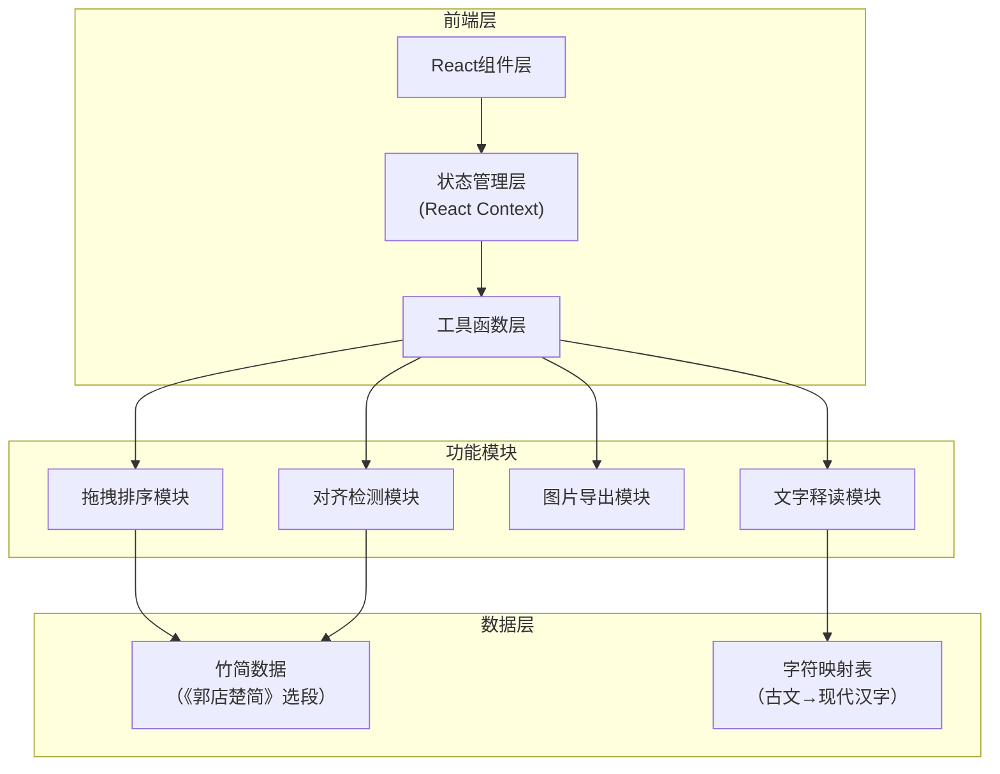

## 1. 架构设计



## 2. 技术描述

- **前端框架**：React@18 + TypeScript
- **构建工具**：Vite@5
- **样式方案**：TailwindCSS@3
- **拖拽库**：@dnd-kit/core + @dnd-kit/sortable
- **图片导出**：html2canvas
- **图标库**：Lucide React
- **初始化工具**：npm create vite@latest

## 3. 路由定义

| 路由 | 用途 |
|------|------|
| / | 竹简编联模拟主页面 |

## 4. 数据模型

### 4.1 竹简数据结构

```typescript
interface BambooSlip {
  id: string;
  order: number;           // 正确顺序
  currentIndex: number;    // 当前位置
  ancientText: string;     // 古文（摹写字形）
  modernText: string;      // 现代汉字
  annotation: string;      // 释读说明
  holes: {                 // 编绳孔位置
    top: number;
    middle: number;
    bottom: number;
  };
  isFlipped: boolean;      // 是否翻转到背面
}
```

### 4.2 《郭店楚简》预置数据

使用《郭店楚简·老子》选段作为预置内容：

| 简号 | 古文内容 | 现代汉字 |
|------|----------|----------|
| 1 | 道可道也 | 道，可道也 |
| 2 | 非恒道也 | 非恒道也 |
| 3 | 名可名也 | 名，可名也 |
| 4 | 非恒名也 | 非恒名也 |
| 5 | 无名万物之始也 | 无名，万物之始也 |
| 6 | 有名万物之母也 | 有名，万物之母也 |
| ... | ... | ... |

### 4.3 对齐检测算法

```typescript
interface AlignmentResult {
  isAligned: boolean;
  deviation: number;      // 偏差像素值
  threshold: number;      // 对齐阈值
}

function checkAlignment(
  slip1: BambooSlip, 
  slip2: BambooSlip
): AlignmentResult {
  const threshold = 8;    // 8像素内视为对齐
  const deviation = Math.abs(
    slip1.holes.top - slip2.holes.top
  );
  return {
    isAligned: deviation <= threshold,
    deviation,
    threshold
  };
}
```

## 5. 核心组件结构

```
src/
├── components/
│   ├── BambooSlip.tsx       # 单个竹简组件
│   ├── BambooWorkspace.tsx  # 竹简工作区
│   ├── ControlPanel.tsx     # 控制面板
│   ├── ReadingPanel.tsx     # 释读面板
│   └── AlignmentIndicator.tsx # 对齐指示器
├── hooks/
│   ├── useDragAndDrop.ts    # 拖拽排序Hook
│   └── useBambooSlips.ts    # 竹简状态管理Hook
├── data/
│   └── slipsData.ts         # 预置竹简数据
├── utils/
│   ├── alignment.ts         # 对齐检测工具
│   └── exportImage.ts       # 图片导出工具
├── App.tsx
└── main.tsx
```

## 6. 关键交互实现

### 6.1 拖拽排序
- 使用 @dnd-kit 实现竹简的拖拽排序
- 拖拽时显示半透明预览
- 释放时触发对齐检测

### 6.2 编绳孔对齐检测
- 每片竹简预设3个编绳孔位置（上、中、下）
- 实时计算相邻竹简的编绳孔位置偏差
- 偏差在阈值内显示绿色连接线，否则显示红色

### 6.3 竹简翻转
- CSS 3D transform 实现翻转动画
- 正面显示古文，背面空白（模拟真实竹简）

### 6.4 图片导出
- 使用 html2canvas 捕获工作区
- 添加顺序编号水印
- 导出为 PNG 格式
