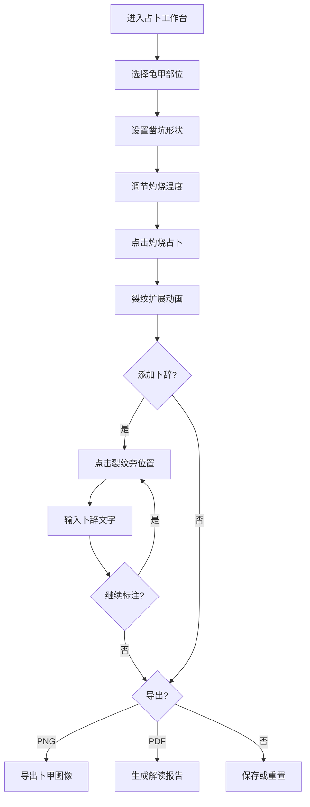

# 龟甲占卜裂纹模拟工具 — 产品需求文档

## 1. 产品概述

龟甲占卜裂纹模拟工具是一款基于热应力场简化模型的甲骨灼烧裂纹生成器，用户可模拟商代龟甲占卜全过程——选择龟甲部位、设置凿坑形状与灼烧温度，系统生成逼真的"卜"字形兆纹裂纹，并支持卜辞标注与PDF报告导出。预置3片商王武丁时期典型甲骨示例供参考学习。

- 目标用户：考古学者、历史爱好者、文化教育工作者
- 核心价值：以数字化方式复现三千年前的占卜仪式，兼具学术参考与文化体验

## 2. 核心功能

### 2.1 用户角色

| 角色 | 注册方式 | 核心权限 |
|------|----------|----------|
| 访客 | 无需注册 | 使用全部功能 |

### 2.2 功能模块

1. **占卜工作台页面**：龟甲部位选择、凿坑形状设置、灼烧温度滑动条、Canvas裂纹模拟绘制、卜辞标注
2. **卜辞模板面板**：常见卜辞模板列表、模板选择与应用
3. **甲骨示例展示**：3片预置商王武丁时期甲骨示例卡片、示例详情与裂纹查看
4. **导出功能**：卜甲图像导出（PNG）、卜辞解读报告PDF导出

### 2.3 页面详情

| 页面名称 | 模块名称 | 功能描述 |
|----------|----------|----------|
| 占卜工作台 | 龟甲选择器 | 选择腹甲或背甲，Canvas显示对应龟甲轮廓 |
| 占卜工作台 | 凿坑设置 | 选择圆形或枣核形凿坑，显示凿坑位置预览 |
| 占卜工作台 | 温度控制 | 500-1200℃滑动条，温度越高裂纹越密集 |
| 占卜工作台 | 裂纹生成器 | 基于热应力场模型生成"卜"字形兆纹，动画展示裂纹扩展过程 |
| 占卜工作台 | 卜辞标注 | 点击裂纹旁位置，弹出文字输入框添加卜辞标注 |
| 占卜工作台 | 卜辞模板 | 侧边面板展示常见卜辞模板（下雨、出征、祭祀等），点击应用 |
| 甲骨示例 | 示例卡片 | 3片武丁时期甲骨缩略图与简介 |
| 甲骨示例 | 示例详情 | 点击卡片展开完整裂纹图、卜辞原文与解读 |
| 导出面板 | 图像导出 | 导出当前卜甲Canvas为PNG图片 |
| 导出面板 | 报告导出 | 生成卜辞解读报告PDF（含裂纹图、卜辞、参数） |

## 3. 核心流程

用户进入占卜工作台 → 选择龟甲部位（腹甲/背甲）→ 设置凿坑形状（圆形/枣核形）→ 调节灼烧温度 → 点击"灼烧占卜"按钮 → 系统模拟裂纹扩展动画 → 用户在裂纹旁添加卜辞标注 → 可选择卜辞模板辅助 → 导出卜甲图像或PDF报告

## 4. 用户界面设计

### 4.1 设计风格

- **主色调**：古铜色（#8B6914）+ 龟甲象牙白（#F5F0E1）+ 朱砂红（#C73E3A）
- **辅助色**：墨黑（#2C2C2C）、甲骨褐（#6B4423）、铭金（#D4A843）
- **按钮风格**：古朴圆角，带铜边框效果，hover时微光动效
- **字体**：标题使用"ZCOOL XiaoWei"（站酷小薇体），正文使用"Noto Serif SC"（思源宋体）
- **布局风格**：中央大Canvas为主视觉区，左右两侧面板，顶部古风导航栏
- **纹理**：背景使用宣纸纹理、龟甲骨质纹理叠加
- **动效**：裂纹扩展动画、火焰灼烧粒子效果、卜辞墨迹渐显效果

### 4.2 页面设计概述

| 页面名称 | 模块名称 | UI元素 |
|----------|----------|--------|
| 占卜工作台 | 中央画布区 | 深色背景，龟甲轮廓居中，裂纹动画，卜辞标注浮层 |
| 占卜工作台 | 左侧控制面板 | 龟甲部位切换（图标按钮）、凿坑形状选择（可视化按钮）、温度滑动条（火焰渐变色） |
| 占卜工作台 | 右侧卜辞面板 | 卜辞模板列表（卡片式）、卜辞输入区（竖排文字）、添加标注按钮 |
| 甲骨示例 | 示例卡片网格 | 3列卡片，每片甲骨缩略图、名称、时期标签 |
| 甲骨示例 | 详情弹窗 | 大图裂纹展示、原文竖排、释读横排、参数标注 |
| 导出面板 | 底部工具栏 | PNG导出按钮、PDF导出按钮、重置按钮 |

### 4.3 响应式设计

- 桌面端优先，画布区域自适应宽度
- 平板端面板折叠为抽屉式
- 移动端竖向布局，画布在上控制区在下

### 4.4 3D场景指导

不适用
