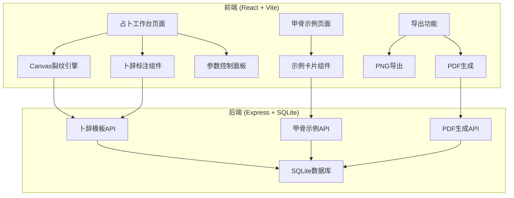
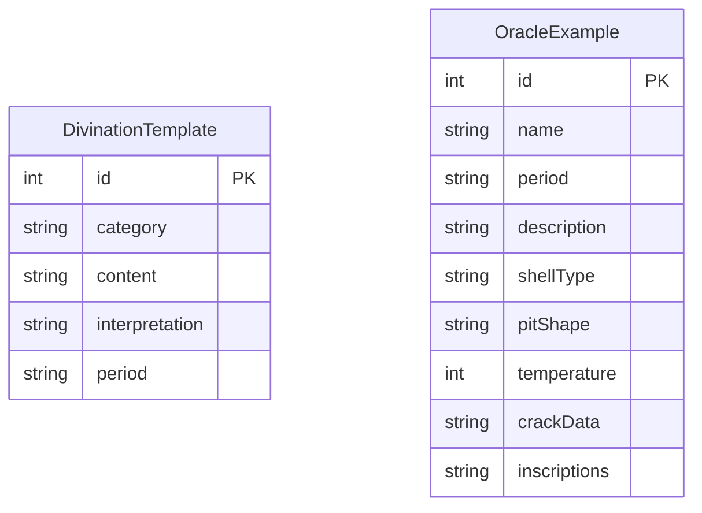

# 龟甲占卜裂纹模拟工具 — 技术架构文档

## 1. 架构设计



## 2. 技术说明

- **前端**：React@18 + TypeScript + Tailwind CSS@3 + Vite
- **初始化工具**：vite-init
- **后端**：Express@4 + TypeScript (ESM)
- **数据库**：SQLite（better-sqlite3）
- **PDF生成**：puppeteer（服务端） / jspdf + html2canvas（客户端）
- **状态管理**：Zustand
- **图标库**：lucide-react

## 3. 路由定义

| 路由 | 用途 |
|------|------|
| `/` | 占卜工作台主页面 |
| `/examples` | 甲骨示例展示页面 |

## 4. API定义

### 4.1 卜辞模板

```typescript
interface DivinationTemplate {
  id: number;
  category: string;
  content: string;
  interpretation: string;
  period: string;
}

// GET /api/templates - 获取所有卜辞模板
// GET /api/templates?category=xxx - 按类别筛选
// Response: DivinationTemplate[]
```

### 4.2 甲骨示例

```typescript
interface OracleExample {
  id: number;
  name: string;
  period: string;
  description: string;
  shellType: 'plastron' | 'carapace';
  pitShape: 'circle' | 'jujube';
  temperature: number;
  crackData: CrackPoint[];
  inscriptions: Inscription[];
}

interface CrackPoint {
  x: number;
  y: number;
  branches: CrackBranch[];
}

interface CrackBranch {
  angle: number;
  length: number;
  width: number;
  subBranches: CrackBranch[];
}

interface Inscription {
  x: number;
  y: number;
  text: string;
  fontSize: number;
  rotation: number;
}

// GET /api/examples - 获取所有甲骨示例
// GET /api/examples/:id - 获取单个甲骨示例详情
// Response: OracleExample / OracleExample[]
```

### 4.3 PDF导出

```typescript
interface PdfExportRequest {
  shellType: 'plastron' | 'carapace';
  pitShape: 'circle' | 'jujube';
  temperature: number;
  crackData: CrackPoint[];
  inscriptions: Inscription[];
  imageDataUrl: string;
}

// POST /api/export/pdf - 生成PDF报告
// Request body: PdfExportRequest
// Response: PDF binary stream (application/pdf)
```

## 5. 服务器架构图


## 6. 数据模型

### 6.1 数据模型定义



### 6.2 数据定义语言

```sql
CREATE TABLE divination_templates (
    id INTEGER PRIMARY KEY AUTOINCREMENT,
    category TEXT NOT NULL,
    content TEXT NOT NULL,
    interpretation TEXT NOT NULL,
    period TEXT NOT NULL DEFAULT '商'
);

CREATE TABLE oracle_examples (
    id INTEGER PRIMARY KEY AUTOINCREMENT,
    name TEXT NOT NULL,
    period TEXT NOT NULL,
    description TEXT NOT NULL,
    shell_type TEXT NOT NULL CHECK(shell_type IN ('plastron', 'carapace')),
    pit_shape TEXT NOT NULL CHECK(pit_shape IN ('circle', 'jujube')),
    temperature INTEGER NOT NULL,
    crack_data TEXT NOT NULL,
    inscriptions TEXT NOT NULL
);

-- 卜辞模板初始数据
INSERT INTO divination_templates (category, content, interpretation, period) VALUES
('天气', '癸巳卜，今日雨？', '癸巳日占卜，今天会下雨吗？', '商'),
('天气', '甲午卜，来日大风雨？', '甲午日占卜，明天会有大风雨吗？', '商'),
('军事', '壬辰卜，征土方，受又？', '壬辰日占卜，征伐土方，会得到保佑吗？', '商'),
('军事', '丙申卜，伐羌，今夕受又？', '丙申日占卜，征伐羌方，今夜会得到保佑吗？', '商'),
('祭祀', '乙卯卜，侑于祖丁？', '乙卯日占卜，对祖丁进行侑祭吗？', '商'),
('祭祀', '丁巳卜，酒于大甲？', '丁巳日占卜，对大甲进行酒祭吗？', '商'),
('农业', '庚子卜，受年？', '庚子日占卜，今年收成好吗？', '商'),
('农业', '辛丑卜，黍年有足雨？', '辛丑日占卜，种黍的年份有充足的雨水吗？', '商'),
('田猎', '戊午卜，逐鹿，获？', '戊午日占卜，逐鹿能捕获吗？', '商'),
('疾病', '己未卜，王疾齿，祟？', '己未日占卜，王牙痛，是鬼神作祟吗？', '商'),
('生育', '甲寅卜，妇好娩，嘉？', '甲寅日占卜，妇好分娩，会吉利吗？', '商'),
('出行', '癸酉卜，行，亡灾？', '癸酉日占卜，出行，没有灾祸吧？', '商');

-- 甲骨示例初始数据（3片商王武丁时期）
INSERT INTO oracle_examples (name, period, description, shell_type, pit_shape, temperature, crack_data, inscriptions) VALUES
('宾组腹甲·雨卜', '商·武丁', '宾组卜辞，腹甲完整，卜问降雨之事。刻辞分布于兆纹两侧，为武丁时期典型腹甲占卜实物。', 'plastron', 'jujube', 850, '[]', '[]'),
('宾组背甲·征伐', '商·武丁', '宾组卜辞，背甲残片，卜问征伐土方之事。兆纹清晰，卜辞竖列排列，为武丁时期军事占卜代表。', 'carapace', 'circle', 950, '[]', '[]'),
('宾组腹甲·祭祀', '商·武丁', '宾组卜辞，腹甲大版，卜问祭祀先祖之事。多组兆纹并存，卜辞密集，为武丁时期祭祀占卜珍贵标本。', 'plastron', 'jujube', 1050, '[]', '[]');
```
