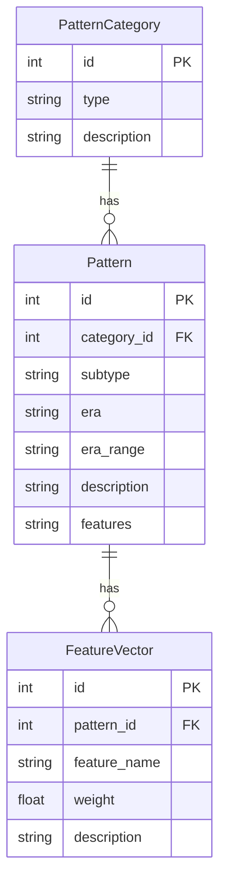

## 1. 架构设计

```mermaid
flowchart TB
    subgraph "前端层"
        "A[React + Vite + TailwindCSS]"
        "B[Canvas图像处理引擎]"
        "C[Zustand状态管理"]
    end
    subgraph "后端层"
        "D[Express.js API服务器"]
        "E[图像处理服务（Sharp/Jimp）"]
        "F[纹饰特征分析服务"]
    end
    subgraph "数据层"
        "G[SQLite数据库"]
        "H[瓦当纹饰数据表"]
        "I[纹饰特征向量表"]
    end
    "A" --> "D"
    "B" --> "C"
    "C" --> "A"
    "D" --> "E"
    "D" --> "F"
    "F" --> "G"
    "E" --> "G"
    "G" --> "H"
    "G" --> "I"
```

## 2. 技术说明

- **前端**：React@18 + TypeScript + TailwindCSS@3 + Vite
- **初始化工具**：vite-init (react-express-ts 模板)
- **后端**：Express@4 + TypeScript (ESM)
- **数据库**：SQLite（better-sqlite3）
- **图像处理**：前端 Canvas API 实现实时预览 + 后端 Sharp 库实现高清导出
- **状态管理**：Zustand

## 3. 路由定义

| 路由 | 用途 |
|------|------|
| / | 主页面，包含上传、对比、推荐、导出全部功能 |

## 4. API定义

### 4.1 图片处理API

```typescript
// POST /api/invert
// 上传图片并执行反转处理
interface InvertRequest {
  image: File;
  direction: "yang2yin" | "yin2yang";
  intensity: number; // 0-100
}
interface InvertResponse {
  taskId: string;
  originalUrl: string;
  invertedUrl: string;
}

// POST /api/enhance
// 边缘增强处理
interface EnhanceRequest {
  taskId: string;
  algorithm: "sobel" | "laplacian";
  strength: number; // 0-100
}
interface EnhanceResponse {
  enhancedUrl: string;
}

// GET /api/export/:taskId
// 导出高清反转图
interface ExportResponse {
  downloadUrl: string;
  fileName: string;
}
```

### 4.2 纹饰推荐API

```typescript
// POST /api/recommend
// 根据反转后图像特征推荐瓦当类型
interface RecommendRequest {
  taskId: string;
  enhanceAlgorithm?: string;
}
interface RecommendResponse {
  recommendations: Array<{
    id: number;
    type: string;
    subtype: string;
    era: "西汉" | "东汉" | "西汉晚期" | "东汉晚期";
    eraRange: string;
    confidence: number;
    description: string;
    features: string[];
  }>;
}
```

### 4.3 瓦当数据库查询API

```typescript
// GET /api/patterns
// 获取所有瓦当纹饰类型
interface PatternsResponse {
  patterns: Array<{
    id: number;
    type: string;
    subtype: string;
    era: string;
    description: string;
    features: string[];
  }>;
}

// GET /api/patterns/:id
// 获取单个瓦当纹饰详情
```

## 5. 服务器架构图

```mermaid
flowchart LR
    "Controller层" --> "Service层" --> "Repository层" --> "SQLite数据库"
    subgraph "Controller层"
        "ImageController"
        "PatternController"
    end
    subgraph "Service层"
        "ImageProcessService"
        "FeatureAnalysisService"
        "PatternService"
    end
    subgraph "Repository层"
        "ImageRepository"
        "PatternRepository"
    end
```

## 6. 数据模型

### 6.1 数据模型定义



### 6.2 数据定义语言

```sql
CREATE TABLE pattern_categories (
    id INTEGER PRIMARY KEY AUTOINCREMENT,
    type TEXT NOT NULL UNIQUE,
    description TEXT NOT NULL
);

CREATE TABLE patterns (
    id INTEGER PRIMARY KEY AUTOINCREMENT,
    category_id INTEGER NOT NULL,
    subtype TEXT NOT NULL,
    era TEXT NOT NULL CHECK(era IN ('西汉', '东汉', '西汉晚期', '东汉晚期')),
    era_range TEXT NOT NULL,
    description TEXT NOT NULL,
    features TEXT NOT NULL,
    FOREIGN KEY (category_id) REFERENCES pattern_categories(id)
);

CREATE TABLE feature_vectors (
    id INTEGER PRIMARY KEY AUTOINCREMENT,
    pattern_id INTEGER NOT NULL,
    feature_name TEXT NOT NULL,
    weight REAL NOT NULL DEFAULT 0.5,
    description TEXT NOT NULL,
    FOREIGN KEY (pattern_id) REFERENCES patterns(id)
);

-- 初始数据
INSERT INTO pattern_categories (type, description) VALUES
    ('云纹', '以卷云纹为主要装饰元素的瓦当，常见于西汉宫殿建筑'),
    ('文字瓦当', '以汉字铭文为主要装饰的瓦当，多含吉祥语或宫殿名'),
    ('四神纹', '以青龙、白虎、朱雀、玄武四灵为题材的瓦当'),
    ('葵纹', '以葵花形态为原型的放射状纹饰瓦当'),
    ('动物纹', '以鹿、鹤、鱼等动物形象为装饰的瓦当'),
    ('几何纹', '以几何图形组合装饰的瓦当，如网纹、方格纹');

INSERT INTO patterns (category_id, subtype, era, era_range, description, features) VALUES
    (1, '卷云纹', '西汉', '前206年-公元8年', '云气卷曲流畅，线条圆润饱满，体现西汉盛世气象', '卷曲度>0.7;对称性>0.6;线宽均匀'),
    (1, '羊角云纹', '西汉', '前206年-公元8年', '形似羊角卷曲，纹饰粗犷有力', '双螺旋结构;粗线条;中心对称'),
    (1, '蘑菇云纹', '西汉晚期', '前49年-公元8年', '蘑菇状云头，形态规整，较前期纹饰略显简化', '蘑菇形轮廓;重复排列;边缘圆滑'),
    (2, '长生无极', '西汉', '前140年-公元8年', '吉语瓦当，四字阳文环绕中心', '四字环形排列;阳文凸起;中心乳钉'),
    (2, '长乐未央', '西汉', '前140年-公元8年', '吉语瓦当，寓意长久欢乐无尽', '四字均布;篆书体;边轮宽厚'),
    (2, '汉并天下', '西汉', '前202年-前87年', '纪事瓦当，彰显统一天下之功', '四字方整;笔画粗壮;威严庄重'),
    (2, '延年益寿', '西汉晚期', '前49年-公元8年', '吉语瓦当，祈福延寿', '四字布局;线条纤细;排列紧凑'),
    (3, '青龙瓦当', '东汉', '公元25年-220年', '青龙形象矫健，鳞甲清晰，为东方守护神', '龙形轮廓;鳞甲纹路;头部朝右'),
    (3, '白虎瓦当', '东汉', '公元25年-220年', '白虎形象威猛，为西方守护神', '虎形轮廓;条纹装饰;张口露齿'),
    (3, '朱雀瓦当', '东汉', '公元25年-220年', '朱雀展翅飞翔，为南方守护神', '鸟形轮廓;展翅姿态;尾羽飘逸'),
    (3, '玄武瓦当', '东汉', '公元25年-220年', '龟蛇合体形象，为北方守护神', '龟蛇缠绕;龟壳纹路;蛇身弯曲'),
    (4, '葵纹瓦当', '西汉', '前206年-前8年', '放射状葵花形纹饰，瓣数多为8-12瓣', '放射对称;花瓣重复;中心圆点'),
    (5, '鹿纹瓦当', '西汉', '前206年-公元8年', '鹿形象生动，姿态优美', '鹿形轮廓;枝状鹿角;奔跑姿态'),
    (5, '鹤纹瓦当', '西汉', '前206年-公元8年', '仙鹤展翅或立姿，寓意长寿', '鸟形轮廓;长颈长腿;翅膀展开'),
    (6, '网纹瓦当', '西汉', '前206年-公元8年', '网格状交叉纹饰，排列整齐', '交叉线条;均匀网格;方形分割'),
    (6, '方格纹瓦当', '西汉', '前206年-公元8年', '方格连续纹饰，简洁规整', '方形重复;直线分割;对称排列');

INSERT INTO feature_vectors (pattern_id, feature_name, weight, description) VALUES
    (1, 'curve_density', 0.8, '曲线密度，云纹具有高曲线密度'),
    (1, 'symmetry', 0.7, '对称性，云纹多为中心对称或轴对称'),
    (1, 'line_continuity', 0.9, '线条连续性，云纹线条流畅不间断'),
    (2, 'spiral_structure', 0.9, '螺旋结构，羊角云纹具有明显双螺旋'),
    (2, 'line_thickness', 0.6, '线条粗细，羊角云纹线条较粗'),
    (3, 'radial_symmetry', 0.7, '径向对称性，蘑菇云纹呈放射状'),
    (4, 'text_count', 0.9, '文字数量，四字瓦当'),
    (4, 'circular_layout', 0.8, '环形布局，文字沿圆周排列'),
    (4, 'center_dot', 0.7, '中心乳钉，文字瓦当常见中心凸起'),
    (5, 'text_count', 0.9, '文字数量，四字瓦当'),
    (5, 'circular_layout', 0.8, '环形布局'),
    (6, 'text_boldness', 0.8, '笔画粗壮度'),
    (7, 'text_slenderness', 0.7, '笔画纤细度'),
    (8, 'dragon_shape', 0.9, '龙形轮廓特征'),
    (8, 'scale_pattern', 0.8, '鳞甲纹路特征'),
    (9, 'tiger_shape', 0.9, '虎形轮廓特征'),
    (9, 'stripe_pattern', 0.7, '条纹装饰特征'),
    (10, 'bird_shape', 0.9, '鸟形轮廓特征'),
    (10, 'wing_spread', 0.8, '展翅特征'),
    (11, 'turtle_snake', 0.9, '龟蛇合体特征'),
    (12, 'radial_petals', 0.9, '放射花瓣特征'),
    (12, 'petal_count', 0.7, '花瓣数量特征'),
    (13, 'antler_shape', 0.8, '鹿角特征'),
    (13, 'running_posture', 0.7, '奔跑姿态特征'),
    (14, 'long_neck', 0.8, '长颈特征'),
    (15, 'grid_structure', 0.9, '网格结构特征'),
    (16, 'square_repetition', 0.9, '方形重复特征');
```
