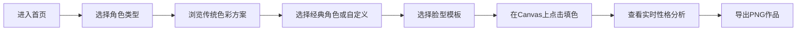

# 屯堡地戏面具色彩知识库 - 产品需求文档

## 1. 产品概述

本产品是一个屯堡地戏面具色彩知识库与在线创作工具，旨在传承和展示贵州屯堡地戏这一国家级非物质文化遗产。用户可以浏览不同角色类型的传统色彩搭配方案，了解色彩背后的文化寓意，并通过在线填色工具创作个性化的面具作品。

- **主要用途**：文化传播、教育展示、创意设计
- **目标用户**：文化爱好者、设计师、学生、游客
- **核心价值**：保护非遗文化，提供交互式学习体验

## 2. 核心功能

### 2.1 用户角色

| 角色 | 注册方式 | 核心权限 |
|------|----------|----------|
| 普通用户 | 无需注册 | 浏览知识库、使用填色工具、导出作品 |

### 2.2 功能模块

1. **首页/知识库浏览**：角色类型选择、色彩方案展示、性格寓意说明
2. **经典角色库**：15个预置经典角色（关羽、岳飞、秦桧、土地公等）快速加载
3. **在线填色工具**：3种脸型模板选择、色块点击上色、实时Canvas预览
4. **性格分析**：根据填色方案自动生成性格分析报告
5. **作品导出**：支持导出染色面具PNG图片

### 2.3 页面详情

| 页面名称 | 模块名称 | 功能描述 |
|----------|----------|----------|
| 主页面 | 角色类型导航 | 武将、文官、丑角、仙女、动物精怪五大类选择 |
| 主页面 | 色彩知识库 | 展示主色、辅色、点缀色搭配及文化寓意 |
| 主页面 | 经典角色展示 | 15个经典角色卡片，点击加载预设配色 |
| 主页面 | 脸型模板选择 | 3种脸型线稿切换（方脸、圆脸、尖脸） |
| 主页面 | Canvas填色区 | 点击面具区域上色，实时预览效果 |
| 主页面 | 调色板 | 传统色彩调色板，支持自定义色彩选择 |
| 主页面 | 性格分析面板 | 根据配色方案展示性格分析 |
| 主页面 | 导出功能 | 一键导出PNG图片 |

## 3. 核心流程

## 4. 用户界面设计

### 4.1 设计风格

- **主色调**：深红木色 (#8B2500) - 象征传统文化底蕴
- **辅助色**：金色 (#D4AF37) - 体现戏曲艺术的华丽感
- **中性色**：米白 (#F5F0E1)、深灰 (#333333)
- **按钮风格**：圆角矩形，轻微浮雕效果，悬停时有金色边框
- **字体**：标题使用书法风格字体，正文使用优雅的宋体/楷体
- **布局风格**：左右分栏布局，左侧知识库，右侧创作区
- **装饰元素**：传统纹样边框、云纹、回纹装饰

### 4.2 页面设计概述

| 页面名称 | 模块名称 | UI 元素 |
|----------|----------|---------|
| 主页面 | 顶部标题栏 | 书法体标题，传统纹样装饰，金色分隔线 |
| 主页面 | 角色类型导航 | 横向标签式导航，选中项金色高亮 |
| 主页面 | 色彩展示区 | 圆形色卡，标注色值和寓意，悬停放大效果 |
| 主页面 | 经典角色卡片 | 网格布局，卡片带金色边框，悬停上浮 |
| 主页面 | Canvas创作区 | 大尺寸画布，带传统纹样边框 |
| 主页面 | 调色板 | 网格排列色卡，传统色彩命名 |
| 主页面 | 性格分析面板 | 卷轴样式面板，古朴典雅 |

### 4.3 响应式设计

- **桌面端优先**：1200px以上左右分栏布局
- **平板端**：768px-1199px上下布局，知识库在上，创作区在下
- **移动端**：768px以下垂直滚动布局，简化交互

### 4.4 交互动效

- 页面加载：元素淡入，顶部标题书法笔触动画
- 角色切换：平滑过渡动画，色彩方案渐变
- 填色反馈：点击时色块填充动画，轻微缩放
- 经典角色选择：卡片翻转展示效果
