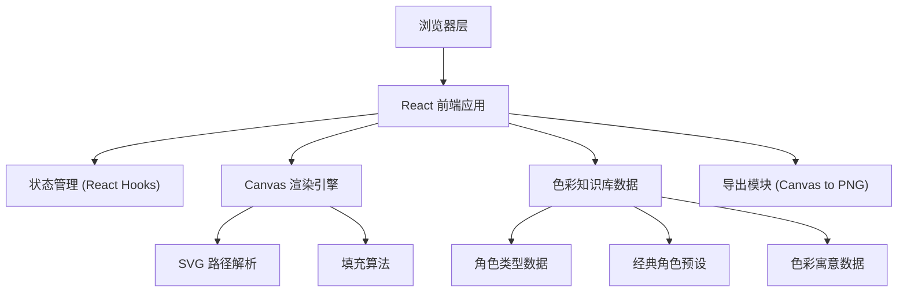

# 屯堡地戏面具色彩知识库 - 技术架构文档

## 1. 架构设计



## 2. 技术选型

- **前端框架**: React@18 + TypeScript
- **构建工具**: Vite
- **样式方案**: TailwindCSS@3
- **状态管理**: React Hooks (useState, useContext)
- **图形渲染**: HTML5 Canvas API
- **图标库**: Lucide React

## 3. 项目结构

```
src/
├── components/
│   ├── Header.tsx              # 顶部标题栏
│   ├── RoleTypeNav.tsx         # 角色类型导航
│   ├── ColorKnowledge.tsx      # 色彩知识库展示
│   ├── CharacterGallery.tsx    # 经典角色画廊
│   ├── FaceTemplateSelector.tsx # 脸型模板选择
│   ├── MaskCanvas.tsx          # 面具Canvas填色区
│   ├── ColorPalette.tsx        # 调色板
│   ├── PersonalityAnalysis.tsx # 性格分析面板
│   └── ExportButton.tsx        # 导出按钮
├── data/
│   ├── roleTypes.ts            # 角色类型数据
│   ├── characters.ts           # 经典角色数据
│   ├── colorMeanings.ts        # 色彩寓意数据
│   └── faceTemplates.ts        # 脸型SVG模板
├── hooks/
│   ├── useCanvasFill.ts        # Canvas填色Hook
│   └── usePersonalityAnalysis.ts # 性格分析Hook
├── types/
│   └── index.ts                # TypeScript类型定义
├── utils/
│   ├── canvasUtils.ts          # Canvas工具函数
│   └── colorUtils.ts           # 色彩工具函数
├── App.tsx
├── main.tsx
└── index.css
```

## 4. 数据模型

### 4.1 类型定义

```typescript
// 角色类型
interface RoleType {
  id: string;
  name: string;
  description: string;
  mainColors: ColorInfo[];
  secondaryColors: ColorInfo[];
  accentColors: ColorInfo[];
}

// 色彩信息
interface ColorInfo {
  color: string;
  name: string;
  meaning: string;
}

// 经典角色
interface ClassicCharacter {
  id: string;
  name: string;
  roleType: string;
  description: string;
  faceTemplate: string;
  colorScheme: {
    forehead: string;
    leftCheek: string;
    rightCheek: string;
    nose: string;
    mouth: string;
    eyes: string;
    eyebrows: string;
  };
}

// 脸型模板
interface FaceTemplate {
  id: string;
  name: string;
  svg: string;
  regions: FillRegion[];
}

// 可填充区域
interface FillRegion {
  id: string;
  name: string;
  path: string;
}
```

## 5. 核心技术实现

### 5.1 Canvas 填色算法

使用基于路径的填充方案：
1. 将SVG路径解析为Canvas路径
2. 点击检测使用 `isPointInPath()` API
3. 使用 `fill()` 进行区域着色
4. 支持撤销/重做操作栈

### 5.2 性格分析算法

基于主色占比的权重分析：
1. 统计各区域颜色使用频率
2. 根据颜色寓意数据库匹配性格特征
3. 生成综合性格分析报告

### 5.3 PNG 导出功能

使用 `canvas.toDataURL('image/png')` 实现导出，支持自定义导出尺寸。

## 6. 性能优化

- Canvas 分层渲染：线稿层 + 填充层
- 颜色选择器预渲染
- 虚拟滚动处理角色列表
- 防抖处理高频交互
