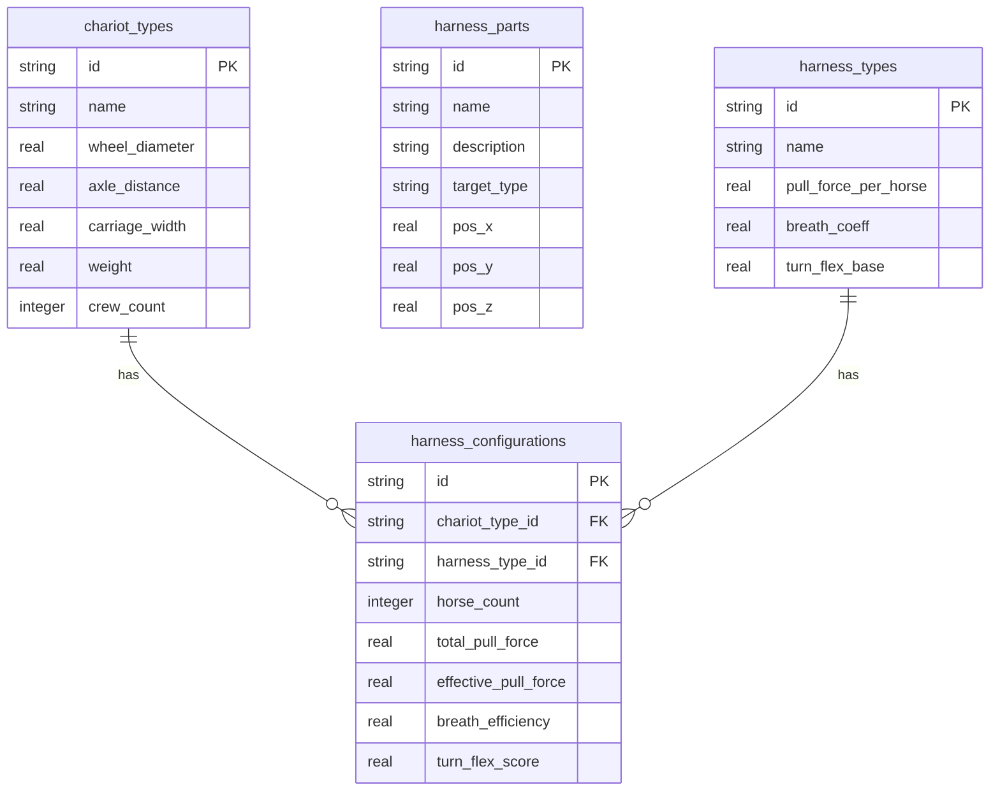

## 1. 架构设计

```mermaid
graph TB
    subgraph "前端层"
        "React App" --> "Three.js 3D场景"
        "React App" --> "拖拽交互引擎"
        "React App" --> "力学模拟计算"
        "React App" --> "PDF导出"
    end
    subgraph "后端层"
        "Express API" --> "战车参数API"
        "Express API" --> "挽具构型API"
    end
    subgraph "数据层"
        "SQLite" --> "战车类型表"
        "SQLite" --> "挽具部件表"
        "SQLite" --> "系驾方式表"
        "SQLite" --> "构型参数表"
    end
    "React App" -->|"HTTP请求"| "Express API"
    "Express API" -->|"SQL查询"| "SQLite"
```

## 2. 技术说明
- 前端：React@18 + Three.js + @react-three/fiber + @react-three/drei + tailwindcss@3 + vite
- 初始化工具：vite-init
- 后端：Express@4 + TypeScript（ESM格式）
- 数据库：SQLite（better-sqlite3）
- PDF导出：jspdf + html2canvas
- 状态管理：zustand

## 3. 路由定义
| 路由 | 用途 |
|------|------|
| / | 主页面，包含3D模型、拖拽交互、力学模拟 |

## 4. API定义

### 4.1 获取战车类型列表
```
GET /api/chariot-types
Response: Array<{
  id: string;
  name: string;
  wheelDiameter: number;
  axleDistance: number;
  carriageWidth: number;
  weight: number;
  crewCount: number;
}>
```

### 4.2 获取挽具部件列表
```
GET /api/harness-parts
Response: Array<{
  id: string;
  name: string;
  description: string;
  position: { x: number; y: number; z: number };
  targetType: string;
}>
```

### 4.3 获取系驾方式参数
```
GET /api/harness-types
Response: Array<{
  id: string;
  name: string;
  pullForcePerHorse: number;
  breathCoeff: number;
  turnFlexBase: number;
}>
```

### 4.4 计算力学参数
```
POST /api/calculate
Body: {
  chariotTypeId: string;
  horseCount: number;
  harnessTypeId: string;
  harnessPartPlacements: Array<{ partId: string; correct: boolean }>;
}
Response: {
  totalPullForce: number;
  effectivePullForce: number;
  breathEfficiency: number;
  turnFlexScore: number;
  forceVectors: Array<{ x: number; y: number; z: number; magnitude: number; label: string }>;
}
```

## 5. 服务器架构图

```mermaid
graph LR
    "Controller" --> "Service"
    "Service" --> "Repository"
    "Repository" --> "SQLite"
```

## 6. 数据模型

### 6.1 数据模型定义



### 6.2 数据定义语言

```sql
CREATE TABLE IF NOT EXISTS chariot_types (
  id TEXT PRIMARY KEY,
  name TEXT NOT NULL,
  wheel_diameter REAL NOT NULL,
  axle_distance REAL NOT NULL,
  carriage_width REAL NOT NULL,
  weight REAL NOT NULL,
  crew_count INTEGER NOT NULL
);

CREATE TABLE IF NOT EXISTS harness_parts (
  id TEXT PRIMARY KEY,
  name TEXT NOT NULL,
  description TEXT NOT NULL,
  target_type TEXT NOT NULL,
  pos_x REAL NOT NULL,
  pos_y REAL NOT NULL,
  pos_z REAL NOT NULL
);

CREATE TABLE IF NOT EXISTS harness_types (
  id TEXT PRIMARY KEY,
  name TEXT NOT NULL,
  pull_force_per_horse REAL NOT NULL,
  breath_coeff REAL NOT NULL,
  turn_flex_base REAL NOT NULL
);

CREATE TABLE IF NOT EXISTS harness_configurations (
  id TEXT PRIMARY KEY,
  chariot_type_id TEXT NOT NULL REFERENCES chariot_types(id),
  harness_type_id TEXT NOT NULL REFERENCES harness_types(id),
  horse_count INTEGER NOT NULL,
  total_pull_force REAL NOT NULL,
  effective_pull_force REAL NOT NULL,
  breath_efficiency REAL NOT NULL,
  turn_flex_score REAL NOT NULL
);

INSERT INTO chariot_types VALUES
  ('light', '轻战车', 1.4, 2.0, 1.0, 60, 3),
  ('heavy', '重战车', 1.6, 2.4, 1.3, 90, 3);

INSERT INTO harness_parts VALUES
  ('belt', '皮带', '连接马颈/胸部至车辕，传递拉力', 'neck', 0.0, 1.2, -1.5),
  ('yoke', '轭', '置于马颈/肩部，连接靷绳，分散受力', 'shoulder', 0.0, 1.4, -1.2),
  ('trace', '靷', '从轭两侧至车轴，提供主力牵引', 'flank', 0.8, 0.8, -0.5),
  ('bridle', '勒', '套于马头部，用于控制方向', 'head', 0.0, 1.8, -2.0);

INSERT INTO harness_types VALUES
  ('neckband', '颈带式', 45, 0.65, 5),
  ('chestband', '胸带式', 70, 0.85, 7);
```
