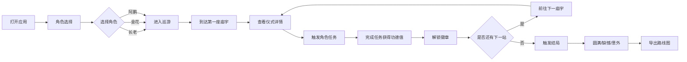

## 1. 产品概述
白族绕三灵节庆模拟应用，通过互动式角色扮演让用户沉浸式体验白族传统节庆文化。用户可选择不同角色参与巡游路线，完成特色任务，了解白族宗教仪式与民俗文化。

- 核心价值：传承和展示白族非物质文化遗产，提供寓教于乐的文化体验
- 目标用户：文化爱好者、学生、旅游人群、对民族文化感兴趣的大众

## 2. 核心特性

### 2.1 用户角色

| 角色 | 选择方式 | 核心职责 |
|------|----------|----------|
| 长老 | 首页角色选择 | 主持祭祀仪式，念诵经文，引领整个巡游队伍 |
| 金花 | 首页角色选择 | 演唱白族调，参与对歌活动，传递节庆祝福 |
| 阿鹏 | 首页角色选择 | 弹奏三弦乐器，为歌舞伴奏，带动现场气氛 |

### 2.2 功能模块
1. **角色选择页**：角色介绍卡片，角色特色展示，选择确认
2. **巡游路线页**：地图可视化展示，四个节点串联（起点庙+三灵庙），节点状态指示
3. **仪式详情弹窗**：文化介绍、供品清单、禁忌事项三栏展示
4. **角色扮演任务系统**：任务提示、互动操作、功德值计算
5. **徽章收藏页**：已解锁/未解锁徽章展示，收藏品展示
6. **结局展示页**：三种结局动画与文案展示
7. **路线导出功能**：生成可下载的巡游路线图

### 2.3 页面详情

| 页面名称 | 模块名称 | 功能描述 |
|----------|----------|----------|
| 角色选择页 | 角色卡片 | 展示三位角色形象、职责描述、专属技能 |
| 角色选择页 | 确认选择 | 选中角色后显示确认按钮，进入巡游 |
| 巡游路线页 | 路线地图 | SVG绘制洱海边巡游路线，包含四个庙宇节点 |
| 巡游路线页 | 节点交互 | 点击节点展示仪式详情，可触发角色扮演任务 |
| 巡游路线页 | 状态栏 | 显示当前角色、功德值、已完成节点数 |
| 仪式详情弹窗 | 文化介绍 | 展示该庙宇的历史渊源与仪式意义 |
| 仪式详情弹窗 | 供品清单 | 罗列祭祀所需供品种类与数量 |
| 仪式详情弹窗 | 禁忌事项 | 说明参与仪式需要注意的礼仪禁忌 |
| 任务交互弹窗 | 任务内容 | 根据角色显示不同任务（主持/唱调/弹三弦） |
| 任务交互弹窗 | 互动操作 | 点击/长按/滑动等互动方式完成任务 |
| 任务交互弹窗 | 功德值结算 | 展示完成任务获得的功德值 |
| 徽章收藏页 | 徽章展示 | 网格展示所有可解锁徽章，已解锁高亮显示 |
| 结局展示页 | 结局动画 | 根据功德值展示圆满/缺憾/意外三种结局 |
| 结局展示页 | 路线导出 | 生成包含路线图与成就的图片供下载 |

## 3. 核心流程

用户打开应用 → 选择角色（长老/金花/阿鹏）→ 进入巡游路线 → 依次访问四个庙宇节点 → 查看仪式详情 → 触发角色扮演任务 → 完成任务获得功德值 → 解锁对应徽章 → 全部节点完成后触发结局 → 可导出巡游路线图

## 4. 用户界面设计

### 4.1 设计风格
- **主色调**：采用白族传统扎染蓝色 (#1E3A5F) 为主色，搭配白族刺绣红色 (#C41E3A) 为辅色，象牙白 (#F5F0E1) 为背景
- **次色调**：苍山黛绿 (#2D5016)，洱海蓝 (#4A90A4)，金色点缀 (#D4AF37)
- **按钮风格**：圆角矩形，带有白族纹样边框，悬停时有轻微上浮效果
- **字体**：标题使用书法风格衬线字体，正文使用清晰易读的无衬线字体
- **布局风格**：卡片式布局，融入白族三坊一照壁建筑元素，传统纹样装饰边框
- **图标风格**：结合白族刺绣图案，使用民族特色的装饰元素

### 4.2 页面设计概览

| 页面名称 | 模块名称 | UI元素 |
|----------|----------|--------|
| 角色选择页 | 角色卡片 | 民族风插画、渐变背景、悬停放大动画、纹样边框 |
| 巡游路线页 | 路线地图 | SVG动态路线、节点脉冲动画、角色位置指示器 |
| 巡游路线页 | 节点弹窗 | 三栏切换标签、民族纹样分隔线、供品图标列表 |
| 任务交互页 | 任务互动 | 进度条动画、点击反馈特效、功德值数字滚动 |
| 徽章收藏页 | 徽章网格 | 金属质感徽章、解锁光芒动画、未解锁灰化处理 |
| 结局展示页 | 结局动画 | 全屏渐变背景、诗词文案淡入、飘落花瓣特效 |

### 4.3 响应式设计
- 桌面优先设计，适配1280px及以上分辨率
- 平板端：卡片两列布局，地图自适应缩放
- 移动端：单列布局，底部导航栏，触控优化按钮尺寸
- 支持触摸滑动操作，手势识别完成任务

### 4.4 动效设计
- 页面切换采用淡入淡出+滑动过渡
- 节点到达时有脉冲光效和庆祝动画
- 任务完成时功德值数字滚动增长
- 徽章解锁时有光芒四射和缩放动画
- 背景有 subtle 的祥云漂浮动效
