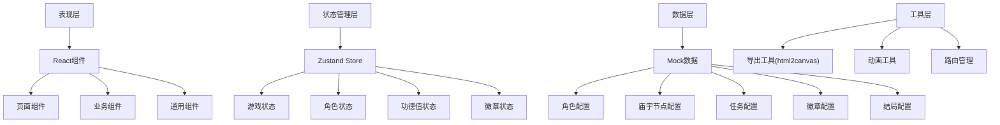
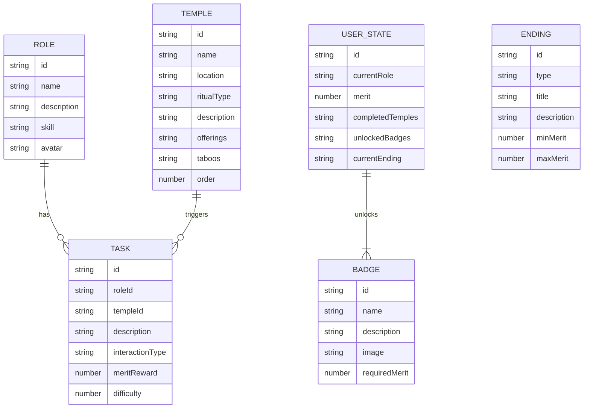

## 1. 架构设计



## 2. 技术描述

- **前端框架**：React@18 + TypeScript + Vite
- **样式方案**：TailwindCSS@3
- **状态管理**：Zustand
- **路由管理**：React Router DOM@6
- **图标库**：Lucide React
- **图片导出**：html2canvas
- **动画**：CSS Animations + Framer Motion（可选）
- **初始化工具**：vite-init

## 3. 路由定义

| 路由 | 页面 | 说明 |
|------|------|------|
| `/` | 角色选择页 | 应用入口，选择长老/金花/阿鹏 |
| `/parade` | 巡游路线页 | 展示地图路线，进行节点交互 |
| `/badges` | 徽章收藏页 | 展示已解锁和待解锁的徽章 |
| `/ending` | 结局展示页 | 展示最终结局，提供导出功能 |

## 4. 数据模型

### 4.1 数据模型定义



### 4.2 数据结构定义

```typescript
// 角色类型
interface Role {
  id: 'elder' | 'jinhua' | 'apeng';
  name: string;
  description: string;
  skill: string;
  avatar: string;
  color: string;
}

// 庙宇节点
interface Temple {
  id: string;
  name: string;
  location: string;
  ritualType: 'sacrifice' | 'singing' | 'dancing';
  description: string;
  culturalIntro: string;
  offerings: string[];
  taboos: string[];
  order: number;
  position: { x: number; y: number };
}

// 任务
interface Task {
  id: string;
  roleId: string;
  templeId: string;
  title: string;
  description: string;
  interactionType: 'click' | 'hold' | 'sequence' | 'rhythm';
  meritReward: number;
  difficulty: 1 | 2 | 3;
}

// 徽章
interface Badge {
  id: string;
  name: string;
  description: string;
  icon: string;
  requiredMerit: number;
  unlocked: boolean;
}

// 结局
interface Ending {
  id: 'perfect' | 'imperfect' | 'unexpected';
  title: string;
  description: string;
  poem: string;
  minMerit: number;
  maxMerit: number;
}

// 游戏状态
interface GameState {
  currentRole: Role | null;
  currentTempleIndex: number;
  completedTemples: string[];
  merit: number;
  unlockedBadges: string[];
  currentEnding: Ending | null;
  isRolePlaying: boolean;
}
```

## 5. 核心模块划分

```
src/
├── components/           # 通用组件
│   ├── Layout.tsx        # 页面布局
│   ├── Navbar.tsx        # 导航栏
│   ├── RoleCard.tsx      # 角色卡片
│   ├── TempleNode.tsx    # 庙宇节点
│   ├── RouteMap.tsx      # 路线地图
│   ├── Modal.tsx         # 弹窗组件
│   ├── MeritDisplay.tsx  # 功德值显示
│   ├── BadgeCard.tsx     # 徽章卡片
│   └── TaskInteraction.tsx # 任务交互
├── pages/                # 页面组件
│   ├── RoleSelect.tsx    # 角色选择页
│   ├── ParadeRoute.tsx   # 巡游路线页
│   ├── BadgeCollection.tsx # 徽章收藏页
│   └── EndingPage.tsx    # 结局展示页
├── store/                # 状态管理
│   └── useGameStore.ts   # 游戏状态Store
├── data/                 # Mock数据
│   ├── roles.ts          # 角色数据
│   ├── temples.ts        # 庙宇数据
│   ├── tasks.ts          # 任务数据
│   ├── badges.ts         # 徽章数据
│   └── endings.ts        # 结局数据
├── types/                # 类型定义
│   └── index.ts          # 所有类型定义
├── utils/                # 工具函数
│   ├── export.ts         # 导出功能
│   └── animation.ts      # 动画工具
├── App.tsx               # 应用入口
└── main.tsx              # React入口
```

## 6. 核心技术实现要点

1. **SVG路线图**：使用SVG绘制洱海边巡游路线，支持节点动态高亮和角色位置标记
2. **状态持久化**：使用localStorage保存游戏进度，刷新页面不丢失
3. **任务交互**：实现多种交互模式（点击连击、长按蓄力、节奏点击、顺序点击）
4. **图片导出**：使用html2canvas将路线图和成就导出为PNG图片
5. **动画系统**：使用CSS keyframes和transition实现平滑过渡效果
6. **响应式适配**：使用Tailwind响应式断点适配不同屏幕尺寸
