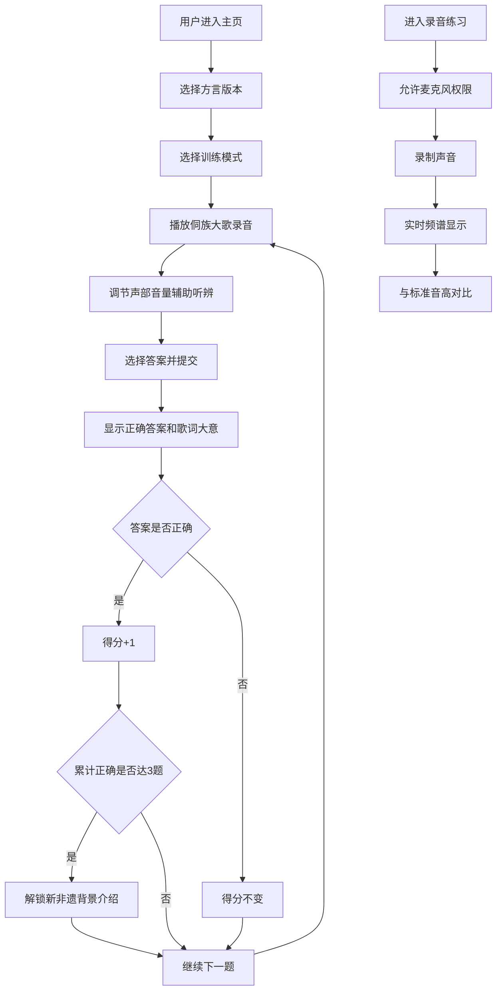

## 1. 产品概述

侗族大歌声部听辨训练系统是一款面向音乐学习者和文化爱好者的互动式教育应用，通过多声部音乐听辨训练，帮助用户掌握侗族大歌的声部特征，提升音乐听觉能力，同时传承和传播国家级非物质文化遗产。

- 核心价值：将传统民族音乐与现代交互技术结合，提供沉浸式的声部听辨训练体验
- 目标用户：音乐专业学生、民族文化爱好者、中小学音乐教育者
- 市场价值：填补侗族大歌数字化教育的空白，为非遗传承创新提供新途径

## 2. 核心功能

### 2.1 功能模块

1. **主页/导航**：方言选择、训练模式选择、进度展示
2. **听辨训练页**：音频播放器、音量平衡控制、题目展示、答案提交
3. **答案反馈页**：正确答案展示、歌词大意解析、得分更新
4. **非遗解锁页**：已解锁的非遗背景介绍内容浏览
5. **录音练习页**：麦克风录音、频谱实时显示、音高对比

### 2.2 页面详情

| 页面名称 | 模块名称 | 功能描述 |
|---------|---------|---------|
| 主页 | 方言选择 | 切换三江、从江、黎平三种方言版本 |
| 主页 | 训练入口 | 选择"声部先进入"或"主要旋律"训练模式 |
| 主页 | 进度展示 | 显示当前得分、已解锁非遗内容数量 |
| 听辨训练页 | 音频播放器 | 播放/暂停、进度条、循环播放 |
| 听辨训练页 | 音量平衡器 | 独立控制高音部、低音部音量滑块 |
| 听辨训练页 | 题目面板 | 显示当前题目和两个选项按钮 |
| 听辨训练页 | 提交按钮 | 确认答案并进入反馈界面 |
| 答案反馈页 | 答案解析 | 显示正确答案、声部进入时间标记 |
| 答案反馈页 | 歌词大意 | 展示该段录音的侗语歌词及汉语翻译 |
| 答案反馈页 | 得分更新 | 本次答题得分、累计得分、解锁提示 |
| 非遗解锁页 | 内容列表 | 已解锁的非遗背景文章列表 |
| 非遗解锁页 | 内容详情 | 图文并茂的侗族大歌文化介绍 |
| 录音练习页 | 录音控制 | 开始/停止录音、回放录音 |
| 录音练习页 | 频谱显示 | 实时音频频谱可视化 |
| 录音练习页 | 音高对比 | 标准音高与用户录音的频谱对照 |

## 3. 核心流程

## 4. 用户界面设计

### 4.1 设计风格

- **主色调**：靛蓝色 (#1E3A5F) — 象征侗族传统靛染工艺
- **辅助色**：暖木色 (#C4A574)、银灰色 (#9CA3AF)、酒红色 (#9B2C2C)
- **中性色**：米白色 (#F5F0E8)、深灰色 (#2D3748)
- **按钮风格**：圆角矩形，轻微浮雕效果，悬停时有光影变化
- **字体**：标题使用"Noto Serif SC"衬线字体，正文使用"Noto Sans SC"无衬线字体，体现人文气息
- **布局风格**：卡片式布局，留白充足，层次分明
- **图标**：使用Lucide图标库，配合民族纹样装饰元素

### 4.2 页面设计概述

| 页面名称 | 模块名称 | UI 元素 |
|---------|---------|---------|
| 主页 | Hero区域 | 侗族鼓楼剪影背景，渐变遮罩，大标题，民族装饰纹样 |
| 主页 | 方言选择器 | 三个并排卡片，选中状态有高亮边框和底纹 |
| 主页 | 训练模式选择 | 两个大按钮，分别带有高音/低音波形图标 |
| 主页 | 进度面板 | 得分数字动画显示，非遗解锁进度条 |
| 听辨训练页 | 播放器区域 | 唱片旋转动画，进度条带时间标记，播放控制按钮 |
| 听辨训练页 | 音量控制区 | 双滑块音量调节器，声部图标指示，实时音量表 |
| 听辨训练页 | 题目区域 | 题目卡片，两个大选项按钮，悬停效果 |
| 答案反馈页 | 答案展示 | 正确答案绿色高亮，错误答案红色标记，声部时间轴图示 |
| 答案反馈页 | 歌词区域 | 侗文歌词与汉文翻译上下对照排版 |
| 非遗解锁页 | 内容列表 | 竖向卡片列表，已解锁显示锁开图标，未解锁显示锁闭图标 |
| 录音练习页 | 频谱区域 | Canvas绘制的实时频谱图，标准音高参考线 |
| 录音练习页 | 控制区域 | 圆形录音按钮，录音状态脉冲动画 |

### 4.3 响应式设计

- **桌面优先**：采用1280px以上桌面端设计
- **平板适配**：1024px时双栏变单栏，音量控制垂直排列
- **手机适配**：768px以下压缩间距，按钮全屏宽度，频谱图简化显示
- **触摸优化**：按钮最小高度48px，滑块触摸区域扩大

### 4.4 交互动效

- 页面加载：元素错落入场动画（staggered reveal）
- 播放器：唱片旋转动画，播放按钮波纹效果
- 答题反馈：正确答案弹跳动画，错误答案抖动动画
- 得分更新：数字滚动动画，解锁时烟花粒子效果
- 录音按钮：录音中脉冲呼吸效果
- 音量滑块：拖动时有实时音量指示器跟随
