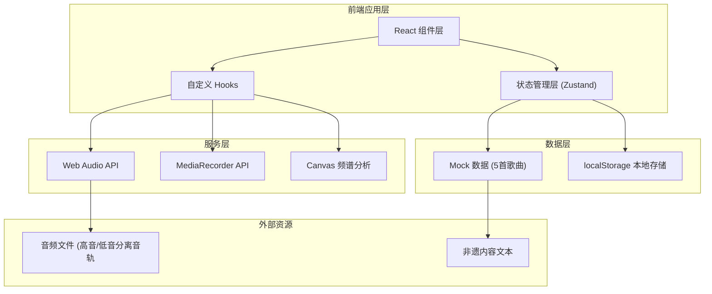

## 1. 架构设计



## 2. 技术描述

- **前端框架**：React@18 + TypeScript
- **构建工具**：Vite@5
- **样式方案**：TailwindCSS@3
- **状态管理**：Zustand
- **路由管理**：React Router DOM@6
- **图标库**：Lucide React
- **音频处理**：原生 Web Audio API
- **录音功能**：原生 MediaRecorder API
- **频谱可视化**：Canvas 2D + AnalyserNode
- **数据持久化**：localStorage
- **后端**：无（纯前端应用）

## 3. 技术选型说明：
1. **纯前端架构**：项目不需要后端服务，所有功能通过浏览器API实现音频处理、录音和频谱分析
2. **Web Audio API**：实现多轨音频播放、独立音量控制、音频分析
3. **Zustand**：轻量级状态管理，管理用户得分、解锁进度、当前题目状态
4. **Mock数据**：预置5首歌曲，每首含高音部、低音部两个独立音轨
5. **方言支持**：三江、从江、黎平三种方言版本通过切换不同音频文件实现

## 3. 路由定义

| 路由路径 | 页面名称 | 功能说明 |
|---------|---------|---------|
| `/` | 主页 | 方言选择、训练模式选择、进度展示 |
| `/training/:mode` | 听辨训练页 | 音频播放、音量控制、题目答题 |
| `/heritage` | 非遗解锁页 | 已解锁非遗内容列表及详情 |
| `/practice` | 录音练习页 | 麦克风录音、频谱显示 |
| `*` | 404页 | 页面不存在提示 |

## 4. 数据模型

### 4.1 歌曲数据模型

```typescript
// 声部类型
type VoicePart = 'high' | 'low';

// 方言类型
type Dialect = 'sanjiang' | 'congjiang' | 'liping';

// 训练模式
type TrainingMode = 'entry' | 'melody';

// 歌曲数据
interface Song {
  id: string;
  title: string;
  dialect: Dialect;
  highTrackUrl: string;      // 高音部音轨URL
  lowTrackUrl: string;      // 低音部音轨URL
  duration: number;         // 时长（秒）
  lyrics: {
    dong: string;       // 侗文歌词
    chinese: string;       // 汉语翻译
  };
  questions: {
    entry: {              // "声部先进入"题目
      correctAnswer: VoicePart;
      highEntryTime: number;  // 高音部进入时间
      lowEntryTime: number;   // 低音部进入时间
    };
    melody: {             // "主要旋律"题目
      correctAnswer: VoicePart;
      description: string;    // 答案说明
    };
  };
}

// 用户进度
interface UserProgress {
  score: number;                     // 累计得分
  totalAnswered: number;             // 累计答题数
  correctStreak: number;          // 连续正确数（用于解锁）
  unlockedHeritageIds: string[];      // 已解锁非遗ID列表
  currentDialect: Dialect;           // 当前选择的方言
}

// 非遗内容
interface HeritageContent {
  id: string;
  title: string;
  content: string;
  imageUrl?: string;
  unlockRequirement: number;   // 解锁所需正确题数
}
```

### 4.2 Mock 数据结构

```typescript
// 预置5首歌曲示例：
1. 《蝉之歌》(三江方言
2. 《大山真美好》(从江方言)
3. 《布谷催春》(黎平方言)
4. 《思念歌》(三江方言)
5. 《敬酒歌》(从江方言)

非遗内容（共5段）：
1. 侗族大歌的历史起源
2. 侗族大歌的声部结构特点
3. 侗族大歌的演唱形式
4. 侗族大歌的文化意义
5. 侗族大歌的传承现状
```

## 5. 核心模块说明

### 5.1 音频播放模块 (`useAudioPlayer Hook)
- 创建两个独立的 AudioBufferSourceNode 分别播放高音部和低音部
- 使用 GainNode 独立控制两个声部的音量
- 同步播放两个音轨
- 支持暂停、继续、进度跳转

### 5.2 音量平衡控制
- 双滑块设计，范围 0-2
- 实时更新 GainNode.gain 值
- 提供"单独拉高高音或低音音量

### 5.3 频谱分析模块 (`useSpectrum Hook)
- 使用 AnalyserNode 获取频域数据
- Canvas 2D 绘制实时频谱图
- 支持标准音高参考线显示
- 录音时实时分析

### 5.4 录音模块 (`useRecorder Hook)
- MediaRecorder API 录制麦克风输入
- 录制后转成 AudioBuffer 进行回放
- 录制过程中实时频谱显示
- 支持与标准音高对比

### 5.5 状态管理 (Zustand Store)
- userProgress: 用户进度
- currentSong: 当前歌曲
- currentQuestion: 当前题目
- isAnswered: 是否已答题
- selectedAnswer: 用户选择的答案
- showFeedback: 是否显示答案反馈

## 6. 项目文件结构

```
src/
├── components/          # 组件目录
│   ├── AudioPlayer.tsx      # 音频播放器组件
│   ├── VolumeControl.tsx  # 音量控制组件
│   ├── QuestionCard.tsx # 题目卡片组件
│   ├── SpectrumCanvas.tsx # 频谱显示组件
│   ├── Recorder.tsx      # 录音组件
│   ├── DialectSelector.tsx # 方言选择组件
│   ├── HeritageCard.tsx   # 非遗卡片组件
│   └── Navbar.tsx       # 导航栏组件
├── hooks/             # 自定义Hooks
│   ├── useAudioPlayer.ts   # 音频播放Hook
│   ├── useRecorder.ts     # 录音Hook
│   └── useSpectrum.ts    # 频谱分析Hook
├── pages/             # 页面组件
│   ├── Home.tsx           # 主页
│   ├── Training.tsx       # 训练页
│   ├── Heritage.tsx       # 非遗页
│   ├── Practice.tsx       # 练习页
│   └── NotFound.tsx      # 404页
├── store/             # 状态管理
│   └── useStore.ts        # Zustand store
├── data/              # Mock数据
│   ├── songs.ts           # 歌曲数据
│   └── heritage.ts       # 非遗内容
├── types/             # 类型定义
│   └── index.ts           # TypeScript类型
├── utils/             # 工具函数
│   └── audio.ts           # 音频工具函数
├── App.tsx
├── main.tsx
└── index.css
```
