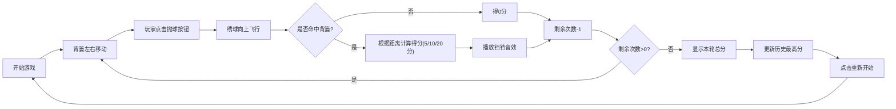

## 1. 产品概述

壮族抛绣球是一款具有民族特色的休闲小游戏，玩家通过点击"抛球"按钮将绣球抛向左右移动的背篓，命中得分，挑战最高分。

- 主要目的：提供趣味性的休闲娱乐体验，同时展示壮族传统文化元素
- 目标用户：所有年龄段的休闲游戏玩家
- 市场价值：融合传统文化与游戏娱乐，具有独特的文化传播价值

## 2. 核心功能

### 2.1 用户角色
| 角色 | 注册方式 | 核心权限 |
|------|----------|----------|
| 普通玩家 | 无需注册 | 游戏游玩、查看分数、保存最高分 |

### 2.2 功能模块
1. **游戏主界面**：游戏画布、背篓、绣球、抛球按钮
2. **计分系统**：实时分数显示、距离判定、总分计算
3. **历史记录**：本地存储最高分、历史最高分展示
4. **音效系统**：接球音效反馈

### 2.3 页面详情
| 页面名称 | 模块名称 | 功能描述 |
|----------|----------|----------|
| 游戏主页面 | 游戏区域 | 背篓左右移动动画、绣球抛射轨迹、距离标识线 |
| 游戏主页面 | 控制面板 | 抛球按钮、剩余次数显示、当前分数显示 |
| 游戏主页面 | 结果展示 | 每轮结束后的总分展示、历史最高分展示、重新开始按钮 |

## 3. 核心流程

玩家进入游戏 → 背篓开始左右移动 → 玩家点击"抛球"按钮 → 绣球从底部向上飞行 → 判定是否落入背篓 → 根据距离计算得分 → 重复5次 → 显示本轮总分 → 更新历史最高分 → 可选择重新开始

## 4. 用户界面设计

### 4.1 设计风格
- **主色调**：壮族传统色彩 - 红色(#E63946)、黄色(#FFB703)、深蓝色(#1D3557)、青色(#457B9D)
- **辅助色**：绿色(#2A9D8F)、橙色(#F4A261)
- **按钮风格**：3D立体圆角按钮，带有民族纹样装饰，点击时有按压动画
- **字体**：使用具有中国风的字体，标题使用"Ma Shan Zheng"，正文使用"Noto Sans SC"
- **布局风格**：居中游戏画布，上下分布信息面板，整体采用卡片式设计
- **装饰元素**：壮族铜鼓纹样、绣球纹理、传统织锦图案作为背景装饰

### 4.2 页面设计概述
| 页面名称 | 模块名称 | UI元素 |
|----------|----------|--------|
| 游戏主页面 | 游戏区域 | 深蓝色渐变背景、三条距离标识线(近/中/远)、左右移动的背篓、彩色绣球、抛射轨迹动画 |
| 游戏主页面 | 顶部信息栏 | 历史最高分展示、当前轮次、剩余次数、实时分数，采用壮族纹样边框装饰 |
| 游戏主页面 | 底部控制区 | 大号"抛球"按钮（红色立体）、得分提示动画、游戏结果弹窗 |
| 游戏主页面 | 装饰元素 | 四角壮族铜鼓图案、传统织锦边框、云彩动画背景 |

### 4.3 响应性
- 采用桌面优先设计，游戏画布最小尺寸800x600
- 移动端自适应缩放，确保按钮可点击区域足够大
- 触摸设备优化点击反馈

### 4.4 动画效果
- 背篓：平滑左右往复移动，速度适中
- 绣球：抛物线轨迹飞行，旋转动画
- 得分：命中时数字弹出动画，"+5/+10/+20"浮动显示
- 按钮：悬停放大、点击按压效果
- 背景：缓慢飘动的云彩动画
