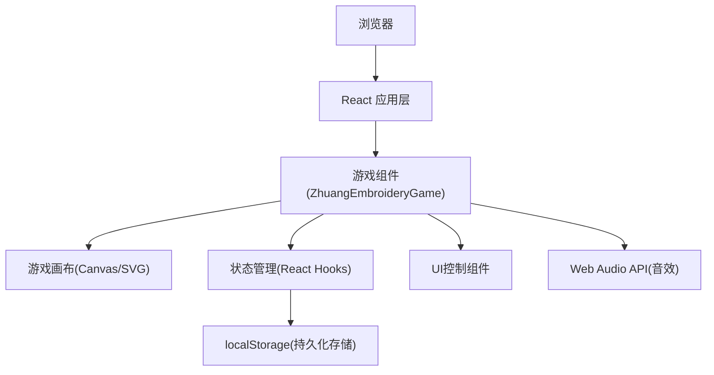

## 1. 架构设计



## 2. 技术描述
- **前端框架**: React@18 + TypeScript
- **构建工具**: Vite@5
- **样式方案**: TailwindCSS@3
- **动画**: CSS动画 + requestAnimationFrame
- **音效**: Web Audio API (动态生成"铛"音效)
- **数据持久化**: localStorage存储历史最高分
- **图标**: Lucide React

## 3. 路由定义
| 路由 | 用途 |
|------|------|
| / | 游戏主页面 |

## 4. 数据模型

### 4.1 游戏状态类型定义
```typescript
// 游戏状态
type GameStatus = 'idle' | 'playing' | 'throwing' | 'finished';

// 距离区域
type DistanceZone = 'near' | 'middle' | 'far';

// 单次投掷结果
interface ThrowResult {
  success: boolean;
  zone: DistanceZone | null;
  score: number;
}

// 游戏状态
interface GameState {
  status: GameStatus;
  currentRound: number;
  totalRounds: number; // 固定为5
  currentScore: number;
  throwResults: ThrowResult[];
  highScore: number;
  basketPosition: number; // 背篓X坐标百分比 0-100
  ballPosition: { x: number; y: number } | null;
  isBallFlying: boolean;
}

// 距离配置
interface DistanceConfig {
  zone: DistanceZone;
  minY: number; // 百分比
  maxY: number; // 百分比
  score: number;
  label: string;
}
```

### 4.2 游戏常量配置
```typescript
// 距离配置
const DISTANCE_ZONES: DistanceConfig[] = [
  { zone: 'near', minY: 60, maxY: 75, score: 5, label: '近(5分)' },
  { zone: 'middle', minY: 40, maxY: 60, score: 10, label: '中(10分)' },
  { zone: 'far', minY: 15, maxY: 40, score: 20, label: '远(20分)' },
];

// 游戏配置
const GAME_CONFIG = {
  totalRounds: 5,
  basketWidth: 80, // px
  basketSpeed: 1.5, // 移动速度
  ballFlyDuration: 800, // ms
  canvasWidth: 800,
  canvasHeight: 600,
};
```

## 5. 核心模块设计

### 5.1 游戏主组件 (ZhuangEmbroideryGame)
负责整体游戏逻辑编排，包含：
- 游戏状态管理
- 背篓移动逻辑
- 抛球物理计算
- 碰撞检测
- 分数计算

### 5.2 游戏画布组件 (GameCanvas)
负责视觉渲染：
- 背景装饰绘制
- 距离标识线绘制
- 背篓渲染
- 绣球渲染与飞行动画
- 得分弹出动画

### 5.3 控制面板组件 (ControlPanel)
用户交互界面：
- 抛球按钮
- 分数显示
- 剩余次数显示
- 历史最高分显示

### 5.4 音效工具 (audioUtils)
使用Web Audio API生成"铛"音效：
- 创建振荡器
- 模拟金属撞击声
- 控制音量和衰减

### 5.5 存储工具 (storageUtils)
localStorage封装：
- 保存最高分
- 读取最高分
