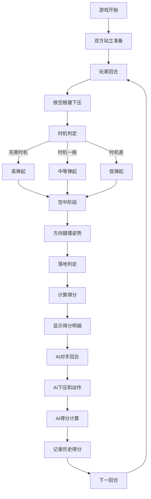

## 1. 产品概述

朝鲜族跳板游戏模拟器，还原朝鲜族传统民俗游戏。用户通过控制下压时机和空中姿态，与AI对手进行跳板竞技，追求更高的动作得分。

- 核心玩法：玩家控制左侧角色，通过空格键控制下压时机，利用方向键在空中摆出各种姿势，落地时姿态越舒展得分越高
- 目标用户：对传统民俗游戏感兴趣的玩家，希望体验朝鲜族跳板文化

## 2. 核心 Features

### 2.1 Feature Modules
1. **游戏主界面**：跳板场景渲染、双角色动画、实时状态显示
2. **操作系统**：空格键控制下压时机，方向键控制空中姿态
3. **AI对战系统**：AI控制右侧角色，具备智能下压时机判断和动作选择
4. **得分系统**：姿态分、高度分、落地分三维评分，每轮0-100分
5. **得分记录面板**：显示每轮得分明细和历史记录

### 2.3 Page Details
| Page Name | Module Name | Feature Description |
|-----------|-------------|--------------------|
| 游戏主页面 | 跳板场景 | 长木板、中间石头、双角色、背景渲染 |
| 游戏主页面 | 实时状态 | 当前轮次、游戏提示、操作指引 |
| 游戏主页面 | 得分面板 | 姿态分、高度分、落地分明细显示 |
| 游戏主页面 | 历史记录 | 每轮得分列表、总分统计 |

## 3. Core Process

游戏流程：游戏开始 → 角色站在跳板两端 → 玩家按空格键下压 → 时机判定影响弹起高度 → 玩家腾空 → 方向键控制空中姿态 → 落地判定 → 计算本轮得分 → 切换到对手回合 → 循环进行。

## 4. User Interface Design

### 4.1 设计风格
- **主色调**：朝鲜族传统色彩——红色（#D32F2F）、蓝色（#1976D2）、黄色（#FBC02D）
- **辅助色**：木色（#8D6E63）、石灰色（#78909C）、天空蓝渐变背景
- **按钮风格**：圆角矩形，传统纹样边框，悬浮时轻微放大
- **字体**：标题使用具有书法感的衬线字体，正文使用清晰易读的无衬线字体
- **布局风格**：左侧游戏场景，右侧得分面板，不对称布局
- **装饰元素**：朝鲜族传统图案边框、祥云纹样装饰

### 4.2 Page Design Overview
| Page Name | Module Name | UI Elements |
|-----------|-------------|-------------|
| 游戏主页面 | 跳板场景 | 渐变天空背景、木质跳板、石头支点、两个传统服饰角色、动画效果 |
| 游戏主页面 | 操作提示 | 底部提示栏，显示当前操作指引 |
| 游戏主页面 | 得分面板 | 右侧卡片式布局，当前轮得分明细，历史记录滚动列表 |
| 游戏主页面 | 时机指示器 | 底部时间轴，显示最佳下压时机窗口 |

### 4.3 Responsiveness
- 桌面端优先，固定游戏场景比例
- 支持窗口大小自适应，保持游戏画面居中
- 键盘操作，无需触摸优化

### 4.4 动画与动效
- 角色弹跳物理动画，遵循真实物理规律
- 空中姿态切换流畅过渡
- 得分数字弹出动画
- 落地时木板震动效果
- 时机判定时的视觉反馈（颜色变化、闪光效果）
