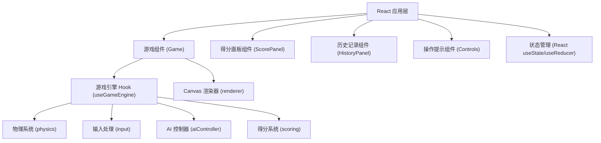

## 1. 架构设计



## 2. 技术描述

- **前端**：React@18 + TypeScript + Vite
- **样式**：TailwindCSS@3
- **渲染**：HTML5 Canvas 2D
- **状态管理**：React Hooks (useState, useReducer, useRef)
- **动画**：requestAnimationFrame 游戏循环
- **无需后端**，纯前端单页应用

### 核心模块说明

1. **游戏引擎 Hook (useGameEngine)**：
   - 管理游戏状态（准备、下压、空中、落地、得分、AI回合）
   - 游戏主循环 (requestAnimationFrame)
   - 协调物理、输入、AI、得分系统

2. **物理系统 (physics)**：
   - 简化的弹跳物理模型
   - 重力、速度、位置计算
   - 木板杠杆原理模拟
   - 碰撞检测（落地判定）

3. **输入处理 (input)**：
   - 空格键：下压时机控制
   - 方向键（↑↓←→）：空中姿态切换
   - 按键状态管理，防止重复触发

4. **AI 控制器 (aiController)**：
   - 智能时机判断（70%-90% 概率完美时机）
   - 随机空中姿态选择
   - 难度动态调整

5. **得分系统 (scoring)**：
   - 姿态分：根据空中姿势舒展度评分 (0-40)
   - 高度分：根据弹起最大高度评分 (0-30)
   - 落地分：根据落地时机和稳定性评分 (0-30)
   - 总分：0-100 分

6. **Canvas 渲染器 (renderer)**：
   - 背景渲染（天空渐变、地面）
   - 跳板渲染（木板、石头支点）
   - 角色渲染（两个角色、传统服饰、姿态动画）
   - 特效渲染（时机指示、闪光、得分动画）

## 3. 数据模型

### 3.1 游戏状态类型

```typescript
type GamePhase = 'idle' | 'waiting' | 'pressing' | 'airborne' | 'landing' | 'scoring' | 'aiTurn' | 'gameOver';

type Pose = 'standing' | 'split' | 'jump' | 'twist' | 'layout' | 'pike';

interface Player {
  id: 'player' | 'ai';
  x: number;
  y: number;
  velocityY: number;
  pose: Pose;
  rotation: number;
  isAirborne: boolean;
  currentHeight: number;
  maxHeight: number;
}

interface RoundScore {
  round: number;
  player: 'player' | 'ai';
  poseScore: number;
  heightScore: number;
  landingScore: number;
  total: number;
  timestamp: number;
}

interface GameState {
  phase: GamePhase;
  currentTurn: 'player' | 'ai';
  round: number;
  pressStartTime: number;
  pressDuration: number;
  perfectWindow: { start: number; end: number };
  timingAccuracy: number;
  player: Player;
  ai: Player;
  boardAngle: number;
  scores: RoundScore[];
  lastScore: RoundScore | null;
}
```

### 3.2 常量配置

```typescript
const GAME_CONFIG = {
  GRAVITY: 0.5,
  JUMP_FORCE_BASE: 12,
  PERFECT_TIMING_BONUS: 1.5,
  BOARD_LENGTH: 600,
  BOARD_THICKNESS: 20,
  STONE_HEIGHT: 60,
  PLAYER_WIDTH: 40,
  PLAYER_HEIGHT: 80,
  PERFECT_WINDOW_DURATION: 200, // ms
  AIRBORNE_TIME_MIN: 800,
  POSE_CHANGE_COOLDOWN: 150,
};
```

## 4. 项目结构

```
src/
├── components/
│   ├── Game.tsx              # 游戏主组件
│   ├── ScorePanel.tsx        # 得分面板
│   ├── HistoryPanel.tsx      # 历史记录
│   └── Controls.tsx          # 操作提示
├── hooks/
│   └── useGameEngine.ts      # 游戏引擎 Hook
├── game/
│   ├── physics.ts            # 物理系统
│   ├── input.ts              # 输入处理
│   ├── aiController.ts       # AI 控制器
│   ├── scoring.ts            # 得分系统
│   └── renderer.ts           # Canvas 渲染器
├── types/
│   └── game.ts               # 类型定义
├── constants/
│   └── config.ts             # 游戏配置
├── App.tsx
├── main.tsx
└── index.css
```

## 5. 路由定义

| Route | Purpose |
|-------|---------|
| / | 游戏主页面，包含所有游戏功能 |

## 6. 得分计算算法

### 时机精度计算
```
timingAccuracy = 1 - |actualPressTime - perfectWindowCenter| / (perfectWindowDuration / 2)
```

### 弹起力度
```
jumpForce = JUMP_FORCE_BASE * (0.3 + timingAccuracy * 0.7) * PERFECT_TIMING_BONUS (if perfect)
```

### 姿态分 (0-40)
- 根据空中切换的姿态数量和类型
- 舒展姿态（layout, split）得分更高
- 姿态切换流畅度加成

### 高度分 (0-30)
```
heightScore = (maxHeight / MAX_POSSIBLE_HEIGHT) * 30
```

### 落地分 (0-30)
- 落地时姿态是否为站立
- 落地稳定性（垂直速度）
- 时机与木板回弹的配合

