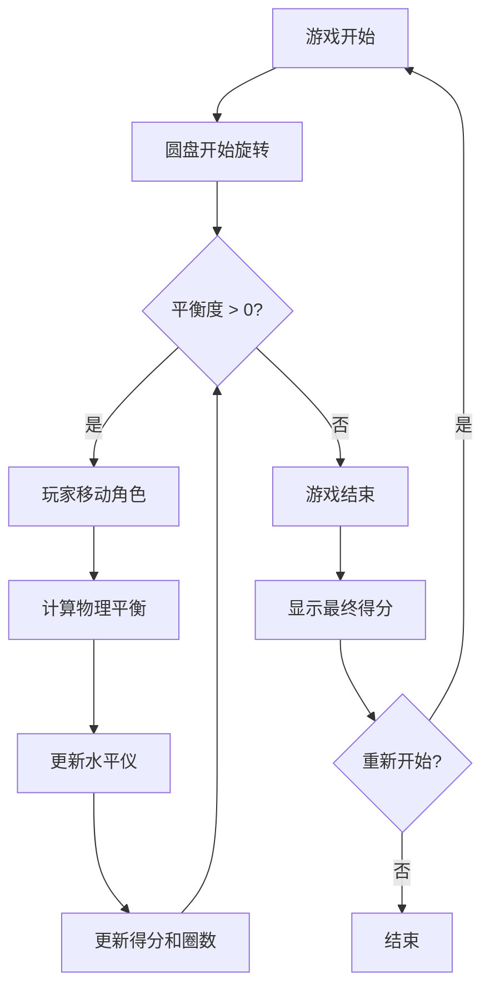

## 1. 产品概述

彝族磨盘秋千模拟游戏——一款基于物理平衡的休闲小游戏。玩家通过左右箭头键控制角色在旋转圆盘上移动，与两个AI角色配合维持圆盘平衡，保持平衡越久、旋转圈数越多得分越高。

- 目标用户：喜欢休闲益智类游戏的玩家，对少数民族文化感兴趣的群体
- 核心价值：在游戏体验中感受彝族传统磨盘秋千的物理乐趣与文化魅力

## 2. 核心功能

### 2.1 用户角色
| 角色 | 控制方式 | 核心权限 |
|------|----------|----------|
| 玩家 | 键盘左右箭头键 | 在圆盘上自由移动，控制平衡 |
| AI角色1 | 自动控制 | 固定位置，根据物理反馈微调 |
| AI角色2 | 自动控制 | 固定位置，根据物理反馈微调 |

### 2.2 功能模块
1. **游戏主界面**: 圆盘显示区、角色控制、水平仪、得分面板
2. **游戏结束界面**: 最终得分、旋转圈数、重新开始按钮

### 2.3 页面详情
| 页面名称 | 模块名称 | 功能描述 |
|----------|----------|----------|
| 游戏主界面 | 旋转圆盘 | 3D透视渲染的大圆盘，随物理倾斜旋转，显示三个角色位置 |
| 游戏主界面 | 角色控制 | 玩家角色用左右箭头键沿圆盘边缘移动 |
| 游戏主界面 | 水平仪 | 圆盘中央的气泡水平仪，实时显示倾斜方向和程度 |
| 游戏主界面 | 平衡度显示 | 百分比显示当前平衡度，100%为完美平衡 |
| 游戏主界面 | 旋转圈数 | 累计旋转圈数实时显示 |
| 游戏主界面 | 得分系统 | 基于旋转圈数和平衡度实时计算得分 |
| 游戏结束界面 | 结果面板 | 显示最终得分、总旋转圈数、游戏时长 |
| 游戏结束界面 | 重新开始 | 点击按钮重新开始游戏 |

## 3. 核心流程

玩家进入游戏后，圆盘开始缓慢旋转。三个角色站在圆盘不同位置，玩家通过左右箭头键移动自己的角色到合适位置以维持圆盘平衡。圆盘中央有气泡水平仪，当圆盘倾斜时水平仪气泡偏向重的一侧。玩家需要向重的一侧移动以恢复平衡。当平衡度持续下降到0%时游戏结束。保持平衡使圆盘持续旋转，旋转越久得分越高。

## 4. 用户界面设计

### 4.1 设计风格
- 主色调：深褐色/红褐色（呼应彝族传统漆器色彩），辅以彝族图腾纹饰的金色/黄色点缀
- 次要色：深绿（象征自然）、米白（背景）
- 按钮风格：圆角、微3D凸起效果，彝族纹样边框
- 字体：粗壮有力的显示字体，搭配简洁的正文字体
- 布局风格：居中圆盘为主视觉，左右侧信息面板
- 装饰风格：彝族太阳纹、火纹等几何图案作为UI装饰元素

### 4.2 页面设计概览
| 页面名称 | 模块名称 | UI元素 |
|----------|----------|--------|
| 游戏主界面 | 旋转圆盘 | 3D透视效果圆形木纹圆盘，三人站在不同位置（彩色圆点），圆盘中央水平仪气泡 |
| 游戏主界面 | 信息面板 | 左上角平衡度百分比（带进度条），右上角旋转圈数和得分 |
| 游戏主界面 | 操作提示 | 底部左右箭头提示键位 |
| 游戏结束界面 | 结果面板 | 居中卡片，显示最终数据，彝族纹样边框装饰 |

### 4.3 响应式设计
- 桌面优先设计，Canvas画布自适应窗口大小
- 最小支持1024x768分辨率

### 4.4 游戏物理设计
- 圆盘质量均匀，三人各有不同体重
- 角色位置产生力矩：力矩 = 体重 × 距圆心距离 × sin(角度)
- 净力矩决定圆盘倾斜方向和速度
- 倾斜导致角色向低侧滑动，形成正反馈
- 平衡时圆盘匀速旋转，旋转速度与平衡度正相关
- 气泡水平仪：气泡位置 = 圆盘倾斜方向的反向偏移
