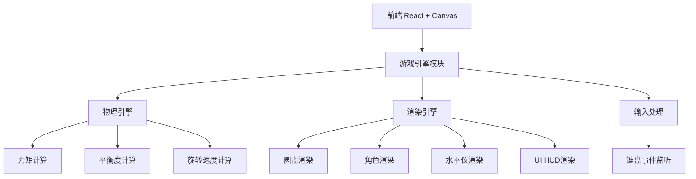

## 1. 架构设计



纯前端项目，无后端服务。所有游戏逻辑在浏览器端通过Canvas 2D + React完成。

## 2. 技术说明
- 前端：React@18 + TypeScript + Tailwind CSS + Vite
- 初始化工具：vite-init
- 游戏渲染：HTML5 Canvas 2D API
- 状态管理：Zustand
- 后端：无
- 数据库：无

## 3. 路由定义
| 路由 | 用途 |
|------|------|
| / | 游戏主界面 |

## 4. 核心模块设计

### 4.1 游戏状态 (Zustand Store)
```
- playerAngle: 玩家在圆盘上的角度位置
- ai1Angle: AI角色1的角度位置
- ai2Angle: AI角色2的角度位置
- discRotation: 圆盘累计旋转角度
- discTilt: 圆盘倾斜角度
- balancePercent: 平衡度百分比
- rotationCount: 旋转圈数
- score: 得分
- gameStatus: 游戏状态（playing/ended）
- tiltDirection: 倾斜方向
```

### 4.2 物理引擎
- 每帧计算三个角色产生的力矩
- 净力矩 → 圆盘倾斜加速度
- 倾斜 → 角色滑动力
- 平衡度 = 100% - |倾斜角| / 最大倾斜角 × 100%
- 旋转速度 = 基础速度 × 平衡度系数
- 平衡度降至0%时游戏结束

### 4.3 AI逻辑
- AI角色每隔一段时间微调位置
- 当检测到圆盘向某方向倾斜时，AI向轻侧移动少量距离
- AI有反应延迟，不会完美配合，增加游戏挑战性

### 4.4 渲染层次
1. 背景（深色 + 彝族纹样装饰）
2. 圆盘（椭圆形透视 + 木纹纹理）
3. 圆盘上的纹样装饰
4. 水平仪（圆盘中央）
5. 角色（三个不同颜色的站立人物）
6. HUD（平衡度、圈数、得分）

## 5. 文件结构规划
```
src/
├── components/
│   ├── GameCanvas.tsx      # 主游戏Canvas组件
│   ├── GameHUD.tsx         # 游戏HUD信息面板
│   └── GameOver.tsx        # 游戏结束面板
├── hooks/
│   ├── useGameLoop.ts      # 游戏主循环Hook
│   ├── useInput.ts         # 键盘输入Hook
│   └── usePhysics.ts       # 物理计算Hook
├── store/
│   └── gameStore.ts        # Zustand游戏状态
├── utils/
│   ├── physics.ts          # 物理计算工具
│   └── renderer.ts         # Canvas渲染工具
├── pages/
│   └── GamePage.tsx        # 游戏页面
├── App.tsx
└── main.tsx
```
